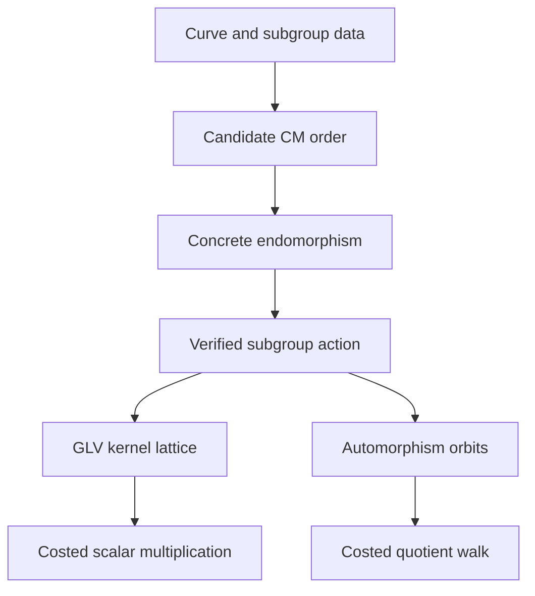
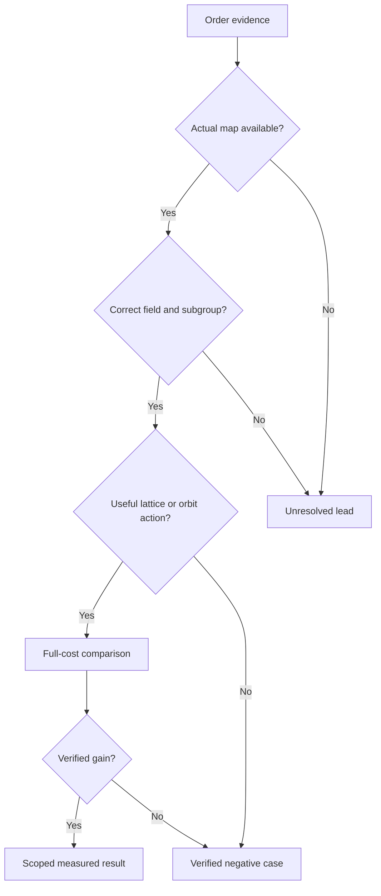

# Visual report outline

Adapt the number of pages to the user. Use a compact formula-first report
for an expert and annotate each symbol for a reader.

## Ten-page starting plan

| Page | Technical purpose | Visual |
| --- | --- | --- |
| 1 | Show the missing bridge | Branching map from curve algebra to GLV and folding |
| 2 | Disambiguate four discriminants | Exact mapping table with formula and meaning |
| 3 | Derive trace, norm and map polynomial | Order element beside its algebraic invariants |
| 4 | Make a cheap actual map concrete | Positive fixture: P, phi(P), verified [lambda]P |
| 5 | Explain scalar decomposition | Kernel lattice, target (14,0), nearby (15,-3), residual (-1,3) |
| 6 | Show why a CM hit can fail | Negative fixture: geometric degree versus subgroup action |
| 7 | Distinguish orbit folding | Point orbit and ideal square-root iteration reduction |
| 8 | Explain four-dimensional extension | Compatible maps, eigenvalues and coefficient bounds |
| 9 | Evaluate a candidate | Evidence gates, with failed gates kept visible |
| 10 | Check understanding | Short questions, answers, notation and primary references |

## Editable conceptual diagram

Label the order as candidate until certified. In research-facing diagrams,
label each edge as derived, verified, measured or proposed as appropriate.

## Editable evidence diagram

## Lattice drawing contract

Draw points `(u,v)` satisfying `u + 5v = 0 mod 31` on integer axes.
Mark `(14,0)` as the target and `(15,-3)` as the selected lattice point.
Draw an arrow from the lattice point to the target: its residual is
`(-1,3)`. Do not reverse the residual arrow or label arbitrary integer
points as lattice points. Use identical scales on both coefficient axes.

## Cost labels

Label sqrt(m) as an ideal rho iteration factor, r^(1/d) as a coefficient
bound only with stated assumptions, and timings as measured only when a
matched complete benchmark supports them. Keep toy arithmetic checks
separate from benchmark evidence. Leave canonical research graphs unchanged
when the task only packages this technical workflow and adds no measurement.

## Questions with answers

- Does D alone imply GLV speed? No: map cost, action and lattice quality remain.
- Does degree 155 mean 155 multiplications? No: it is geometric degree.
- Why is lambda a polynomial root? Apply the map identity to an order-r generator.
- Does sixfold orbit collapse imply sixfold rho speed? The ideal iteration factor is sqrt(6).

## PDF review

Render every page. Inspect formula glyphs, contrast, arrows, axis scales,
label collisions and citations. Ensure tiny examples are visibly labeled.
Keep editable diagram or document source with any repository deliverable.
Save the final PDF through the active file-saving skill and keep its identity
when revising it. Do not imply that a selected PDF plugin was used if no
relevant capability was available.
