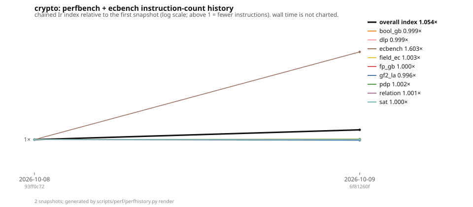

# Performance history

Generated by `scripts/perf/perfhistory.py render` from the snapshots in `docs/perf/history/`; do not edit by hand.  One snapshot per measured commit: callgrind instruction counts (`Ir`) of every quick `perfbench` kernel and of the frozen `ecbench` children in `docs/perf/ecbench-children.json`, with a wall-time reading beside each.  The index chains consecutive `Ir` ratios and takes no credit across a fingerprint change (the kernel computed something else: **re-based**).  Formula: `docs/perf/PERFORMANCE_INDEX.md`; what this does and does not mean: engineering class, `AGENTS.md` §3.  **Noise floor:** two builds of different sources move the `Ir` of untouched kernels by up to a few per cent (the release profile's 16 codegen units are partitioned afresh, and cross-module inlining changes with them), so a single step under about 5 % on one kernel is build noise, not a result; a trend over several snapshots, or an area index, is.



**Latest snapshot:** `6f81260f6ab5` (2026-10-09T16:37:19Z) — Release profile: measure fat LTO + one codegen unit, keep the default  
**Snapshots:** 2, from `93ff0c72333c` (2026-10-08).  
**Overall chained Ir index since first snapshot:** **1.054×**  
**Note on the latest snapshot:** src/ at 93ff0c72 with PR #1594's src diff applied (main did not compile on 2026-10-09); measured on a shared 4-core container  

## Areas

| area | kernels | index since first | step from previous |
|---|---:|---:|---:|
| bool_gb | 19 | 0.999× | 0.999× |
| dlp | 10 | 0.999× | 0.999× |
| ecbench | 2 | 1.603× | 1.603× |
| field_ec | 24 | 1.003× | 1.003× |
| fp_gb | 19 | 1.000× | 1.000× |
| gf2_la | 19 | 0.996× | 0.996× |
| pdp | 21 | 1.002× | 1.002× |
| relation | 10 | 1.001× | 1.001× |
| sat | 11 | 1.000× | 1.000× |
| **overall** | 135 | **1.054×** | 1.054× |

## Snapshots

| # | committed | commit | overall | bool_gb | dlp | ecbench | field_ec | fp_gb | gf2_la | pdp | relation | sat | kernels | host |
|---:|---|---|---:|---:|---:|---:|---:|---:|---:|---:|---:|---:|---:|---|
| 1 | 2026-10-08 | `93ff0c72` | 1.000× | 1.000× | 1.000× | 1.000× | 1.000× | 1.000× | 1.000× | 1.000× | 1.000× | 1.000× | 135 | Intel(R) Xeon(R) Processor @… |
| 2 | 2026-10-09 | `6f81260f` | 1.054× | 0.999× | 0.999× | 1.603× | 1.003× | 1.000× | 0.996× | 1.002× | 1.001× | 1.000× | 135 | Intel(R) Xeon(R) Processor @… |

## Movers in the latest step

Kernels whose `Ir` changed by more than 5 % against the previous snapshot with the same fingerprint (the build-noise floor is a few per cent, see above).

Fewer instructions:

| kernel | previous Ir | latest Ir | step |
|---|---:|---:|---:|
| `ecbench/rho_negation_prime26_p42652151` | 4,853,442 | 1,929,331 | 2.516× |
| `field_ec/ct_scalar_mul_p256_x16` | 103,430,171 | 96,131,067 | 1.076× |
| `pdp/semaev_s5_symbolic` | 61,959,751 | 58,479,684 | 1.060× |

## Kernels at the latest snapshot

`Δ prev` is the latest step's change in `Ir` (negative = fewer instructions); `index` is the chained index since the first snapshot that has the kernel; `wall` is one native median on the recording host and is informational only.

### bool_gb

| kernel | Ir | wall | Δ prev | index | note |
|---|---:|---:|---:|---:|---|
| `bool_gb/crossbred_m2_n23` | 683,319,846 | 120.137ms | +0.1 % | 0.999× |  |
| `bool_gb/f4_basis_m2_n17` | 1,501,358,353 | 284.883ms | -0.0 % | 1.000× |  |
| `bool_gb/f4_basis_random_n18` | 1,570,541,776 | 273.190ms | -0.0 % | 1.000× |  |
| `bool_gb/fes_gray_m2_n23` | 321,423,274 | 30.803ms | -0.0 % | 1.000× |  |
| `bool_gb/fes_gray_random_n28` | 2,567,071,635 | 244.242ms | +0.0 % | 1.000× |  |
| `bool_gb/fes_moebius_random_n22` | 161,446,828 | 77.546ms | +0.0 % | 1.000× |  |
| `bool_gb/fes_monica_random_n25` | 476,813,491 | 178.005ms | -0.0 % | 1.000× |  |
| `bool_gb/fes_wide_random_n30` | 2,051,511,424 | 196.355ms | +0.0 % | 1.000× |  |
| `bool_gb/matrix_f4_deg3_m3_n23` | 287,056,718 | 66.178ms | -0.0 % | 1.000× |  |
| `bool_gb/matrix_f4_deg4_m2_n23` | 860,555,567 | 333.279ms | -0.0 % | 1.000× |  |
| `bool_gb/matrix_f4_deg4_m3_n15` | 952,357,602 | 263.769ms | -0.0 % | 1.000× |  |
| `bool_gb/matrix_f5_deg4_m2_n23` | 766,776,087 | 264.687ms | -0.0 % | 1.000× |  |
| `bool_gb/solve_inherited_m2_n23` | 1,222,656,559 | 222.075ms | +0.8 % | 0.992× |  |
| `bool_gb/solve_inherited_m3_n15` | 467,287,939 | 83.408ms | +0.4 % | 0.996× |  |
| `bool_gb/solve_matrixf4_m2_n17` | 1,929,374,570 | 324.403ms | -0.1 % | 1.001× |  |
| `bool_gb/solve_matrixf5_m2_n17` | 1,952,598,745 | 435.004ms | -0.0 % | 1.000× |  |
| `bool_gb/wide_found_m5_n15` | 1,977,874,338 | 338.196ms | +0.1 % | 0.999× |  |
| `bool_gb/wide_mixed_m4_n15` | 2,383,293,851 | 424.598ms | +0.0 % | 1.000× |  |
| `bool_gb/wide_refute_m3_n31` | 868,550,987 | 145.300ms | -0.1 % | 1.001× |  |

### dlp

| kernel | Ir | wall | Δ prev | index | note |
|---|---:|---:|---:|---:|---|
| `dlp/aut_folded_rho_j0_p25` | 40,534,773 | 11.103ms | +0.3 % | 0.997× |  |
| `dlp/bsgs_fast_toy40_w1_x4` | 655,546,566 | 280.452ms | +0.0 % | 1.000× |  |
| `dlp/bsgs_fast_toy40_w4_interval38_x8` | 956,006,053 | 335.558ms | +0.0 % | 1.000× |  |
| `dlp/collab_walkers_demo32_x8` | 112,334,240 | 24.649ms | -0.1 % | 1.001× |  |
| `dlp/ecc2k130_certify_m131_len12` | 25,241,711 | 2.729ms | +0.0 % | 1.000× |  |
| `dlp/gaudry_schost_negation_demo32` | 133,643,871 | 33.598ms | +0.3 % | 0.997× |  |
| `dlp/koblitz_signed_rho_k0_n41` | 228,708,334 | 78.852ms | +0.0 % | 1.000× |  |
| `dlp/pohlig_hellman_smooth47` | 1,716,728 | 1.431ms | +0.2 % | 0.998× |  |
| `dlp/rho_dp_zp_multi_q34_x3` | 36,346,256 | 3.615ms | -0.0 % | 1.000× |  |
| `dlp/rho_floyd_zp_q36` | 110,163,001 | 20.209ms | +0.0 % | 1.000× |  |

### ecbench

| kernel | Ir | wall | Δ prev | index | note |
|---|---:|---:|---:|---:|---|
| `ecbench/rho_negation_prime26_p42652151` | 1,929,331 | 6.869ms | -60.2 % | 2.516× |  |
| `ecbench/rho_signed_frobenius_k0n41` | 129,040,302 | 58.152ms | -2.1 % | 1.021× |  |

### field_ec

| kernel | Ir | wall | Δ prev | index | note |
|---|---:|---:|---:|---:|---|
| `field_ec/binary_scalar_mul_sect163k1_x8` | 174,105,046 | 20.203ms | -0.0 % | 1.000× |  |
| `field_ec/binary_scalar_mul_sect233k1_x4` | 180,274,483 | 17.101ms | -0.0 % | 1.000× |  |
| `field_ec/ct_scalar_mul_p256_x16` | 96,131,067 | 9.925ms | -7.1 % | 1.076× |  |
| `field_ec/ct_scalar_mul_secp256k1_x16` | 70,408,395 | 7.316ms | -0.1 % | 1.001× |  |
| `field_ec/ecdsa_verify_p256_x4` | 545,886,326 | 79.591ms | +0.0 % | 1.000× |  |
| `field_ec/ecdsa_verify_secp256k1_x4` | 540,361,275 | 76.745ms | +0.0 % | 1.000× |  |
| `field_ec/f2m_inv_m163_2k` | 191,778,033 | 22.528ms | +0.0 % | 1.000× |  |
| `field_ec/f2m_mul_sqr_m131_64k` | 94,066,161 | 9.862ms | +0.0 % | 1.000× |  |
| `field_ec/f2m_mul_sqr_m163_64k` | 98,252,209 | 9.944ms | +0.0 % | 1.000× |  |
| `field_ec/f2m_mul_sqr_m233_64k` | 116,343,734 | 11.681ms | +0.0 % | 1.000× |  |
| `field_ec/fastfield_p61_inv` | 32,546,917 | 7.001ms | +0.0 % | 1.000× |  |
| `field_ec/frobenius_canon_n53_bulk_256k` | 92,060,401 | 6.418ms | +0.0 % | 1.000× |  |
| `field_ec/frobenius_canon_n53_shift_256k` | 69,257,965 | 10.776ms | +0.0 % | 1.000× |  |
| `field_ec/gf2_n53_batch_inv_4x64k` | 25,055,208 | 4.270ms | +0.0 % | 1.000× |  |
| `field_ec/gf2_n53_inv_16k` | 12,353,578 | 7.102ms | +0.0 % | 1.000× |  |
| `field_ec/gf2_n53_mul_sqr_1m` | 49,440,610 | 6.748ms | +0.0 % | 1.000× |  |
| `field_ec/gf3m_mul_m97` | 233,160,552 | 26.180ms | +0.0 % | 1.000× |  |
| `field_ec/hyperelliptic_g2_scalar_mul_x4` | 659,328,787 | 75.638ms | +0.0 % | 1.000× |  |
| `field_ec/koblitz_curve_mul_n53_1k` | 11,407,075 | 2.691ms | +0.0 % | 1.000× |  |
| `field_ec/koblitz_n53_add_many_lazy_64x2k` | 34,872,434 | 6.330ms | +0.0 % | 1.000× |  |
| `field_ec/koblitz_n53_fast_mul_2k` | 26,591,145 | 7.563ms | +0.0 % | 1.000× |  |
| `field_ec/point_scalar_mul_ct_secp256k1_x1` | 781,880,675 | 134.780ms | +0.0 % | 1.000× |  |
| `field_ec/point_scalar_mul_p256_x8` | 165,125,726 | 23.931ms | -0.0 % | 1.000× |  |
| `field_ec/point_scalar_mul_secp256k1_x8` | 159,273,101 | 22.702ms | +0.0 % | 1.000× |  |

### fp_gb

| kernel | Ir | wall | Δ prev | index | note |
|---|---:|---:|---:|---:|---|
| `fp_gb/buchberger_katsura3_p32003` | 473,101,195 | 68.403ms | +0.0 % | 1.000× |  |
| `fp_gb/f4_autoreduce_pkm_m2_t4_x2` | 520,054,136 | 91.245ms | +0.1 % | 0.999× |  |
| `fp_gb/f4_cubic_n4_p31` | 176,210,136 | 31.787ms | +0.1 % | 0.999× |  |
| `fp_gb/f4_cyclic5_p65521` | 48,820,629 | 9.408ms | +0.1 % | 0.999× |  |
| `fp_gb/f4_katsura6_p65521` | 260,143,125 | 51.798ms | +0.1 % | 0.999× |  |
| `fp_gb/f4_pkm_kummer_m2_t5` | 1,434,323,552 | 297.263ms | +0.2 % | 0.998× |  |
| `fp_gb/f4_pkm_kummer_m3_t2` | 177,293,490 | 50.154ms | +0.1 % | 0.999× |  |
| `fp_gb/f4_quad_n7_p65521` | 1,215,560,093 | 238.680ms | +0.1 % | 0.999× |  |
| `fp_gb/f4_solve_cubic_n3_p29` | 47,333,472 | 7.258ms | +0.3 % | 0.997× |  |
| `fp_gb/f4_solve_quad_n4_p31` | 47,842,336 | 7.910ms | -0.5 % | 1.005× |  |
| `fp_gb/f4_solve_quart_n3_p31` | 182,812,942 | 35.795ms | +0.7 % | 0.993× |  |
| `fp_gb/gaudry_quartic_generic_d3_p269` | 125,364,200 | 40.907ms | -1.3 % | 1.013× |  |
| `fp_gb/gaudry_s4_macaulay_p1039` | 384,734,810 | 101.734ms | -1.9 % | 1.019× |  |
| `fp_gb/sig_tower_kummer_m2_n12` | 1,040,052,967 | 221.574ms | +0.8 % | 0.992× |  |
| `fp_gb/sig_tower_kummer_m3_n9` | 1,462,018,382 | 237.729ms | +0.6 % | 0.994× |  |
| `fp_gb/tower_f4_kummer_m2_n12` | 823,885,655 | 140.998ms | -0.0 % | 1.000× |  |
| `fp_gb/tower_f4_kummer_m2_n12_planted` | 964,488,085 | 179.456ms | -0.1 % | 1.001× |  |
| `fp_gb/tower_f4_kummer_m3_n9` | 1,447,802,162 | 262.226ms | -0.0 % | 1.000× |  |
| `fp_gb/tower_f4_kummer_m4_n8` | 529,749,557 | 93.337ms | -0.0 % | 1.000× |  |

### gf2_la

| kernel | Ir | wall | Δ prev | index | note |
|---|---:|---:|---:|---:|---|
| `gf2_la/echelon_macaulay_k23m2d4` | 346,626,214 | 93.456ms | -0.0 % | 1.000× |  |
| `gf2_la/echelon_macaulay_k5m3d5` | 217,401,654 | 41.704ms | -0.0 % | 1.000× |  |
| `gf2_la/f5_criterion_k23m2d6` | 3,277,200,520 | 465.074ms | -0.0 % | 1.000× |  |
| `gf2_la/f5_criterion_k5m3d7` | 310,660,608 | 43.290ms | +0.0 % | 1.000× |  |
| `gf2_la/legacy_echelon_macaulay_k23m2d3_x16` | 203,931,153 | 28.691ms | +2.5 % | 0.976× |  |
| `gf2_la/legacy_rref_macaulay_k23m3d3` | 107,618,280 | 13.687ms | +0.0 % | 1.000× |  |
| `gf2_la/legacy_rref_macaulay_k5m3d5` | 1,245,036,587 | 148.526ms | +2.6 % | 0.974× |  |
| `gf2_la/rank_refute_anf_s4_n6l3d4` | 1,320,064,116 | 427.766ms | -0.0 % | 1.000× |  |
| `gf2_la/rref_macaulay_k15m3d4` | 662,957,866 | 213.477ms | -0.0 % | 1.000× |  |
| `gf2_la/rref_macaulay_k17m2d5` | 956,443,811 | 518.637ms | -0.0 % | 1.000× |  |
| `gf2_la/rref_macaulay_k23m2d3_x16` | 121,435,070 | 20.066ms | -0.0 % | 1.000× |  |
| `gf2_la/rref_macaulay_k23m2d4` | 520,078,041 | 118.464ms | -0.0 % | 1.000× |  |
| `gf2_la/rref_macaulay_k5m3d5` | 275,663,026 | 57.301ms | -0.0 % | 1.000× |  |
| `gf2_la/rref_random_2048` | 80,298,427 | 10.811ms | -0.0 % | 1.000× |  |
| `gf2_la/rref_random_4940x8357` | 865,393,710 | 248.104ms | -0.0 % | 1.000× |  |
| `gf2_la/rref_random_4940x8357_w17` | 705,146,969 | 247.439ms | -0.0 % | 1.000× |  |
| `gf2_la/sparse_finish_macaulay_k7m3d5` | 286,518,048 | 37.285ms | +3.8 % | 0.964× |  |
| `gf2_la/sparse_high_macaulay_k5m3d5` | 231,714,068 | 37.806ms | +0.0 % | 1.000× |  |
| `gf2_la/sparse_rank_refute_macaulay_k5m3d5` | 388,551,997 | 121.202ms | -1.3 % | 1.013× |  |

### pdp

| kernel | Ir | wall | Δ prev | index | note |
|---|---:|---:|---:|---:|---|
| `pdp/build_system_m2_n23` | 2,553,956 | 0.374ms | +0.5 % | 0.995× |  |
| `pdp/build_system_m3_n15` | 14,096,012 | 1.861ms | +0.7 % | 0.993× |  |
| `pdp/descend_s3_n31_np20` | 65,459,788 | 10.951ms | -0.2 % | 1.002× |  |
| `pdp/descend_s4_n23_np6` | 45,337,296 | 8.385ms | -0.0 % | 1.000× |  |
| `pdp/enumerate_m2_n23` | 16,270,452 | 5.573ms | +0.0 % | 1.000× |  |
| `pdp/enumerate_m3_n15` | 9,134,665 | 3.061ms | -0.0 % | 1.000× |  |
| `pdp/groebner_m2_n17` | 179,138,558 | 44.144ms | +1.0 % | 0.990× |  |
| `pdp/groebner_m3_n9` | 150,067,389 | 28.579ms | +0.0 % | 1.000× |  |
| `pdp/instantiate_m2_n23` | 30,342,663 | 5.769ms | +0.1 % | 0.999× |  |
| `pdp/instantiate_m3_n15` | 23,647,567 | 4.987ms | +0.1 % | 0.999× |  |
| `pdp/mitm_m3_n31` | 220,272,537 | 37.600ms | +0.0 % | 1.000× |  |
| `pdp/mitm_m4_n31` | 74,583,403 | 14.236ms | -0.0 % | 1.000× |  |
| `pdp/pair_table_build_n31_l10` | 376,187,799 | 203.533ms | +0.0 % | 1.000× |  |
| `pdp/relation_solver_u1024` | 184,363,540 | 41.484ms | +0.0 % | 1.000× |  |
| `pdp/sat_m2_n17` | 262,563,824 | 48.718ms | +0.0 % | 1.000× |  |
| `pdp/sat_m6_n7` | 101,323,708 | 16.053ms | +0.1 % | 0.999× |  |
| `pdp/semaev_s5_symbolic` | 58,479,684 | 8.182ms | -5.6 % | 1.060× |  |
| `pdp/subspace_oracle_n20_l7` | 142,744,886 | 26.506ms | +0.0 % | 1.000× |  |
| `pdp/symmetrised_groebner_m2_n17` | 1,495,770,204 | 242.916ms | +0.0 % | 1.000× |  |
| `pdp/symmetrised_groebner_m3_n15` | 736,368,950 | 154.816ms | -0.2 % | 1.002× |  |
| `pdp/weil_descend_s4_sym_n17_l4` | 20,350,633 | 3.020ms | -0.5 % | 1.006× |  |

### relation

| kernel | Ir | wall | Δ prev | index | note |
|---|---:|---:|---:|---:|---|
| `relation/block_wiedemann_r45_n768_w13` | 470,781,060 | 54.739ms | +0.1 % | 0.999× |  |
| `relation/koblitz_collect_k0n41_w164_u4096` | 347,811,037 | 31.247ms | +0.0 % | 1.000× |  |
| `relation/koblitz_collect_k0n53_w477_u1024` | 253,011,005 | 23.614ms | +0.0 % | 1.000× |  |
| `relation/koblitz_descent_k0n53_m2_x4` | 438,507,242 | 47.869ms | -0.0 % | 1.000× |  |
| `relation/koblitz_pair_table_k0n41_folded` | 114,059,407 | 20.657ms | +0.0 % | 1.000× |  |
| `relation/koblitz_rung_k0n31` | 170,559,416 | 22.039ms | -0.0 % | 1.000× |  |
| `relation/pq_sparse_solve_m127_c640` | 270,076,830 | 62.238ms | -0.1 % | 1.001× |  |
| `relation/pq_wiedemann_m127_c160` | 432,994,803 | 53.071ms | -0.5 % | 1.005× |  |
| `relation/residual_walk_lmw_b22_x3` | 234,396,907 | 89.945ms | -0.0 % | 1.000× |  |
| `relation/sparse_solve_r45_c4800_w3` | 559,069,050 | 74.065ms | -0.0 % | 1.000× |  |

### sat

| kernel | Ir | wall | Δ prev | index | note |
|---|---:|---:|---:|---:|---|
| `sat/koblitz_bool_cnf_m3_n15_b1500_x2` | 840,645,917 | 183.322ms | -0.0 % | 1.000× |  |
| `sat/koblitz_bool_native_m2_n19_x2` | 976,046,063 | 169.367ms | +0.0 % | 1.000× |  |
| `sat/koblitz_bool_native_m3_n15_x3` | 447,830,830 | 81.412ms | -0.0 % | 1.000× |  |
| `sat/random3sat_n150_r426_x12` | 758,896,803 | 186.497ms | +0.0 % | 1.000× |  |
| `sat/random3sat_n200_r426_x5` | 728,173,625 | 196.623ms | +0.0 % | 1.000× |  |
| `sat/semaev_s4_encode_n19l6_x4` | 61,112,641 | 9.232ms | -0.2 % | 1.002× |  |
| `sat/semaev_s4_n15l5_cnf_x2` | 287,127,588 | 69.210ms | -0.0 % | 1.000× |  |
| `sat/semaev_s4_n15l5_sat_x4` | 877,875,575 | 166.409ms | +0.0 % | 1.000× |  |
| `sat/semaev_s4_n15l5_unsat_x1` | 1,263,473,246 | 233.821ms | -0.0 % | 1.000× |  |
| `sat/semaev_s4_n17l6_sat_x1` | 1,279,270,310 | 211.732ms | -0.0 % | 1.000× |  |
| `sat/xor_planted_n120_x6` | 940,450,935 | 196.280ms | +0.0 % | 1.000× |  |

## How to add a point

```bash
cargo build --release --example perfbench --bin ecbench
python3 scripts/perf/perfhistory.py record --binary target/release/examples/perfbench \
    --ecbench target/release/ecbench --out docs/perf/history
python3 scripts/perf/perfhistory.py render --history docs/perf/history \
    --md docs/perf/HISTORY.md --svg docs/perf/history.svg --json docs/perf/history.json
```

`.github/workflows/perf-history.yml` does this for every push to `main` and checks each pull request against the latest snapshot.
