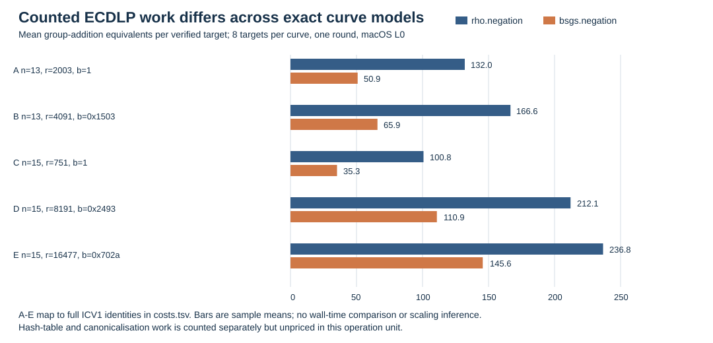

# Exact binary-curve ECDLP comparison — 2026-10-09

## Question and evidence status

How do ECDLP costs and the characteristic-two GHS screening results differ
between exact curve models, including curves over the same binary field?
The [first frozen protocol](PROTOCOL.md), its [same-field addendum](NON_KOBLITZ_ADDENDUM.md),
and the [standard-curve protocol](STANDARD_CURVES_PROTOCOL.md) specify the
inputs and acceptance gates before their respective runs. The executable
methods here are generic Pollard rho and BSGS. The higher-genus GHS solver
is not implemented, so there is **no measured GHS ECDLP cost** in this round.

The editable [chart data](figures/costs.tsv) gives complete ICV1 model
identities. The [construction diagram](figures/route.svg) and its
[editable source](figures/route.mmd) distinguish the executable trace from
the higher-genus construction gap. A printable copy is [RESULT.pdf](RESULT.pdf).

## Measured one-target ECDLP panel

The primary same-field session `ECBS1hd395a1344225` used the five exact
polynomial-basis curves in [non_koblitz.spec.json](non_koblitz.spec.json),
eight independently derived targets per curve, and one cold counted run of
each method on each target. Every `rho.negation` and `bsgs.negation` run
recovered and independently verified its scalar: **80/80 verified**.
`ecbench verify --replay-all` audited all 80 records, reproduced all 80,
and returned `audit OK`, receipt SHA-256
`22cf241164e32af826128fdfc2e0ad1c770768b071c71d54d34e52409b67b973`.
The recorded binary SHA-256 is
`1b0fcfe12d8af391d56a79929dea1a3dbc65c65869647ceaa5847cdc34a08c2d`.

The unit below is **S = total counted group-addition equivalents / sqrt(r)**.
Each cell averages eight verified one-target runs; the 95% intervals from
the [sealed table](non_koblitz.table.txt) are retained there. The floor is
the harness's generic square-root floor using each model's recorded
automorphism count. Ratios to rho are paired on the same target and are
from the [saved comparison](sessions/non-koblitz-01/comparisons/rho-neg__bsgs-neg.json).
All numbers are **counted lower bounds**: hash-table, canonicalisation and
other native costs remain unpriced. BSGS stores the indicated table entries.

| Exact curve model | Field degree | Prime r | Method | Mean S | S / floor | S / matched rho | Verified | BSGS entries |
| --- | ---: | ---: | --- | ---: | ---: | ---: | ---: | ---: |
| `icv1-f2m13-t181-515ee569` | 13 | 2,003 | rho.negation | 2.949 | 11.999 | 1.000 | 8/8 | — |
| `icv1-f2m13-t181-515ee569` | 13 | 2,003 | bsgs.negation | 1.137 | 4.625 | 0.385 | 8/8 | 24 |
| `icv1-f2m13-t11-f036dc01` | 13 | 4,091 | rho.negation | 2.605 | 2.940 | 1.000 | 8/8 | — |
| `icv1-f2m13-t11-f036dc01` | 13 | 4,091 | bsgs.negation | 1.030 | 1.162 | 0.395 | 8/8 | 33 |
| `icv1-f2m15-tm275-2d22ff5d` | 15 | 751 | rho.negation | 3.676 | 16.067 | 1.000 | 8/8 | — |
| `icv1-f2m15-tm275-2d22ff5d` | 15 | 751 | bsgs.negation | 1.286 | 5.621 | 0.350 | 8/8 | 15 |
| `icv1-f2m15-t5-d9fb183e` | 15 | 8,191 | rho.negation | 2.344 | 2.645 | 1.000 | 8/8 | — |
| `icv1-f2m15-t5-d9fb183e` | 15 | 8,191 | bsgs.negation | 1.225 | 1.382 | 0.523 | 8/8 | 47 |
| `icv1-f2m15-tm185-565c1669` | 15 | 16,477 | rho.negation | 1.844 | 2.081 | 1.000 | 8/8 | — |
| `icv1-f2m15-tm185-565c1669` | 15 | 16,477 | bsgs.negation | 1.134 | 1.280 | 0.615 | 8/8 | 66 |

At degree 15, the model with `r=16,477` needed a mean **236.75** counted
group-addition equivalents for rho and **145.625** for BSGS, versus
**100.75** and **35.25** on the `r=751` model. These are direct means of
the frozen records, giving raw-cost ratios **2.35** and **4.13** respectively;
the subgroup-size ratio is **21.94**. At degree 13, changing the model from
`r=2,003` to `r=4,091` changed mean rho work from **132** to **166.625**
and BSGS work from **50.875** to **65.875**. The chart shows these
absolute counts, while the table normalises by sqrt(r). This is an
eight-target, one-round observation, not a size-exponent fit.

The BSGS/rho counted ratios are a memory tradeoff with unpriced hash work,
not an end-to-end physical speed claim. macOS gave all records isolation
level L0; wall-clock comparisons are excluded. The [host summary](host.txt),
[raw session](sessions/non-koblitz-01/), [audit receipt](sessions/non-koblitz-01.audit.json),
[table](non_koblitz.table.txt), and [paired comparison](non_koblitz.rho_vs_bsgs.txt)
retain the exact execution evidence.

## Characteristic-two structure on the same curves

The native [`ghs_screen`](../../src/bin/ghs_screen.rs) audited every proper
field tower with genus bound four. The native [`ghs_transport`](../../src/bin/ghs_transport.rs)
checked the published or registry generator and subgroup annihilator before
attempting a trace. The complete [Koblitz](structural/) and
[non-Koblitz](structural-non-koblitz/) JSON files retain every tower, not
only the best row.

| Exact curve model | Field degree | Best GHS magic / genus | Trace outcome on every tower | Interpretation |
| --- | ---: | --- | --- | --- |
| `icv1-f2m13-t181-515ee569` | 13 | 1 / 0 | Generator killed | Trace loses the tested prime subgroup |
| `icv1-f2m13-t11-f036dc01` | 13 | 13 / 4,095 | Model not subfield-defined | No low-genus row at bound 4 |
| `icv1-f2m15-tm275-2d22ff5d` | 15 | 1 / 0 | Generator killed | Trace loses the tested prime subgroup |
| `icv1-f2m15-t5-d9fb183e` | 15 | 3 / 3 | Model not subfield-defined | Higher-genus construction is a structural candidate |
| `icv1-f2m15-tm185-565c1669` | 15 | 3 / 3 | Model not subfield-defined | Higher-genus construction is a structural candidate |

The first panel also screened registered degree-7 and degree-9 Koblitz
models. All its structural rows had magic one and genus zero; checked
trace killed all their tested prime generators. Its session
`ECBS1h5a490d269b02` has **107 verified and 13 exhausted** records.
The exhausted runs are all in the signed-Frobenius rho arm (4/8 at degree
7, 8/8 on one degree-9 model, 1/8 on the other). The generic rho and
BSGS arms each verified all 40 targets. The session audit passed with
107 deterministic verified replays, receipt SHA-256
`bff5841f0732c0289aedc8fb37a6a89ab6d35a5662b0ef6cd7bfaa7b75aaa071`.
The [original spec](ecbench.spec.json), [session](sessions/panel-01/),
[audit](sessions/panel-01.audit.json), and [table](table.txt) are retained;
the failed reference arm is not silently removed. Its small-order
exhaustions are an algorithm/parameter diagnostic, not evidence of a
curve's ECDLP hardness.

The trace conclusion has a group-theoretic reason: if `r` is prime and
`r > #E(F_(2^l))`, every homomorphism from the source order-`r` subgroup
to `E(F_(2^l))` is zero. The computed traces confirm this on the tested
Koblitz generators. A genus-zero structural GHS row must not be read as
an executable order-`r` ECDLP transfer. Conversely, the genus-three rows
for the two degree-15 non-Koblitz curves do not yet supply a smooth
Jacobian model, point map, or relation solver. [Hess's GHS analysis](https://www.cambridge.org/core/services/aop-cambridge-core/content/view/315278965D8D277A85812D9498236A88/S146115700000108Xa.pdf/generalising-the-ghs-attack-on-the-elliptic-curve-discrete-logarithm-problem.pdf)
is the mathematical construction context; this repository's screen is
only its structural stage.

## Standard and wide-field context

The [standard-curve receipts](structural-standard/) independently screened
and checked both [SEC 2 sect113r1 and sect113r2](https://www.secg.org/SEC2-Ver-1.0.pdf)
using their published generators. Both have a single proper tower over
`F_2`, magic 113 and genus `2^112-1`; neither meets genus bound four,
and neither model is defined over `F_2` for the checked trace. Their
published prime subgroup orders are about `2^112`, so the generic
square-root scale is about `2^56` group operations. That scale is derived
from subgroup order, not a measured run on these curves.

The earlier [`F_(2^192)` receipts](../../docs/ghs-transport-evidence/)
screen a binary field and transport an order-two point; they do not price
a 192-bit prime subgroup. [NIST P-192](https://nvlpubs.nist.gov/nistpubs/SpecialPublications/NIST.SP.800-186.pdf)
is a **prime-field** curve with a roughly 192-bit subgroup order and a
generic square-root scale around `2^96` operations. This binary GHS
construction does not apply to its field. These large-curve lines are
structural or derived comparisons, not host measurements.

## Reproduction, interpretation, and remaining work

Build `ecbench`, `ghs_screen` and `ghs_transport` with the native Cargo
targets. The exact commands are in the three protocols and the
[`run_structural.sh`](run_structural.sh),
[`run_non_koblitz_structural.sh`](run_non_koblitz_structural.sh), and
[`run_standard_structural.sh`](run_standard_structural.sh) scripts. The
first measured spec is SHA-256
`55db23271b37d05c61fd091f5525c233b5185ed40955d9a056acc89f440e1b1e`;
the second is
`766d97561d9ccb406e4027451c55a438a44bd0851c416c3c7c7f5d90292b2567`.
The structural scripts preserve source revision and input hashes in their
manifests. No Python research harness was used.

**Interpretation.** On these exact models, much of the observed absolute
generic ECDLP difference follows which prime subgroup the curve offers.
The same field degree alone is an inadequate comparison key. The genus-three
degree-15 models are the next characteristic-two construction lead, but
their measured generic ECDLP costs cannot be compared to an unimplemented
GHS solver cost. The 113-bit standard curves and P-192 remain separate
assessment cases.

**Requirement status.** Same-field generic ECDLP differences are measured
and audited on five curves. GHS structure and the checked trace outcome are
measured or computed for these and both SEC 2 113-bit curves. Higher-genus
point transport, a Jacobian order/subgroup certificate, end-to-end index
calculus, and a matched rho comparison on 113- or 192-bit prime subgroups
remain open. The existing scoreboard's index-calculus progress chart and
leaderboard have no new IC cell or cost to plot; their claims are unchanged.
