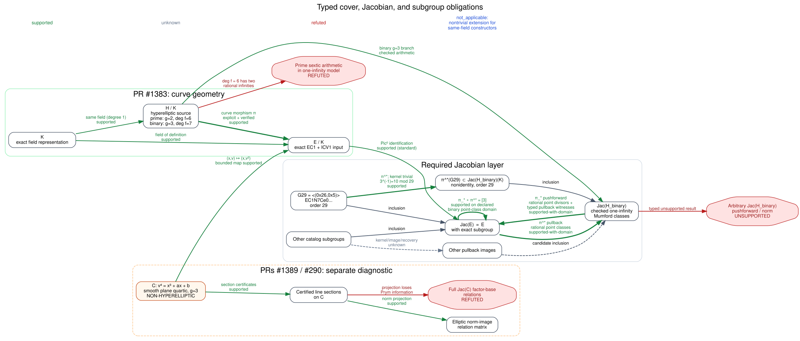

# Hyperelliptic cover infrastructure audit

## Outcome

The repository has replayable **curve-level** hyperelliptic cover
constructions for two catalog model families, but the audited evidence does
not establish a general cover-to-Jacobian transfer pipeline or a full
Jacobian index-calculus solver.

The precise correction is:

- Xavier Xarles's Corollary 3 is a theorem about a hyperelliptic curve with
  **two independent maps** to a given elliptic curve over the same field. It
  is not the trivial observation that an elliptic curve has genus one.
- Crypto PR
  [#1383](https://github.com/aburan28/crypto/pull/1383) gives stronger,
  simpler one-map constructions for the two catalog families and verifies
  their geometry. Its original head contains 115 certificates. The catalog
  at the audit baseline contains 121 because six models were added later.
- Crypto PR
  [#1389](https://github.com/aburan28/crypto/pull/1389) and cryptanalysis PR
  [#290](https://github.com/aburan28/cryptanalysis/pull/290) implement a
  bounded experiment on a genus-three **non-hyperelliptic plane quartic**.
  Its linear system is formed after elliptic norm projection. It is not full
  arithmetic or index calculus in the quartic Jacobian.
- The odd-characteristic Mumford implementation audited at commit
  `5874ce8b393dccc4c735cc7ca5a47de7fe196c59` is for odd-degree,
  one-rational-infinity models. The prime constructor in PR #1383 emits a
  monic genus-two sextic with two rational points at infinity. Applying that
  implementation to this even-degree model is unsupported.
- The delivered implementation at commit
  `3b8664a466efd56121509cd77866a07e3cb55741` adds checked odd-prime and binary
  one-infinity arithmetic and a **bounded** binary transfer: rational
  elliptic point-class pullback, rational source-point-divisor pushforward,
  and typed \([3]\) composition witnesses, including infinity and the
  exceptional ramified fiber. It explicitly rejects an arbitrary
  \(\operatorname{Jac}(H)\) pushforward.
- No audited record supplies an arbitrary-class pullback/pushforward pair,
  an exact image-generator replay, and a subgroup log-recovery certificate.
  Cover existence and the bounded transfer therefore do not establish a
  full discrete-log transport pipeline.

All transfer assessments below use exactly `unknown`, `supported`,
`refuted`, or `not_applicable`. Missing evidence is `unknown`, not a
nonexistence result.

## Audit basis

The repository audit is pinned to the following immutable revisions and
content digests.

- **Crypto audit baseline** — existing arithmetic and current generated
  catalog:\
  `5874ce8b393dccc4c735cc7ca5a47de7fe196c59`
- **Hyperelliptic infrastructure implementation** — checked arithmetic,
  bounded binary transfer, standalone command, and release integration:\
  `3b8664a466efd56121509cd77866a07e3cb55741`
- **PR #1383** — original cover certificates:\
  head `7c186ca89b8efeb0db2cea53e10e6da520166b56`\
  merge `c8a8f027998295f2a3620d96a2f0985f17ffb52b`
- **PR #1389** — crypto quartic experiment:\
  head `6c6247bde5e585642773ed5b6b933b4ec4c6fd4f`\
  merge `7ea1db7a6b4b6962f3fa38d70ac65300d25ceb4b`
- **PR #290** — cryptanalysis mirror; PR base was
  `claude/cryptanalysis-repo-setup-p59kek`:\
  head `3b14ec30de6c79fbc9dd72f4ed3eb8ea19d5a642`\
  merge `54cbf1dc27879b9bd441df7b64e2c629e9d9d9ea`
- **Xarles source** — primary theorem source:\
  arXiv:1303.4220v1, 2013-03-18
- **Xarles v1 PDF SHA-256** — retrieved 2026-10-06:\
  `5bf067b8e6376eca4559bc7335d824c3f74911649bd806bfcda1cefb0d6ce2ed`
- **Xarles v1 source-gzip SHA-256** — retrieved 2026-10-06:\
  `243c91375bd9bae5c8e17093fcdb8e9e4af12b362beaf8a1cd0e4f7033206e51`
- **PR #1383 `covers.json` SHA-256** — exact 115-row artifact:\
  `5f90fe0c1dfaa5cd2bd187a87dfd5ee5985c4d0171ea93e7874f9246527aaf9b`
- **Current `covers.json` SHA-256** — exact 121-row artifact at the audit
  baseline:\
  `b1634d75fff27add2e27adf996ba820a8852ea72468088d9eb3c88bb69759a39`
- **Quartic kernel SHA-256** — byte-identical at both PR heads:\
  `54ef65c7325a7c850741a8def84ee2b2ceddcc3689a0879afd2796eb7cb01e52`
- **Quartic CLI SHA-256** — byte-identical at both PR heads:\
  `0f71936014b3ff54dacc9dc6b642c88bea60b70a658f6e42c467aab73f11a069`
- **Quartic receipt SHA-256** — byte-identical at both PR heads:\
  `d3de82409e6fe82a59e74425916ed820ac5f8912e74046f41468cef56c01a967`

The receipt retained in PR #1389 says
`repository-CI-pending`; the later PR description reports the final head
passed its applicable CI. These are different historical statements. The
receipt has not been rewritten to conceal that ordering.

## Requirement-to-evidence table

| Requested item | Status in this report | Evidence or exact gap |
|---|---|---|
| Primary theorem and exact hypotheses | Verified complete | Xarles v1, Theorem 2 and Corollary 3, audited below |
| Audit PRs #1389 and #290 | Verified complete | Exact heads, matching source hashes, frozen correctness receipt |
| Audit PR #1383 certificates | Verified complete | Exact head artifact: 28 prime plus 87 binary records |
| Separate odd-characteristic and characteristic-two models | Specified | Infrastructure guide and additive JSON Schema |
| Constructive cover algorithms | Partial in repository | Two PR #1383 families are supported; this is not a theorem-complete implementation |
| Genuine Jacobian arithmetic | Partial | The committed feature checks odd-prime and binary one-infinity models; prime even-sextic cover arithmetic remains structured unsupported |
| Pullback and pushforward | Partial | Bounded binary rational-point domains are supported; arbitrary Jacobian pushforward and the prime balanced model are not implemented |
| Subgroup preservation | Partial | The exact F2^7 order-29 catalog subgroup has a bounded certificate; other catalog subgroups and arbitrary Jacobian transfer remain `unknown` |
| Catalog schema | Implemented in this change | `docs/curves/hyperelliptic-infrastructure.schema.json` |
| Standalone command contract | Implemented and documented | Direct commands with strict model shapes, 32 MiB input caps, propagated output errors, required external registry for catalog export, and no `cargo run` requirement for packaged builds |
| Full Jacobian IC solver | Not attempted; separate deliverable | Acceptance gates are specified below |

## Xarles Theorem 2 and Corollary 3

Primary source: Xavier Xarles, *Hyperelliptic curves covering an elliptic
curve twice*, arXiv:1303.4220v1
([abstract](https://arxiv.org/abs/1303.4220v1),
[PDF](https://arxiv.org/pdf/1303.4220v1)).

### Exact statement and hypotheses

Theorem 2 assumes:

- an arbitrary field \(K\) with
  \(\operatorname{char} K\ne 2,3\);
- \(j\in K\) with \(j\ne0,1728\); and
- \(A=3^3j/(2^2(j-1728))\).

It takes

\[
 E_A:y^2=x^3-Ax+A
\]

and gives the genus-five hyperelliptic curve

\[
 H_A:y^2=A(x+1)^4(x^2+1)^4
       -2^6x^3(x^2+x+1)^3
\]

with two independent maps to \(E_A\). In the proof, \(E_A\) is replaced by
the isomorphic genus-one quartic
\(D:y^2=x^4+x^3+B\), where \(B=A/2^6\). The auxiliary curve \(C\) has maps
\(f_1(x,y,z)=(x,y)\) and \(f_2(x,y,z)=(z,y)\) to \(D\). The proof states
that both maps have degree three.

Corollary 3 states: for every elliptic curve \(E/K\), where
\(\operatorname{char}K\ne2,3\), there is a hyperelliptic curve \(H/K\) of
genus at most five and two independent maps \(H\to E\), all defined over
\(K\). For \(j\ne0,1728\), the proof uses the same quadratic twist of the
Theorem 2 construction. For \(j=0\) or \(1728\), it cites known genus-two
constructions rather than writing their equations in this note.

### What follows and what does not

| Question | Audit result |
|---|---|
| Base field | Any field \(K\), subject to characteristic not 2 or 3 |
| Field extension required | No; the corollary says \(H\) and both maps are defined over \(K\) |
| Genus | Exactly 5 in Theorem 2; at most 5 in Corollary 3, with genus 2 cited for exceptional \(j\) |
| Number of maps | Two independent maps, not merely one cover |
| Degree | The proof gives degree 3 for both maps in the nonexceptional case |
| Separability | Not a separately stated hypothesis or conclusion. In the nonexceptional case, degree 3 and characteristic not 3 imply the degree-three maps are separable. The note does not separately audit the exceptional-\(j\) maps. |
| Constructive status | Formula-level constructive for \(j\ne0,1728\), after a quadratic twist and standard isomorphisms. It is not a uniform executable algorithm: final coordinate formulas on the displayed \(H\) are not fully expanded, and the exceptional cases are cited rather than constructed. |
| Smoothness certificates | Asserted in the theorem through the smooth hyperelliptic curve; no machine-checkable certificate format is supplied |
| Minimal genus | Not established. The paper says genus 2 is unavailable for a general elliptic curve over a general field for the **two-map** problem. |

The word “hyperelliptic” here is substantive. The displayed \(H_A\) is a
genus-five curve with a degree-two map to a line. The identity map
\(E\to E\) is neither the construction nor two independent maps, and under
the standard convention a hyperelliptic curve has genus at least two.

The result is also stronger than the one-map existence question. For odd
characteristic short Weierstrass models, PR #1383 uses the elementary
quadratic pullback \(x=u^2+c\) to obtain a genus-two cover with one map.
That does not replace Xarles's two-independent-map statement.

## Repository implementation audit

### PR #1383: explicit hyperelliptic covers

At the exact PR head, `docs/curves/covers.json` contains 115 rows:

| Family | Count | Source curve and map | Verified scope |
|---|---:|---|---|
| Prime short Weierstrass, characteristic \(>3\) | 28 | \(H:v^2=F(u^2+c)\), \((u,v)\mapsto(u^2+c,v)\) | Genus 2, degree 2, separable, same field |
| Ordinary binary | 87 | \(H:v^2+u^2v=u^7+au^4+du\), \((u,v)\mapsto(u^3,uv+d)\), \(d^2=b\) | Genus 3, degree 3, separable, same field |

The verifier checks canonical field/model inputs, the defining-equation
identity, the family-specific smoothness and genus argument, map degree, and
behavior at infinity. Tests enumerate all affine cover points for all
nonsingular short Weierstrass models over \(\mathbf F_5,\mathbf F_7,\mathbf
F_{11}\) and all ordinary models over \(\mathbf F_8\), and reject altered
certificates and identity bindings.

Important boundaries:

- the fixed 20-base Miller--Rabin screen is not a primality proof; prime
  field status remains a registry assumption;
- the binary modulus check uses the exact Rabin irreducibility criterion;
- minimum genus, minimum degree, subgroup transport, and DLP advantage are
  not established;
- a construction failure is recorded as unsupported or invalid input, never
  as universal nonexistence.

The current main artifact has 121 verified rows, not 115. Its catalog
`checker_source_sha256` digest (checker module UTF-8 followed by the
`curve_cover_check` wrapper UTF-8) remains
`205e2b9b250568c2b3235c2fd803122a085505798c28fee7e93ce08e0b6d3cc0`;
the registry expanded after PR #1383. This report preserves both populations
and does not rewrite the original PR count.

### PRs #1389 and #290: bounded plane-quartic norm projection

These PRs use

\[
 C:v^4=x^3+ax+b,\qquad \pi(x,v)=(x,v^2)
\]

over small prime fields. A smooth plane quartic has genus three and is
non-hyperelliptic. The implementation certifies complete line sections on
\(C\), then projects their divisor relations to the elliptic factor.

The frozen fixture reports 45 rational quartic points, 79 certified
sections, 22 distinct nonidentity norm images, 11 folded matrix columns, and
rank 11. Its retained controls cover 118 known-answer scalar cases and all
990 secant pairs for the fixture. Those are correctness counts, not a common
operation unit or a performance measurement.

The matrix columns identify points only after elliptic norm projection.
Deck-conjugate divisors can have equal norm and different Prym components.
Accordingly:

- the claim “the PRs implement the bounded elliptic norm-projection
  experiment” is `supported`;
- the claim “the PRs construct a hyperelliptic cover” is `refuted`;
- the claim “their matrix is a factor-base relation matrix for the full
  quartic Jacobian” is `refuted`; and
- full-Jacobian target decomposition, a reduced factor base with
  large-prime recombination, extension-field descent, and end-to-end
  performance remain `unknown` or unimplemented.

Passing the PR tests proves the bounded contracts those tests exercise. It
does not promote the experiment to a general Jacobian solver.

### Existing Jacobian arithmetic at the audit baseline

The odd-characteristic module contains actual Cantor/Mumford operations:
validity checking, reduction, equality, addition, negation, and scalar
multiplication. Its sound documented model is monic squarefree
\(\deg f=2g+1\), with one rational point at infinity. At the pinned baseline:

- the constructor did not fully validate primality, squarefreeness, degree,
  genus, or domain compatibility;
- point embedding rejected \(y=0\), even though the corresponding
  Weierstrass/2-torsion divisor is representable;
- targeted nontrivial shared-support, exceptional-divisor, closure,
  associativity, malformed-input, and independent operation-oracle tests were
  missing; and
- one genus-two order check compared point-count/L-polynomial arithmetic with
  exhaustive Mumford enumeration, but this is not an independent addition
  oracle.

Most importantly, the prime PR #1383 cover is a monic sextic. Its two
rational points at infinity require balanced or real-model Jacobian
arithmetic. The existing one-infinity representation is a different
mathematical object and must return structured unsupported for this input.

The characteristic-two module represents
\(v^2+h(u)v=f(u)\) with a one-infinity Mumford model. At the audit baseline,
its public constructor did not globally prove smoothness and its direct unit
tests were concentrated on a genus-one generic-point fixture. Those are
baseline findings; the separately identified committed feature below does not
rewrite them.

The specialized `jv_cover` module contains a conorm--norm transfer for its
own Joux--Vitse genus-three family. It is not a generic implementation of
the PR #1383 morphisms, is not a replacement for record-specific
pullback/pushforward certificates, and does not establish support for the
prime even-sextic family.

### Delivered implementation evidence after the audit baseline

The following evidence is bound to implementation commit
`3b8664a466efd56121509cd77866a07e3cb55741`, whose source history is based on
the audit baseline. It does not rewrite what was true at the baseline and the
test results are local receipts, not CI receipts. Root independently ran the
listed targets on 2026-10-06 with the Rust 1.90 workspace toolchain.

| Capability | Exact supported domain | Feature evidence | Assessment |
|---|---|---|---|
| Odd-prime Jacobian arithmetic | Deterministically validated odd prime \(p<2^{64}\), monic squarefree \(y^2=f(x)\), \(\deg f=2g+1\), one rational infinity | Checked field/curve-bound Mumford constructors and exact Cantor divisions; all 24 classes of \(y^2=x^5+x^2+1\) over \(\mathbf F_3\), including two-torsion and nontrivial shared support; order 24 independently derived from \(\mathbf F_3/\mathbf F_9\) point counts | `supported` in this domain; the PR #1383 even sextic is `refuted` as an input to this implementation |
| Prime reference counters | Linear enumeration for \(p\le1{,}000{,}000\); quadratic enumeration and checked \(\mathbf F_{p^2}\) context for \(p\le4096\) | Deterministic primality, validated nonzero quadratic nonresidue, canonicalized extension elements, and explicit enumeration bounds | `supported` only as bounded diagnostics; not a large-field point counter |
| Binary Jacobian arithmetic | Polynomial-basis \(\mathbf F_{2^m}\), \(1\le m\le4096\), Rabin-verified modulus, separable \(v^2+h(u)v=f(u)\), \(\deg f=2g+1\), \(\deg h\le g\), one rational infinity | Checked canonical operations; noncanonical trailing-zero polynomials rejected; exhaustive 486-class F8 genus-three fixture; retained and cancelling shared-support branches | `supported` in this domain; even-degree/generalized infinity models are outside scope |
| Binary pullback | \([P]-[O]\) for rational \(P\in E(K)\) in `binary_cubic_pullback_v1` | Typed generic, infinity, and exceptional two-torsion fibers with reduced Mumford output | `supported` for the declared point-class domain |
| Binary pushforward | \([Q]-[\infty_H]\) for rational \(Q\in H(K)\), plus the implementation's own three typed pullback witnesses | Direct point map and ramification-aware formal fiber sum | `supported` only for this bounded domain |
| Binary composition | The preceding rational elliptic point classes | \(\pi_*\pi^*=[3]\), exhaustively checked on rational target points for all 56 ordinary F8 models, including infinity and the exceptional ramified point | `supported` for the declared point-class domain |
| Exact binary subgroup | `EC1N7Ce0hb6d297a2ca08`, generator \((0x26,0x5)\), order 29 | Independently checks \(G\ne O\) and \([29]G=O\), so primality of 29 proves the supplied integer is the exact order; then checks nonidentity pullback image, \([29]\pi^*G=0\), degree inverse \(3^{-1}=10\bmod29\), and \([10](\pi_*\pi^*G)=G\) | `supported` for this exact subgroup and bounded transfer domain; the generic order helper is conditional on independent exact-order evidence |
| Arbitrary binary Jacobian norm | General reduced Mumford class in \(\operatorname{Jac}(H)\) | Public negative control returns `Unsupported(ArbitraryJacobianPushforward)` | implementation-support claim `refuted` |
| Standalone wrapper | Supported explicit model shapes; no implicit registry lookup | Unknown model fields rejected, all inputs capped at 32 MiB, stdout failures propagated, required external registry for catalog export, and combined wrapper/checker source provenance | `supported` as an interface contract; no new mathematical claim |

The 64-bit prime bound belongs to ordinary prime-curve and group arithmetic.
It does not enlarge the deliberately small reference counters: linear
enumeration stops at one million, while both the quadratic counter and
`Fp2Ctx` stop at 4096. The checked extension context revalidates the odd
prime and its nonzero quadratic nonresidue; its operations reduce public
element coordinates before use.

The standalone commands consume a supported model object directly. They do
not resolve an ICV1 slug or read a registry unless `catalog-export` is
explicitly invoked with its required `--registry` path. Catalog export names
the wrapper in `generated_by` and hashes the checker source concatenated with
the wrapper source in `producer_source_sha256`.

The content pins are listed one source or producer per digest so the complete
64-character values remain readable in the PDF:

- `src/prime_hyperelliptic/curve.rs`\
  `7a769bfb7abfe92ce06da7c02340f2a2426827d8066ebef510375149b8c3d5ad`
- `src/prime_hyperelliptic/fp2.rs`\
  `b833bdff5247f2eea0cde7feb89d0378cfe8305671f9065d2dae7ab538c03e55`
- `src/prime_hyperelliptic/fp_poly.rs`\
  `b5d1a1ba5e95d8d0dd06b71757567fb559adbdd09b1ab623ae76e0049ee593c2`
- `src/prime_hyperelliptic/mod.rs`\
  `b6906f75b4d0eb6b7ac406a0fca1b2cef1786a528d4aedbab414e9fa1e7f7662`
- `src/binary_ecc/hyperelliptic.rs`\
  `09ce8a689aa8e190f51c871f9e94467271ea731b9629f69d322ae716de507c5c`
- `src/binary_ecc/cover_transfer.rs`\
  `67b94112f70becf100ccc2cc7e0b3bc057e5663a4019b63fe966de9e62fd5069`
- `src/binary_ecc/mod.rs`\
  `84ece02cbf6f897317b236239c47efb0738d0e8e9f3d8530d2d4793609426099`
- `src/bin/curve_cover_check/checker.rs`\
  `65a51b7265d1a426b915deffc58c34562204c8f649219ce50deaed5cb8d23f18`
- Existing catalog producer concatenation (checker, then
  `curve_cover_check` wrapper)\
  `205e2b9b250568c2b3235c2fd803122a085505798c28fee7e93ce08e0b6d3cc0`
- `src/bin/hyperelliptic_cover.rs`\
  `cd32103c2ea0f23ca0dc568155e836cc055a854f23975a37314b63f5aa8361a1`
- New catalog producer concatenation (checker, then `hyperelliptic-cover`
  wrapper)\
  `3927efaddd7e7e966bb284affc56ac22a823f98f498017509e266b603b244e37`

| Local command | Result | Test time |
|---|---:|---:|
| `cargo test --lib prime_hyperelliptic::curve::tests` | 10 passed, 0 failed, 1 ignored | 36.18 s |
| `cargo test --lib prime_hyperelliptic::fp2::tests` | 6 passed, 0 failed, 0 ignored | 0.00 s |
| `cargo test --lib binary_ecc::hyperelliptic::tests` | 11 passed, 0 failed | 29.07 s |
| `cargo test --lib binary_ecc::cover_transfer::tests` | 4 passed, 0 failed | 0.27 s |
| `cargo test --bin curve_cover_check` | 6 passed, 0 failed, 0 ignored | 0.33 s |
| `cargo test --bin hyperelliptic-cover` | 6 passed, 0 failed | 0.00 s |

The F3 point-count cross-check independently certifies the group order, not
each addition output. The F8 exhaustive checks are deterministic internal
controls, not an external CAS oracle. These distinctions keep the feature
evidence useful without overstating independence.

## Typed correspondence graph



Editable source:
[`typed_correspondence.dot`](typed_correspondence.dot). Vector rendering:
[`typed_correspondence.svg`](typed_correspondence.svg).

The graph separates a curve morphism from the two induced Picard/Jacobian
homomorphisms. Green Jacobian edges are labeled
`supported-with-domain`: they cover only binary rational point classes,
rational source-point divisors, and the transfer implementation's typed
fiber witnesses. The red arbitrary-class norm is not hidden behind those
edges. The graph also keeps the non-hyperelliptic quartic experiment on a
separate path.

## Transfer obligation table

| ID | Typed claim or obligation | Status | Evidence and remaining work |
|---|---|---|---|
| T1 | Xarles Corollary 3 gives a same-field genus-\(\le5\) two-map existence theorem in characteristic not 2 or 3 | `supported` | Primary source, Corollary 3 |
| T2 | Xarles gives a uniform executable construction for every input model | `unknown` | Nonexceptional formulas need full coordinate expansion and replay; exceptional \(j\) cases are cited |
| T3 | PR #1383 prime and ordinary-binary records contain explicit same-field \(H\to E\) maps | `supported` | Native checker, exact 115-row PR artifact |
| T4 | PR #1383 verifies smoothness, genus, equation identity, degree, separability, and infinity behavior within its families | `supported` | Checker and exhaustive small-field controls |
| T5 | A failed bounded constructor proves no cover exists | `refuted` | Both the checker contract and this audit prohibit that inference |
| T6 | The current one-infinity odd-characteristic arithmetic supports PR #1383's even sextic | `refuted` | Two rational infinity points versus a one-infinity Mumford model |
| T7 | The committed feature implements checked odd-degree/one-infinity arithmetic in its declared prime-field model | `supported` | Deterministic primality for every supported modulus below \(2^{64}\), typed constructors/errors, exact divisions, two-torsion/shared-support cases, and all 24 F3 classes; the L-polynomial point-count route independently gives group order 24, not an addition oracle |
| T7a | The prime reference counters are general large-field algorithms | `refuted` | Linear enumeration is bounded to \(p\le1{,}000{,}000\); quadratic enumeration and checked `Fp2Ctx` are bounded to \(p\le4096\) |
| T7b | The same odd-prime implementation has independent operation-oracle certification across every advertised genus and field size | `unknown` | The bounded F3 evidence does not justify that broader claim |
| T8 | Characteristic-two genus-three cover arithmetic is checked for the PR #1383 binary family | `supported` | Committed feature; canonical/trailing-zero rejection, 486-class F8 exhaustive fixture, and explicit shared-support branches |
| T9 | Pullback of rational elliptic point classes for `binary_cubic_pullback_v1`, including infinity and exceptional two-torsion | `supported` | Checked reduced Mumford construction and exhaustive F8 rational-point controls |
| T9b | Pullback for the prime two-infinity family or other unlisted cover families | `unknown` | No balanced prime implementation or certificate |
| T10 | Pushforward of rational binary source-point divisors and the transfer implementation's typed pullback witnesses | `supported` | Direct point map and bounded ramification-aware formal fiber sum |
| T10b | A verified pushforward/norm for an arbitrary binary \(\operatorname{Jac}(H)\) class is implemented | `refuted` | The public negative-control API returns `Unsupported(ArbitraryJacobianPushforward)` |
| T11 | \(\pi_*\pi^*=[3]\) is replayed on the supported binary rational point-class domain, including infinity and the exceptional divisor | `supported` | Exhaustive rational target-point replay across all 56 ordinary F8 models |
| T11b | The feature supplies a pushforward on arbitrary \(\operatorname{Jac}(H)\) classes | `refuted` | The supported composition verifier is intentionally limited to its typed point-fiber witnesses |
| T12 | The exact order-29 subgroup in `EC1N7Ce0hb6d297a2ca08` meets \(\ker\pi^*\) trivially and supports inverse-degree recovery | `supported` | Independently verify \(G\ne O\) and \([29]G=O\), hence exact order 29; then verify the nonidentity order-29 image, \(3^{-1}=10\bmod29\), and \([10](\pi_*\pi^*G)=G\). The generic helper alone is only conditional on a separately verified exact order. |
| T12b | Every PR #1383 subgroup has a corresponding kernel/image/recovery certificate | `unknown` | Only the named F2^7 order-29 record has the delivered bounded certificate |
| T13 | A nontrivial field extension is needed by the PR #1383 constructors | `not_applicable` | Both constructors are over the declared target field; record the degree-one identity relationship |
| T14 | PRs #1389/#290 establish full-Jacobian relations | `refuted` | Relations are used only after elliptic norm projection |
| T15 | Any measured computational advantage follows from cover existence | `unknown` | No end-to-end matched measurement; all performance fields remain null |
| T16 | The standalone wrapper performs implicit registry lookup or accepts arbitrary model fields | `refuted` | Supported model shapes are explicit; unknown fields are rejected, and only catalog export reads its required caller-supplied registry |

For a degree-\(d\) finite separable morphism, the expected mathematical
identity is \(\pi_*\pi^*=[d]\) on \(\operatorname{Jac}(E)\). Even after that
identity is implemented, injectivity on a subgroup of prime order \(r\)
requires a kernel argument; \(\gcd(d,r)=1\) is a useful sufficient route but
must be checked against the exact EC1 subgroup. The delivered F2^7/order-29
fixture now supplies that bounded check. It does not generalize the result to
other catalog subgroups or create an arbitrary-class Jacobian norm.

## Supported-input boundary

This audit covers only:

- Xarles arXiv:1303.4220v1;
- the two fixed PR #1383 constructor families;
- exact artifacts at the three PR heads listed above;
- the arithmetic source present at the pinned crypto baseline;
- the content-addressed feature implementation commit and local test results stated in
  the delivered-evidence section; and
- the EC1/ICV1 identity contracts currently documented in the repository.

Within the committed feature, generic prime Jacobian arithmetic uses
deterministically validated odd primes below \(2^{64}\). The diagnostic
linear counter is limited to \(p\le1{,}000{,}000\), while the quadratic
counter and `Fp2Ctx` are limited to \(p\le4096\). Binary fields use
polynomial bases of degree at most 4096. Standalone inputs are limited to
32 MiB and must match the documented JSON shapes exactly.

It does not:

- search all cover families, genera, or degrees;
- establish characteristic-three constructions;
- replace Xarles's unknown-method comment about characteristics two and
  three with a nonexistence theorem;
- establish even-degree, two-infinity prime-field Jacobian arithmetic;
- certify an arbitrary-class cover-induced norm or any unlisted transfer
  family;
- run a Jacobian relation collection or target decomposition; or
- assess a production curve for key recovery.

The proper negative statement is “not found or not implemented within the
named family and boundary,” never “no such cover or transfer exists.”

## Cost and accounting

No calibrated cost benchmark was performed for this documentation and
schema round. Local correctness-test elapsed times and historical fixture
counts are not converted into algorithmic costs.

| Phase or quantity | Measured value | Unit | Status |
|---|---:|---|---|
| Cover construction | `null` | `null` | unmeasured |
| Unsuccessful construction attempts | `null` | attempts | unmeasured |
| Duplicate candidates | `null` | candidates | unmeasured |
| Geometry verification | `null` | operations | unmeasured |
| Jacobian validity and reduction | `null` | operations | unmeasured |
| Jacobian addition | `null` | operations | unmeasured |
| Pullback | `null` | operations | bounded binary implementation present; cost unmeasured |
| Pushforward | `null` | operations | bounded binary point-divisor implementation present; arbitrary-class norm unsupported |
| Composition checks | `null` | operations | local correctness replay present; operation cost unmeasured |
| Subgroup/kernel checks | `null` | operations | exact F2^7/order-29 correctness control present; cost unmeasured |
| Reusable preprocessing | `null` | operations | unmeasured |
| Failed relation searches | `null` | attempts | not run |
| Relation duplicates/dependencies | `null` | rows | not run |
| Linear algebra | `null` | operations | not run |
| Target decomposition | `null` | operations | not run |
| Peak memory | `null` | bytes | unmeasured |
| Total runtime | `null` | milliseconds | unmeasured |
| Matched Pollard-rho reference | `null` | operations | not run |
| End-to-end speedup | `null` | ratio | not established |

A missing phase makes the total and any speedup `null`, not zero.

## Required controls

An implementation claiming the next status transition must include:

1. **Identity controls.** Recompute EC1 from the exact `field` and `curve`
   preimage; resolve the ICV1 slug and full identity against a hash-pinned
   registry; reject mismatches.
2. **Geometry controls.** Independently check target nonsingularity, source
   smoothness, genus, the rational-function identity, map degree,
   separability, and all places at infinity.
3. **Arithmetic controls.** Check canonicality, closure, identity, inverses,
   commutativity and associativity; include nontrivial partial shared support,
   full shared support, ramified/Weierstrass divisors, repeated support, and
   malformed inputs.
4. **Independent arithmetic reference.** Compare bounded exhaustive examples
   with a separately implemented CAS or exhaustive divisor-class oracle. A
   second call path through the same formulas is not independent.
5. **Transported-data control.** For exact sampled classes, compute pullback
   and pushforward, verify homomorphism identities, and replay
   \(\pi_*\pi^*D=[d]D\).
6. **Coordinate-isomorphism control.** Transport a fixture through a
   separately specified coordinate change and check that the resulting
   divisor maps commute. Matching \(j\)-invariants is not enough.
7. **Subgroup control.** Bind the exact EC1 order and generator, compute or
   certify the kernel intersection, verify image order, and replay scalar
   recovery in both groups.
8. **Negative controls.** Reject the prime even-sextic in the one-infinity
   arithmetic path; reject composite or oversized prime moduli, invalid
   quadratic nonresidues, noncanonical extension elements, trailing-zero
   binary polynomials, altered coefficients, infinity data, maps, digests,
   divisors, composition multipliers, unknown model fields, and oversized
   command inputs.
9. **Failure accounting.** Preserve unsupported inputs, exhausted searches,
   duplicates, timeouts, and invalid certificates. Never turn a bounded
   failure into nonexistence.
10. **Cross-repository control.** Require byte-identical mirrored kernels or
    record a versioned adapter and both source hashes.

## Full Jacobian index-calculus solver acceptance specification

This is a separate deliverable. A solver is acceptable only if all of the
following are reproduced on explicitly supported parameters:

1. The source field, hyperelliptic curve, Jacobian representation, infinity
   configuration, subgroup order, generator, factor base, and target have
   exact immutable identities.
2. Every accepted relation is an equality in the **full Jacobian** and is
   independently replayed there. An elliptic norm image equal to zero is not
   a Jacobian relation certificate.
3. Relation collection records every attempt, failed decomposition,
   duplicate, dependent row, rejection, timeout, and stop condition.
4. The matrix modulus is the exact subgroup order. The archived matrix,
   column dictionary, rank target, achieved rank, dependencies, solver
   configuration, and solution residual are independently checked.
5. Factor-base logarithms replay against their full-Jacobian classes. Free
   variables, sign/orbit folding, and exceptional divisors are explicit.
6. Target decomposition is an implemented, bounded stage for a previously
   supplied target. It records all rerandomizations and recursive work and
   may not fall back to exhaustive search, rho, or a planted scalar.
7. The recovered scalar is verified by an independent multiplication
   \([k]P=Q\) in the claimed group. If a cover transfer is used, pullback,
   pushforward, composition, kernel intersection, and log recovery are
   separately certified.
8. Supported field/model/genus/infinity configurations and resource limits
   are explicit. Every other case returns structured unsupported.
9. Preprocessing, construction, unsuccessful searches, verification,
   duplicate handling, matrix build, linear algebra, target work, recovery,
   memory peak, and total runtime are accounted for in nonoverlapping
   intervals. Missing values stay null.
10. Any performance claim uses matched targets and resource envelopes, a
    verified reference solver, preserved failures, and the repository's
    operation-count and CI gates.

The PR #1389/#290 elliptic norm-projection experiment does not satisfy items
2, 5, 6, or 7 for the full Jacobian and must not be named as this solver.

## Catalog and schema integration

The additive schema is
[`docs/curves/hyperelliptic-infrastructure.schema.json`](../../docs/curves/hyperelliptic-infrastructure.schema.json).
It does not mutate the generated `covers.json` v1 artifact. It introduces:

- exact EC1 preimages and full UIDs, plus exact ICV1 registry references;
- separate characteristic-two and odd-characteristic field/model records;
- a first-class infinity configuration and Jacobian normalization context;
- a typed curve morphism distinct from induced pullback and pushforward;
- field identity/extension/restriction relationships;
- composition identities and subgroup-transfer certificates;
- exact implementation revisions and evidence digests; and
- separate claim assessments for existence, construction, verified map,
  arithmetic, pullback, pushforward, subgroup preservation, and
  computational advantage.

The conforming instance
[`evidence.json`](evidence.json) binds the exact F2^7 ICV1/EC1 target to its
source, Jacobian, morphism, bounded induced-map domains, composition and
order-29 subgroup certificate. It separately records the arbitrary-class
norm as unsupported and the prime even-sextic one-infinity claim as refuted.
Every delivered feature implementation is identified by exact commit
`3b8664a466efd56121509cd77866a07e3cb55741` and source SHA-256. Historical
baseline and PR implementations retain their own immutable commits.

Schema validity is not mathematical validity. A catalog exporter must also
recompute hashes, resolve every local reference, verify the stated formulas,
and reject dangling evidence or implementation references.

## Canonical visual and dashboard review

The following canonical outputs were checked for impact:

- `docs/index-calculus-scoreboard.html`;
- `docs/ic/progress-timeline.json`;
- `docs/ic/LEADERBOARD.md` and `docs/ic/leaderboard.json`;
- `docs/browser/`; and
- `docs/curves/covers.json`.

They are unchanged. This audit adds no catalog curve, benchmark, performance
value, or solver result, and the task explicitly preserves generated
catalog/browser artifacts. The bounded binary point-class transfer appears
only in the study-local typed graph and evidence envelope. There is no
quantitative graph because every end-to-end cost is unmeasured and explicitly
null.

## Open obligations

1. Expand Xarles's two maps into complete rational functions on the displayed
   \(H_A\), including twists and the \(j=0,1728\) cases, then verify them.
2. Give hyperelliptic source curves and Jacobians stable content identities
   and emit v1 records from the native catalog exporter.
3. Extend odd-degree one-infinity validation beyond the bounded F3 fixture
   and compare operations with an independent CAS/divisor-class oracle.
4. Implement balanced/two-infinity arithmetic before claiming arithmetic on
   `prime_quadratic_pullback_v1`.
5. Compare the characteristic-two genus-three arithmetic with an independent
   CAS/divisor-class oracle; the exhaustive F8 control is internal.
6. Extend the bounded binary point-divisor pushforward to a verified norm on
   arbitrary Mumford classes, and implement balanced prime-family transfer.
7. Replay arbitrary-class composition identities after the general norm
   exists; the delivered infinity, exceptional, and generic point-fiber
   cases remain bounded evidence.
8. Produce kernel-intersection, image-order, and log-recovery certificates
   for every exact EC1 subgroup; the named F2^7/order-29 record is the sole
   delivered instance.
9. Pass the required CI/review gates, publish the release artifacts, and
   mirror accepted schemas, records, commands, and fixtures into
   cryptanalysis with explicit revision links.
10. Treat a full Jacobian relation solver as the separate deliverable defined
    above.

## Reproduction notes and sources

Read-only audit commands included:

```text
gh pr view 1383 --repo aburan28/crypto --json ...
gh pr view 1389 --repo aburan28/crypto --json ...
gh pr view 290 --repo aburan28/cryptanalysis --json ...
git show 7c186ca89b8efeb0db2cea53e10e6da520166b56:docs/curves/covers.json
sha256sum <exact artifacts>
jq -e . docs/curves/hyperelliptic-infrastructure.schema.json
jsonschema -i research/hyperelliptic_cover_infrastructure_20261006/evidence.json docs/curves/hyperelliptic-infrastructure.schema.json
cargo test --lib prime_hyperelliptic::curve::tests
cargo test --lib prime_hyperelliptic::fp2::tests
cargo test --lib binary_ecc::hyperelliptic::tests
cargo test --lib binary_ecc::cover_transfer::tests
cargo test --bin curve_cover_check
cargo test --bin hyperelliptic-cover
dot -Tsvg typed_correspondence.dot -o typed_correspondence.svg
pandoc README.md --from=markdown+tex_math_single_backslash --pdf-engine=pdflatex -o hyperelliptic_cover_infrastructure_20261006.pdf
pdfinfo hyperelliptic_cover_infrastructure_20261006.pdf
```

Repository sources:

- [`docs/curves/HYPERELLIPTIC_INFRASTRUCTURE.md`](../../docs/curves/HYPERELLIPTIC_INFRASTRUCTURE.md)
- [`evidence.json`](evidence.json)
- [`docs/curves/COVERS.md`](../../docs/curves/COVERS.md)
- [`docs/curves/covers.json`](../../docs/curves/covers.json)
- [`docs/curves/ICV1.md`](../../docs/curves/ICV1.md)
- [`docs/curve-identities.md`](../../docs/curve-identities.md)
- [`research/bielliptic_quartic_20261005/README.md`](../bielliptic_quartic_20261005/README.md)
- [`research/bielliptic_quartic_20261005/PROTOCOL.md`](../bielliptic_quartic_20261005/PROTOCOL.md)
- [`research/bielliptic_quartic_20261005/evidence/receipt.json`](../bielliptic_quartic_20261005/evidence/receipt.json)
- [`src/prime_hyperelliptic/curve.rs`](../../src/prime_hyperelliptic/curve.rs)
- [`src/binary_ecc/hyperelliptic.rs`](../../src/binary_ecc/hyperelliptic.rs)
- [`src/cryptanalysis/jv_cover.rs`](../../src/cryptanalysis/jv_cover.rs)

No source in this round performs or plans general cryptographic key recovery.
