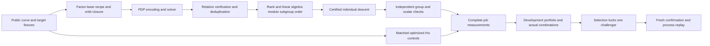

# IC autolab: development through confirmation

The repo skill is [ic-autolab](../../.agents/skills/ic-autolab/SKILL.md).
This extends the existing tournament; its archived rounds keep their original
evaluators and claims. The portable `autolab.py` is a development entry point.
`tournament.py` still owns calibrated instruction scoring, independent checking,
selection, held-out confirmation and replay.

New research admission is governed by [MEASUREMENT.md](MEASUREMENT.md).
Canonical identity and cost validators now exist, and CI checks the real base
census and explicit unknown phase ledger. The archived optimized producers now
pass [scientific admission controls](goal_20260924/producer-admission/README.md).
Both drivers now require schema-3 public-point admission and reconstruct canonical
records from the frozen source, base census and workload. They report one-target
online native time first and retain supplementary complete cold costs. Only the
prepared optimized `pair_table` / `tiny_gauss` / `subgroup_orbits` producer is
currently admitted. Other implemented engines remain proposals until their stage
adapters are qualified. The [archived IC/rho reference panel](goal_20260924/reference-qualification/README.md)
has executed; bind its audited sources/settings and the familywise confirmation
protocol before an improvement round. New contracts cannot promote on admission
evidence alone. Follow the [goal checkpoint](goal_20260924/STATUS.md).

## What was reviewed and corrected

The September 24 review found real gaps between the historical optimized source
snapshots and an ordinary checkout:

| Finding | Correction or remaining boundary |
|---|---|
| The checked-in worker lacked the descent relation required by its checker | `IndividualLogReport` now retains the actual probe coefficients and factor-base indices; the worker emits them |
| A 64-way descent batch could exceed `max_trials` | Each probe observes the cap |
| Descent could recover from a generic direct collision with `allow_direct_relation=false` | Both walking and sampled-probe paths honor that setting |
| Worker accepted only pair-table/enumeration despite existing algebra engines | Explicit F4, F5, inherited-F4, SAT native-XOR and SAT CNF adapters, with bounded solver budgets |
| Winner-only proposals and top-two selection can discard useful mechanisms | Factorial grids, explicit recombination and frozen diverse development portfolios |
| Different fixture seeds can produce the same point | New instruction rounds reserve distinct targets across all pre-replay stages; tiny exhausted groups fail preparation |
| Boundary autolab hashed source as the fixture and compared distinct target streams | Actual target-corpus identity and completion checks; unmatched streams yield `INVALID_COMPARISON` |
| Boundary IC batch totals could be compared to mean rho per-target cost | Rho batch costs are summed; partial IC timing fields are no longer a full-cost fallback |
| Linux-only tests failed on macOS before exercising the algorithms | Two Linux affinity/resource tests are explicitly capability-skipped; portable timeout/evidence tests run on both |
| Native report assumed rho had an IC matrix rank | Rho rank remains null; the failed first screen is retained |

The older boundary producers do not yet share a target-generation domain in this
checkout. They now refuse a matched comparison instead of claiming one. Use the
tournament worker for matched public-hash targets. The boundary schema checker
still checks field presence, not scientific validity or a win. A null cost or
false `all_stages_charged_same_series` must never support promotion.
Charged-stage reports without complete matched accounting are explicitly marked
`ACCOUNTING_INCOMPLETE`; they cannot be substituted for whole-process measurements.

## Pipeline and interchangeable components



The PDP is the problem being solved; Gröbner and SAT are alternative engines
inside it, not mandatory consecutive stages. Boolean-system elimination is over
GF(2). Relation-matrix elimination is over the prime subgroup scalar field.
Those matrices and costs must not be interchanged.

| Interface | Implemented choices | Evidence required |
|---|---|---|
| `config.factor_base` | Existing `FactorBaseSpec`: factor, divisor, Frobenius union, subgroup orbits, pruned, torsion-saturated | Actual points/support hash, orbit columns, rank and construction cost |
| `config.solver` | `pair_table`, `enumerate`, `f4`, `f5`, `inherited_f4`, `sat_xor`, `sat_cnf` | Same public targets and independent certificates; frozen algebra regression before performance claims |
| `groebner_degree`, `node_budget`, `conflict_budget` | Explicit bounded algebra controls | Exhaustion is incomplete, never UNSAT or negative mathematics |
| `linear_algebra` | `dense`, `sparse` with the existing filtering/Wiedemann configuration | Full rank over the subgroup field and verified column logs |
| `batch_trials`, `collection_window` | Collection/rank-check and walked-probe tradeoffs | Failed probes and repeated rank checks remain charged |
| `rho_parallel_walks` | Native screen measures 1, 8 and 32 requested walks | Same targets; implementation may cap effective width on small groups |

Recipes are curve-dependent. A union or subspace that provides too few useful
columns is a retained rejection, not grounds to weaken the checker. Orbit
samplers can exceed requested point counts. A fixed-support panel rejects any
support mismatch; a factor-base-policy panel permits different supports across
arms and still requires identical targets and stable support within each arm.

External SAT solvers, Sage/Magma F4/F5, and GPU kernels are not silently admitted
by naming them in JSON. Add a tested adapter, pin the executable and dependencies,
verify its outputs, and extend process/device accounting before scoring it.
The current instruction protocol is CPU-only. Current backends are research
implementations; their presence is not a certification of state-of-the-art speed.

## Portable bounded development

From the repository root, materialize a reviewed optimized producer and run the
bounded wiring control (Python 3.11 or newer). The two configurations change a
stopping limit; this example makes no optimization claim.

```sh
python3.11 research/ic_candidate_tournament_20260915/producer/prepare.py \
  --reference scaled --out /tmp/ic-prepared
python3.11 research/ic_candidate_tournament_20260915/autolab.py doctor \
  --source-root /tmp/ic-prepared/source
python3.11 research/ic_candidate_tournament_20260915/autolab.py screen \
  --source-root /tmp/ic-prepared/source \
  --candidates research/ic_candidate_tournament_20260915/goal_20260924/driver-admission/candidates.json \
  --out /tmp/ic-development-01 --cells 13a0,17a1 --cases 1 \
  --repetitions 1 --seed 2026092530 --timeout 180
python3.11 /tmp/ic-development-01/evaluator/autolab.py verify --round /tmp/ic-development-01
```

Preparation copies and hashes the source and compile-time dependencies before
building the copy. It freezes the executable, compiler, fixtures, candidate
registry and evaluator. Native execution uses fresh child processes, randomizes
case/repetition blocks and order within each block, and retains full stdout,
stderr, input, watchdog status and external process wall time. The checker is
outside the measured child, as it is in the historical instruction protocol.

Reissue `run --round PATH` using the **frozen** evaluator to resume. Existing
receipts are reverified. An interrupted directory without its receipt is retained
and rejected; use a new round. No automatic retry of failures occurs.
Measured resumption requires the frozen host identity. Moving an artifact to
another host permits read-only audit; start a new campaign for measurements there
so its times cannot be attributed to the previous host.
The native summary pairs each target's online repetition medians and weights
curve cells equally. `single_target_online` retains the actual point, canonical
identities, IC and rho milliseconds and their ratio; incomplete pairs have no
speedup. Whole-process cold timing is separate.
The A/A paired ratio is a noise diagnostic, never a promotion test on this path.

Use `--source-screen PATH` for a new seed/panel on an already frozen source and
executable. It checks and copies those exact bytes, including the original build
log and compiler identity; **current source changes are not used**. Omit that
argument to compile an implementation change. The native screen admits one
source tree; the instruction tournament supports separately built source arms.

For algebra proposals, the committed
[`autolab_20260924/algebra-base.json`](autolab_20260924/algebra-base.json)
describes two summands on a degree-9 linear factor base. Generate proposals with
`propose --panel algebra --base-config FILE`; factor-base proposals use
`--panel factor-base`. These generic engines need public-input scientific
instrumentation and independent stage adapters before the current drivers can
admit them. Historical screens remain replayable with their own frozen evaluator.
The [PDP outcome controls](goal_20260924/pdp-admission/PROTOCOL.md) address one
admission defect: an encoding rejection must be retained as unsupported, never
reported as a proved absence of decompositions. These controls are separate
from solver performance qualification. Generic `RelationCollector` still drops
per-attempt solver statistics; its scientific adapter must retain them before
ordinary-query status mixes can enter a comparative table.

Native screens always report `promotion_eligible=false`; operation counts, S,
floor ratios, memory caps and affinity remain null when unavailable. A/A results,
failures and every reference remain visible. These screens validate integration
and identify experiments. Unpinned laptop times do not certify improvements.
Cold means the complete worker process; OS caches are uncontrolled and repeated
process execution is not a machine-cold boot. Peak memory is not measured by this
portable path. Larger runs need the resource-capped Linux tournament.

## Preserve alternatives, test interactions

`autolab.py propose` builds bounded factorial configurations, including combined
changes before individual rankings are known. `autolab.py recombine --candidates
FILE --retain ID,ID,... --out NEW` constructs new disjoint combinations of retained
parents on the same source. It refuses to merge source edits as configuration
JSON. Each combination requires a fresh complete run; phase-wise minimum costs
are never a candidate. Retain slower distinct mechanisms too.

The instruction tournament defaults to `--selection-width 6 --exploration-slots 1`.
Development retains the instruction leader, native leader, nondominated families,
cell specialists, and a deterministic random outsider. The vector uses complete
costs across both metrics and all cells. Everything else remains in raw evidence.
The portfolio budget and seed are frozen before runs. Only one challenger reaches
confirmation, selected on separate selection targets. Do not retune on confirmation.

A finite portfolio can still miss a globally superior combination. Add new
mechanisms, scales and resource regimes in separate, predeclared panels; avoid
calling a local winner a global optimum. Deduplicate by source **and** configuration
across history, and preserve failed configurations as evidence.

## Development reference qualification

`tournament.py prepare --qualification` freezes only A/A, smoke and development.
It interleaves declared rho widths from each distinct candidate source with
all IC arms, reports actual effective widths, and keeps separate online and cold
reference leaders. Failed smoke or incomplete development runs disqualify a
reference. The mode creates no confirmation targets and cannot promote.

The [predeclared five-cell protocol](goal_20260924/reference-qualification/PROTOCOL.md)
uses widths 1, 2, 4, 8, 16 and 32 through the existing optimized-producer workflow. Dispatch `ic-producer.yml` with
`qualify_references=true`: all three producer release/control jobs must pass
before their sealed source artifacts enter the single-host qualification job.
`qualify_references.py` only orchestrates the existing tournament CLI. Audit the
result with its frozen `evaluator/tournament.py verify --round ...`; the verifier
recomputes the reference selection as well as the individual certificates.

The retained [five-cell results](goal_20260924/reference-qualification/README.md)
select `pairinv` for IC, `rho_incumbent_4` for rho cold instructions and
`rho_pairinv_4` for rho online time. Keep both rho settings. Strict replay of the
frozen floating summaries uses Linux/Python 3.12; the report documents the two
one-ULP macOS differences without relaxing exact comparisons.

Reference selection uses development data. It does not substitute for the fresh
60-target confirmation panel or the familywise rule required by the active goal.

## Promotion and reference quality

On Linux amd64 with Valgrind 3.22.0, follow [OPERATIONS.md](OPERATIONS.md).
`prepare --require-native-progress` retains the existing two-metric gate.
For a support-policy registry also declare `--comparison-kind factor-base-policy`.
Set enough `--max-processes` for the declared portfolio; exhaustion retains evidence.
Run and verify the frozen evaluator, then use `report.py` and the canonical
scoreboard. A screen, schema PASS, correct scalar, or small-field win is not an
ECC2K-130 or asymptotic result.

Before asserting a rho win, lock its reference implementation/configuration on
development data after checking packed/reference equivalence, operation ledgers,
fruitless cycles and walk scaling. Keep a sensitivity panel and compare against
stronger compatible references as they become available. Current fresh native
screens report all three widths; none is declared globally best. Use the same
hardware, automorphism eligibility, public targets and complete cost boundary.
Single-target and amortized multi-target jobs remain different protocols.

`tournament.py prepare --rho-source-root PATH --rho-config FILE` can freeze a
separately qualified reference source/configuration. It receives the same public
fixtures and runs through the same checker and cost protocol. Its executable and
source dependencies are sealed and audited alongside the candidates. Without
these options the reference remains the declared IC baseline's worker/config;
that default must not be confused with a globally best rho implementation.
When a source candidate improves shared arithmetic, check whether the improvement
also strengthens rho and qualify the updated reference before making a rho claim.

The new worker repairs correctness/admission and adds adapters. It is not the
archived optimized `koblitz_tiny_ic` winner. A performance campaign must restore
that winner and compare against its actual source, or explicitly limit its claim
to the declared baseline. Never inflate a claim by benchmarking only this general
worker against its own untuned configuration.

The initial bounded runs and retained reporting failure are recorded in
[`autolab_20260924/RESULTS.md`](autolab_20260924/RESULTS.md).

## Linux integration gate

The `IC autolab integration` GitHub Actions workflow runs on Ubuntu 24.04 amd64,
with Rust 1.94.1, the checked-in `ci/Cargo.lock`, and Valgrind 3.22.0. It runs the
harness/accounting regressions and release descent/rho regressions, then
`ci_smoke.py` executes 34 complete-solve checks: all seven PDP adapters with both
relation-LA modes on two degree-9 curves, two additional profiled IC checks, two
profiled rho checks, and two degree-13 factor-base recipes. Four profiled jobs
must have the same certificates as their native executions and exclusive dump
intervals that sum to Callgrind's collected instruction count. Each process has
a 60-second timeout and an 8 GiB address-space cap; the CI job stops at 30 minutes.
Failures and raw profiles are uploaded with the inputs and receipts.

These are fixed integration vectors. No candidate is ranked or promoted. CI
artifacts expire after 30 days; any later research claim must archive its own
evidence durably in the repository's normal evidence system. The existing dump
intervals combine some scientific stages and are not the new exclusive `T_*`
accounting schema. Before a new comparative research campaign, implement the
user's canonical curve/candidate/workload/run manifests and exclusive phase
export; missing phase costs keep the end-to-end total and speedup unknown.
Historical evidence and its original identifiers remain unchanged.

## Bounded improvement round

The accepted qualification is merged in [PR 765](https://github.com/aburan28/crypto/pull/765).
Use Python 3.12 and the [frozen improvement protocol](goal_20260924/improvement/PROTOCOL.md)
for the goal campaign. [round1.json](goal_20260924/improvement/round1.json) records
16 complete pipelines and their hypotheses. The Linux workflow `ic-improvement.yml`
runs candidate controls on PRs; its explicit `run_round_one=true` dispatch invokes
`run_improvement.py --out NEW_DIRECTORY` through the existing tournament. Inspect
workflow history first: a duplicate dispatch or job retry is not a new round.

The primary display is one-target online native time; cold instructions and cold
native time remain additional promotion gates. Confirmation uses 72 fresh targets
and three process repetitions, with exact historical point exclusion and a nominal
familywise bootstrap rule across three attempts. A confirmation or replay result
cannot tune the same challenger. Preserve both cold and online rho references and
retain all failed or incomplete runs. [Round one](goal_20260924/improvement/round1/README.md)
completed all 3,243 measured pairs and retained the incumbent. Its evidence merged
in [PR 782](https://github.com/aburan28/crypto/pull/782). Two attempts remain; do not
redispatch round one or use its confirmation/replay results to tune candidates.
