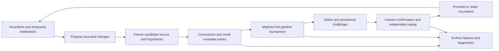

# Index-calculus candidate tournament

Status: implementation complete; three further tournaments finished and audited
on 2026-09-16. [The continued-operation results](campaign_20260916/RESULTS.md)
confirm a candidate below matched rho in both metrics on complete cold batches of
16 targets: 0.7195 times its profiled instructions and 0.7796 times its native
process time, with confirmation and replay passing the predeclared parity rule.
The latest measured single-target candidate remains at 3.04 times rho's
instructions and 1.52 times its native time on the tested small Koblitz panel.

All 4,704 new profiled trials and their paired native runs verified. The
[original pilot](runs/round-0002/REPORT.md), every intermediate comparison, and
unsuccessful build attempts remain recorded. See [OPERATIONS.md](OPERATIONS.md)
for commands, measurement limits, source candidates and installed operating skills.
The [committed evidence guide](evidence/README.md) explains archive restoration,
independent audit, and the distinction between frozen candidate sources and current
library defaults. The sections below preserve the accepted research design.

## Recommendation

Build a bounded experiment loop that generates concrete algorithm changes, runs
every viable candidate through complete ECDLP recovery, and promotes only a
reproducible improvement on unseen inputs. Keep the incumbent when challengers
fail the gates. Use the existing IC workflow and boundary autolab as the execution
and evidence layers.

The initial scope is this repository's elliptic-curve index calculus, beginning
with tractable Koblitz/binary fixtures. Prime-field elliptic curves and other
extension-field curves need their own matched panels. Multiplicative finite-field
discrete logarithms are a different campaign.



## 1. Reuse the existing pieces and close the gaps

This section preserves the initial workspace survey. References marked local
describe separate uncommitted research present at design time; those prototypes
are not dependencies of this tournament or included in this PR.

| Existing component | Reuse | Required extension |
|---|---|---|
| [IC workflow](../../docs/ic/README.md#running-the-pipeline-as-a-resumable-workflow) | Selection, collection, factor-base logs, descent, certificates and matched rho | Candidate adapters and complete exclusive cost accounting |
| [Factor-base comparison](../../docs/ic/README.md#comparing-factor-bases) | Fresh child processes, matched fixtures, holdouts and preserved failures | Compare complete algorithm configurations; its current winner is a bounded runtime observation |
| [Boundary autolab](../sat_factor_base_review_20260908/autolab/README.md) | Locks, immutable run directories, pinned contracts, schema checks and replay | Candidate registry, multi-candidate scheduler and deterministic promotion rule |
| [Frozen WDSat regression](../index_calculus_baseline_20260914/regression/README.md) | Accepted `baseline_v2`, 60 inputs, two configurations, three repetitions | Fresh baseline/candidate comparisons plus independent holdouts for each iteration |
| Continuous runner (local design reference) | Supervision and retained attempt history | It currently repeats a fixed measurement; algorithm generation is a new capability |
| Model-operated harness (local design reference) | Structured proposals and execution receipts | Its documented mode does not edit algorithms; a new candidate workspace and implementation step are needed |

The accounting gap is concrete: [the IC report](../../src/bin/ic.rs) currently
sets `hybrid_runtime.total_common_operations` to null, and
the local `scripts/ic_hybrid_e2e.py` prototype records integration
correctness without an operation speedup. Existing timings are useful diagnostics;
they cannot fill these missing totals.

## 2. Freeze the experiment before generating candidates

The evaluator owns a versioned campaign contract, fixture sets, checkers, resource
limits and promotion rule. Candidate implementations cannot edit these during a
round. The [example protocol](protocol.example.json) is a design template, not a
runnable campaign: source, suite and calibration hashes must first be filled.

Freeze:

- The actual incumbent source tree, executable, dependencies and compiler flags.
  The workspace currently contains extensive uncommitted work; a commit hash alone
  is insufficient. Snapshot relevant tracked and untracked source into an isolated
  build and hash it. Each candidate receives its own derivative snapshot.
- Curves, field representations, subgroup orders, generators, public targets,
  algorithm seeds, budgets and target counts. Store expected scalars separately.
- The incumbent IC algorithm and a healthy Pollard-rho reference using the same
  eligible automorphisms, instances and resource envelope.
- Independent development, selection and final-confirmation sets. A target's
  hidden generation seed must not be the public algorithm seed.
- A fixed common-operation unit, its calibration, cost ownership by phase, and
  applicable mathematical boundaries. Missing measurements stay null.

For solver or implementation changes, match factor bases, permitted decompositions
and summand count exactly. For factor-base or summand-policy research, declare those
as experimental variables in a separate versioned panel. Include matched controls
within each fixed-support cell; do not label moving to an easier cell as an
improvement against an unchanged floor. Every full-strategy comparison still solves
the same public DLP workloads and charges the selection policy's own work.

## 3. Drive candidates from hypotheses

Start each round with at most eight proposals. Each proposal names its parent,
changed component, mathematical mechanism, affected cost phases, predicted gain,
memory impact, falsification condition, implementation diff and source hash.
Reject duplicate source/configuration hashes. Use failed experiments to prevent
repeated proposals with the same mechanism and parameters.

First implement individual changes. Combine two winners only after their separate
effects are measured, then rerun the combined algorithm from beginning to end.

| Candidate family | Concrete first experiment | Evidence required |
|---|---|---|
| Factor-base policy | Existing divisor/union choices, pruning and saturation, selected for total setup plus solve cost | Coverage, independent columns, selection cost, complete solves |
| Pair-table decomposition | Existing table representations, probe order and memory layouts | Full table construction, lookups, verification and retained bytes |
| Semaev encoding | Direct/chained systems and reusable target-independent structure | Equivalent decomposition coverage, encoding cost, solving, lifting |
| SAT | XOR reasoning, valid symmetry constraints and bounded preprocessing | Natural targets, certified controls, actual work counters, lifted relations |
| Groebner/hybrid | Variable-split budget, F4 scheduling and preprocessing depth | Every failed split, matrix construction, elimination and extraction |
| Collection and scalar linear algebra | Rank-check frequency, collection batch size, filtering and dense/sparse thresholds | Fresh rank, complete reconstruction, retry work and final scalar |
| Execution placement | CPU versus batched GPU reduction or explicit cache policy | Cold setup, transfers, actual computation, cache population and verification |
| Structural exploration | Wider bases, alternative summand counts or justified partial-relation methods | A viable counting bound and an implemented complete recovery path |

These are experiment directions, not claims that existing optimizations are new.
For example, auxiliary-variable encodings have a published motivation in the
tradeoff between polynomial degree and variable count; their total cost here must
be measured. [Karabina, Point Decomposition Problem in Binary Elliptic Curves](https://eprint.iacr.org/2015/319).

Allocate roughly 80% of the development budget to current bottlenecks and 20% to
plausible structural alternatives. Preserve a scaling lane so small-instance
overhead does not automatically eliminate an algorithm intended for larger inputs.

### A cheap mathematical screen

For a fixed signed base of B points and m summands, the number of unordered
multisets is `M = binomial(B + m - 1, m)`. Their images cover at most M targets.
For independently uniform nonzero targets in a subgroup of order r:

```
p_success <= min(1, M / (r - 1))
expected queries to one success >= 1 / p_success_upper_bound
```

This is a counting bound, not a measured yield or a common-operation total.
Collisions and inadmissible sums can reduce coverage further. Do not multiply by
the Frobenius orbit size when B already includes those points. Do not assume every
successful relation adds rank. Adaptive/nonuniform target policies need their own
analysis; this screen does not apply unchanged to them.

Use it to reject infeasible parameter choices before long experiments. In
particular, the local degree-131 report (`research/koblitz_131_20260915/README.md`) already
identifies a severe coverage barrier for its small base. Faster SAT alone does
not establish that the complete algorithm becomes competitive.

## 4. Run each candidate end to end

Every buildable candidate first gets a bounded small complete-DLP attempt.
Correctness failures or exhausted budgets remain recorded outcomes. Candidates
that pass move through progressively larger matched workloads; a decomposition
microbenchmark alone never makes a candidate eligible to win.

| Gate | Workload | Pass condition |
|---|---|---|
| A: integrity and correctness | Independent small-field oracle, exceptional/repeated summands, malformed relations, and small complete DLPs | Matching semantics, valid relations and recovered scalars |
| B: frozen regression | Full 60-input WDSat suite, both configurations, three repetitions, fresh reference and candidate; independent holdouts | Compatible counters/certificates and retained comparison, including regressions |
| C: development tournament | Paired complete solves at increasing sizes, with a fresh cold process per run | Every required target solved, all phases accounted for, resource caps respected |
| D: selection | Fresh curves/targets and matched reruns of the shortlist | Select one provisional challenger using the frozen objective |
| E: confirmation | Previously unseen inputs, incumbent and challenger, independent replay | Promotion threshold and all admission requirements pass |

An incompatible encoding or curve family uses a documented equivalent suite under
the [parent accounting contract](../index_calculus_baseline_20260914/ec_index_calculus_contract.json),
not invented WDSat conflict conversions. Keep the algebraic-only rejection control:
a polynomial solution that cannot lift to curve points contributes zero relations.

Use four or more baseline-calibrated sizes with nontrivial relation matrices for
scaling. Start with 30 independent targets per eligible curve/cell and three timing
repetitions; use 100 targets for confirmation, subject to a declared campaign
budget. A repeated run is not a new independent instance. The parent contract's
curve-diversity requirements also apply. Koblitz's two coefficients do not provide
three independent curves at one degree: narrow the claim explicitly when that
gate cannot be met, and use separate panels for broader families.

The measured path is:

```
selection -> field/base/table setup -> target generation -> encoding
-> preprocessing and solving, including failures -> extraction and lifting
-> point verification -> canonicalization and filtering
-> relation matrix -> factor-base log certification
-> individual descent -> final scalar recovery and verification
```

Some algorithms interleave these stages. Record exclusive costs, not a fabricated
sum of nested timers. The relation matrix is over the subgroup scalar field even
when the polynomial solver's matrices are over F2. Require the rank/recovery
conditions of the chosen algorithm and verify every completed answer as `[d]G=Q`.

The evaluator gives candidates public curve data, G, Q and algorithm seeds.
Expected scalars and decomposition witnesses belong to the independent checker.
Current `known_log` fixtures need an adapter that keeps that value outside the
candidate-facing input. Exhaustive diagnostic-oracle work is charged in the
validation workload; use the same declared checking policy on both arms.

Retain TIMEOUT, OOM, ERROR, invalid relations and incomplete recovery separately.
No successful-subset comparisons. If a baseline cannot finish a size, that cell
cannot establish a measured speedup; it remains a feasibility diagnostic.

## 5. Price the whole algorithm

Follow [AGENTS.md](../../AGENTS.md): operation cost is the headline; wall time and
memory describe practicality. Define `C_A(i,K)` as the total calibrated common
operations for algorithm A on instance i and a batch of K targets. Setup and
precomputation occur once in that batch; every target's remaining work is charged.

```
Cold score:                  S_A(i,1) = C_A(i,1) / sqrt(r_i)
Batch score per target:      S_A(i,K) = C_A(i,K) / (K * sqrt(r_i))
Speedup against incumbent:   C_incumbent(i,K) / C_A(i,K)
Ratio to matched rho:        C_A(i,K) / C_rho(i,K)
```

Report cold K=1 first, with a separate K=100 panel for amortized use. Each panel
includes the incumbent, every evaluated variant and rho in one common unit,
correctness/completion counts, applicable floor ratios and the repository's
advance/engineering/relabelling/accounting classification.

Implementation requirements:

- Count actual work at one exclusive accounting layer. Do not add curve calls to
  the field operations inside those calls, or replayed logical counters to work
  that a cache avoided. Price all workers and subprocesses.
- Freeze documented conversions for heterogeneous primitives. SAT conflicts,
  matrix dimensions and relation counts alone are not total common operations.
- Keep count/yield bounds in their original units until a justified conversion
  exists. Record each floor's assumptions; no universal bound is assumed for
  every candidate family. An apparent violation triggers a bound/accounting audit.
- Measure wall/CPU time, total peak host/device memory and transfer/storage costs.
  Run timed comparisons in randomized paired order on matched resources without
  competing benchmark jobs. Report any remaining interference.
- Empty candidate caches and use new run directories for cold measurements.
  A resumed workflow is not a cold run. Warm runs explicitly pay for population
  and state the target count. Keep research/search compute in a campaign ledger;
  also charge any selection or tuning the deployed algorithm performs per input.

Missing phase costs or conversions make a row diagnostic-only and ineligible for
operation-cost promotion. GPU placement may win a separate runtime comparison
without changing the operation count; label that conclusion precisely.

## 6. Pick the winner by a frozen rule

Default objective: lowest cold complete-DLP common-operation cost within a fixed
memory budget. Do not mix cold and warm workloads or curve families into an
unstated universal score.

1. Admit only candidates that complete the exact required workload correctly,
   meet resource caps, have fully priced phases and pass independent verification.
2. For each candidate, compute paired cost ratios to the incumbent. Aggregate
   repetitions within an instance first; use a geometric mean with predeclared
   equal weights across the selected size/curve cells.
3. Rank on the selection set and lock one provisional challenger. Use a paired
   confidence analysis that respects shared curves and precomputation batches;
   timing repetitions are not independent samples. Retain per-cell results.
4. On untouched confirmation data, require **at least 20% lower aggregate total
   cost** (`candidate/incumbent <= 0.80`, equivalently speedup >= 1.25), a 95%
   paired interval whose upper endpoint is below 1, and no cell's aggregate cost
   more than 10% worse. These are proposed practical thresholds to freeze before
   the campaign, additional to existing repository admission requirements.
5. Independently replay the frozen result. Promote only after it agrees. A runtime
   claim additionally needs the repository's paired hardware/timing evidence.

If the interval is too wide, the result is inconclusive. If no challenger passes,
retain the incumbent; this is not a claim that it is globally optimal. If accounting
is incomplete, report `winner = null` and the missing evidence. Winning within IC
and beating rho are separate verdicts; rho must actually finish and verify too.

Do not try successive challengers on the same exposed final set until one passes.
After a failed confirmation, that set becomes development evidence and the next
round gets fresh confirmation inputs. Fit exponents only over at least four sizes,
including every phase, and mark extrapolations separately from measurements.

## 7. Controller and deliverables

The implementation should add a small controller around the existing autolab:

```
propose -> implement -> freeze -> validate -> benchmark -> select
        -> confirm -> replay -> promote_or_retain
```

The proposal generator reads development evidence and proposes a source patch plus
manifest. The controller builds that patch in isolation. The fixed evaluator runs
it, verifies outputs and computes the decision. The generator never selects its
own winner or changes the score after observing a result.

Each round retains:

```
round-0001/
  contract.json, source-manifest.json, fixture-manifest.json
  candidates/<id>/manifest.json, patch.diff, build.json
  runs/<id>/<cell>/<seed>/<repetition>/
    raw.json, stdout.txt, stderr.txt, phase-costs.json, certificates/
  comparison.json, confirmation.json, replay.json, decision.json
  report.md
```

Stop at the fixed candidate/compute budget, or after three rounds without a
qualified promotion. Keep unsuccessful candidates and the incumbent's history.
Every completed measurement round updates the research table and canonical
[scoreboard](../../docs/index-calculus-scoreboard.html); an accepted ledger record
also updates [both boundary-ledger files](../../docs/ic/BOUNDARY_TARGETS.md).

## Implementation order

1. Freeze a real baseline snapshot and complete cost instrumentation. Validate
   accounting on small complete solves and the matched rho reference.
2. Add candidate adapters, the registry and controller. First run an A/A control:
   identical binaries must have compatible outcomes/counters and no spurious
   promotion. Exercise timeout, bad-certificate and missing-cost rejection paths.
3. Run the first bounded round: incumbent, rho and six single-change challengers
   drawn from measured bottlenecks. Expand only candidates with completed E2E data.
4. Confirm and replay the provisional winner; publish the evidence-backed decision
   locally in the canonical research artifacts. Begin another round from the
   promoted incumbent, or retain it with the failed hypotheses recorded.

The controller, independent checker, instrumented worker and operating skills are
implemented. The bounded first campaign evaluates complete cold solves in an
explicit guest-instruction unit; arithmetic-complexity and broader-family claims
remain outside that implementation metric. See [OPERATIONS.md](OPERATIONS.md).
