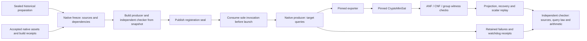

# Native prepared SAT control

This continues the full source-bound F4/F5 and SAT one-target goal after
[PR #1262](https://github.com/aburan28/crypto/pull/1262). It replaces the prepared
SAT controller, process transport, registration and audit path with Rust.
Historical Python controllers and all consumed registrations remain closed.
There is no new cross-method measurement in this implementation PR.

## Question and limits

Hypothesis: the retained native exporter and CryptoMiniSat can recover the
already disclosed synthetic n17 target through a complete source-checked
three-summand decomposition, with a newly registered maximum of one million
conflicts per query and eight target attempts. A complete control requires
independent reconstruction of its query law, validated native model and group
witness, cofactor projection, recovered scalar and retained timing ledger.
An exhausted budget, timeout, invalid/nonlifting model, transport failure or
interruption remains a failure or inconclusive cell; it is never a win.

The target is `[52411,72106]`. Its answer was disclosed in the closed F5
development control. It is a training input, never a holdout. The scalar is
absent from producer inputs. The committed `control-template.json` fixes the
proposed query seed, exporter nonce, limits and point. **This template is not an
executable registration.** No native SAT search has run under this protocol.

The accepted target-independent SAT preparation has whole-certificate SHA-256
`91856ab78550436d3f668367f9aebd9e2c0604bd64b1472d9d19ec318e2b144e` and mathematical
state `ICP1hedbff76da644`. Its original controller was Python. The native checker
reconstructs all 149 ordinary attempts, 37 verified relations, 106 complete
geometric negatives and six inconclusive outcomes, full rank 29 and all 29
column logarithms before launch. These are historical yield records, not a
measurement of new native ordinary-query yield. Geometry has 63 points;
cofactor projection has 62 usable points and 29 sign/Frobenius columns.

There is no matched rho/incumbent arm, calibrated operation count, A/A spread,
newly sampled target or speedup. Those fields remain unknown. This is a
correctness and transport control, not an optimisation result. Its boundary
question is admission: one independently verified completion within the frozen
limits. If that fails, preserve the terminal outcome and keep family admission
pending. No retries, replacement seeds or extended budgets belong to this
registration. All three historical tournament confirmation sets stay closed.

## Architecture



The producer uses the library's native curve arithmetic. The checker uses the
existing independent shift-and-add curve implementation. It independently
reproduces rand 0.8's seed expansion, ChaCha12 and multiply-high rejection
sampling; it does not trust recorded query coefficients. SAT models must assign
every expanded variable exactly once and terminate correctly. Both source ANF
and signed CNF/XOR equations are checked. Source x-coordinates must lift to an
actual three-point group sum; a satisfiable Boolean system alone is insufficient.
Claimed geometric negatives are checked by complete pair-complement search,
including repeated indices, killed torsion and identity pair sums.

The control accepts only the disclosed n17 point and the accepted macOS ARM64
native assets. Other hosts can run arithmetic and transport tests. They cannot
execute these native solver binaries through a fallback. New hardware needs a
separate source build, compatibility checks and registration.

## Source and process custody

Freeze retains the complete repository `src` tree, Cargo manifest and lockfile,
required compiled-in JSON/SQL resources, offline vendored Cargo dependencies,
compiler/Cargo identities, flags, environment and build logs. It builds the
producer and checker from that snapshot with an empty Cargo home and explicit
compiler. It retains the accepted exporter/CryptoMiniSat/Cadical/Cadiback native
archive, original sources and build receipts. The accepted outer archive is
SHA-256 `a1fd5bd49c80076f3b64fd5cb51d891b278afde765b4d3e39853692ac318bd96`;
the fourteen extracted regular files and their contents are inventoried.
No ambient exporter or solver can be selected.

The actual registration hashes all immutable sources and binaries, config and
preparation. Publish its seal and durable capsule before dispatch. Startup and
completion recheck the full immutable tree. Each native child also binds the
helper and actual role binary, query, argv, environment, stdout, stderr, exit,
deadline and source files before/after solving. Receipts use create-only writes;
file and parent-directory synchronization protects the one-use launch claim.

The controller has its own process group. An inner helper inherits that group
until the parent fsyncs its PID ledger and sends `GO`; it then creates a separate
group and execs only the accepted exporter or solver. Per-child cancellation can
continue the next failed attempt. Outer cancellation kills the controller group
and every still-active escaped group in the durable ledger. Normal exits also
terminate descendants. A process group that cannot be confirmed drained cannot
pass source-bound execution admission.

Registration and worker-start claims are create-only. A crash before the first
query still consumes the invocation. There is no resume route. Retain partial
progress and raw files if an interruption prevents a full producer report; its
online total and scalar remain unknown.

## Accounting and promotion boundary

The online control timer starts after preparation validation/loading, target
validation and sampler initialization. All target-dependent point queries,
native exports/solves, source gates, failed attempts, model/lift checks, recovery
and producer scalar replay belong to exactly one of these five phases:

`target_query + target_pdp + target_relation_check + target_descent + target_recovery_check`.

Their integer nanosecond sum must equal the complete attempted interval. Only
a producer-verified completion gets `online_wall_ns`; incomplete controls retain
`online_attempt_wall_ns` and a null completed online time. Native launch time
inside each target-dependent exporter/solver attempt is included. Launch/loading
of the controller and reusable preparation are outside the online interval.

Independent external replay has a separate timer and is **outside** that online
interval. Consequently this control cannot establish the primary independently
verified one-target online speedup. Its uncalibrated wall times are diagnostics.
Candidate/run identity and fresh-paired promotion remain pending. A development
audit may admit complete source-bound execution without admitting a tournament
winner. Planted retained models used in tests do not establish solver search,
ordinary-query yield or family performance.

## Commands and next gates

Build/test through native `isolated_bench busy`, using a fresh output path. The
repository ignores its development Cargo lockfile, so generate it before a clean
`--locked` build. These example commands do not dispatch science:

```sh
rustc --edition 2021 src/bin/isolated_bench/busy_unix.rs -o /tmp/ic-native-busy
/tmp/ic-native-busy busy -- cargo generate-lockfile
/tmp/ic-native-busy busy -- cargo test --locked --lib prepared_sat_control
/tmp/ic-native-busy busy -- cargo test --locked --bin icprog --bin prepared_sat_worker
```

After the implementation is accepted, freeze with `icprog sat-control-freeze`
using this template, explicit Cargo/rustc paths and a new capsule directory.
Prepare the exact locked dependency cache with native `cargo fetch --locked`
first; offline vendoring includes optional and other-platform packages too.
Commit/publish its **actual** source inventory, build receipts and registration
seal before dispatch. Use the frozen `immutable/bin/icprog sat-control-execute`
with that exact `--registration-sha256` and a new execution directory. Then use
the frozen `sat-control-audit` with a new report path; audit never launches search.
Publish the original terminal outcome and independent report in a follow-on PR,
including failures. The template and implementation controls do not satisfy this
execution gate.

Remaining full-goal gates: actual separately sealed native SAT control; complete
native F4/F5 control path and new ordinary-yield evidence; reconciled exposure
union; a new candidate/workload protocol; frozen strongest compatible rho and
incumbent sources; hardware rebuild, calibration and resource/order registration;
fresh paired runs with uncertainty and retained incomplete cells. New cross-method
measurements must use native `ecbench` (AGENTS.md §12). Its current cold interval
does not implement the required primary IC online window; add that and complete
independent verification before any online comparison. Retain diverse complete
pipelines for recombination. Local stage winners are not a global optimum.
