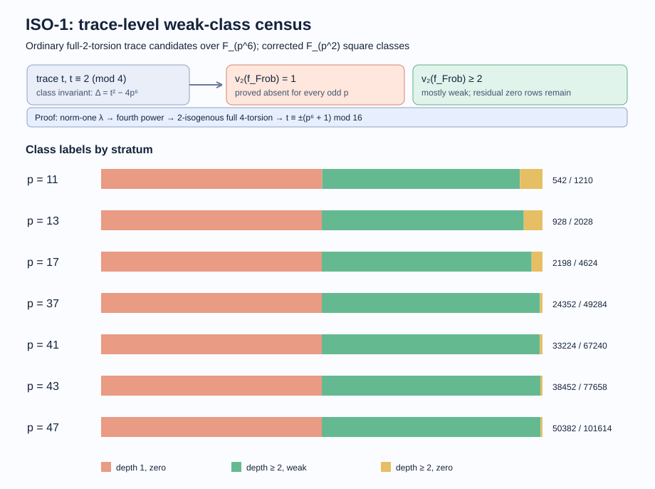

# ISO-1 weak isogeny classes: trace census and 2-adic obstruction (updated 2026-10-08)

## Requested question and scope

The requested base primes are **p = 37 through about 200**, with
q = p² and curves over F_(q³) = F_(p⁶).  The requested result is a label for
every ordinary full-2-torsion isogeny class at every such p, followed by a
formula that can replace both the cover-branch reach census and random
seed grinding. This round completed **p = 37, 41, 43, and 47** in that range
and used p = 11, 13, 17 as development and held-out checks. It also proves
a necessary trace condition for every odd base prime. The remaining primes
and a necessary-and-sufficient formula remain open.

| Requested item | Status | Evidence or gap |
|:--|:--|:--|
| Every trace at p = 37, 41, 43, 47 | Measured, probabilistic point-count assignment | [p37](p37_twist_derived.csv), [p41](p41_twist_derived.csv), [p43](p43_twist_derived.csv), and [p47](p47_orbit.csv) trace rows |
| Every trace at p = 53 through about 200 | Not completed | Even the exact sixfold orbit quotient leaves hundreds of millions of point counts near p = 200 |
| Fit 2-splitting, Frobenius-order 2-depth, trace residues, class-number parity | Completed on p = 11, 13; tested on p = 17, 37, 41, 43, 47 | [held-out p37 fit](fit_p11_p13_to_p37.txt), [p41 fit](fit_p11_p13_to_p41.txt), [p43 fit](fit_p11_p13_to_p43.txt), [p47 fit](fit_p11_p13_to_p47.txt) |
| Prove a class obstruction | Verified theorem | The norm-one parameter is a fourth power; the 2-isogenous Legendre curve has full rational 4-torsion; see proof below |
| Actual endomorphism-ring 2-volcano levels | Bounded, not individually measured | The proof below places every ordinary weak curve at least one level above the deepest possible level; exact levels need curve-specific endomorphism orders |
| Exact criterion replacing reach census and seed sieve | Not established | The proved necessary condition has 290, 396, 376, and 424 false positives at p = 37, 41, 43, 47; see counterexamples below |

## Field, representatives, and trace assignment

The field implementation is `F_p[u]/(u²-w)` followed by
`F_(p²)[theta]/(theta³-s)`, with the first nonsquare `w` in F_p and the first
noncube `s` in F_(p²) chosen by the code in `jv_cover.rs`.  A weak curve is
`y² = x(x-alpha)(x-sigma(alpha))`, where `sigma` is the p²-Frobenius and
`alpha` is outside F_(p²).  Translation and F_(p²) square scaling leave
`2q²+2q` normalized representatives.  For p = 37 this is **3,751,060**.
The run evaluated one representative from each quadratic-twist pair and
derived the opposite trace, so it made 1,875,530 point-count calls.  A
full four-branch run and the twist-derived run agreed byte for byte at
p = 13; at p = 7 two individual point-count assignments failed independent
square-table audits: provisional [346 became -686](p7_trace346_audit.txt)
and [554 became -430](p7_trace554_audit.txt).  The trace labels are consequently
**probabilistic computational labels**, not independently certified
cardinalities of every representative.  The exact normalized representative
count and the twist trace identity are algebraic.
One positive p = 11 witness at provisional trace 38 had
[exact square-table trace 38](p11_trace38_audit.txt); its fresh
twist-derived run agreed with the full run on all weak versus zero labels.
An independent [PARI/GP `ellcard` control](gp_p37_validation_receipt.txt)
generated 100 distinct traces from norm-one Legendre parameters at p = 37;
all 100 lie in the Rust census's positive weak-trace set. The same control
placed [3,952 distinct p = 41 and 4,043 distinct p = 43 traces](gp_p41_p43_validation_receipt.txt)
from 5,000 samples per prime in their positive sets. At p = 47, another
[5,000 GP samples gave 4,200 distinct positive traces and zero missing](gp_p47_validation_receipt.txt).
These test positive labels through a different
point counter and field model, while leaving zero labels dependent on the
exhaustive Rust enumeration.

The pre-existing census used `w` from F_p as its supposed nonsquare in
F_(p²).  Every nonzero F_p element is a square in F_(p²), so that run
duplicated one branch and omitted the other.  The source now selects an
actual F_(p²) nonsquare.  Prior p = 7–31 weak-class counts and reach
fractions are historical and require correction; p = 23 and 31 have not
yet been rerun with the corrected representative set.

The trace `t = p⁶+1-#E(F_(p⁶))` identifies the F_(p⁶) isogeny class.
The CSV includes every `t ≡ 2 (mod 4)` in the Hasse interval, including
zero-witness rows.  The `trace_status` column separates ordinary traces
from boundary and p-divisible traces.  These are class diagnostics, not
individual curve or DLP subgroup manifests, so no `IC1` candidate or
speedup measurement is asserted.

## Measured results

| p | q | normalized weak representatives | ordinary trace rows | weak rows | weak rows with v₂(f_pi)=1 | zero rows with v₂(f_pi)>=2 | random full-2 curves in weak class (n=4,000, Wilson 95%) |
|---:|---:|---:|---:|---:|---:|---:|:--|
| 11 | 121 | 29,524 | 1,210 | 542 | 0 / 606 | 62 / 604 | 2,363 / 4,000 = 0.5908 [0.5754, 0.6059] |
| 13 | 169 | 57,460 | 2,028 | 928 | 0 / 1,014 | 86 / 1,014 | 2,324 / 4,000 = 0.5810 [0.5656, 0.5962] |
| 17 | 289 | 167,620 | 4,624 | 2,198 | 0 / 2,312 | 114 / 2,312 | 2,480 / 4,000 = 0.6200 [0.6048, 0.6349] |
| **37** | **1,369** | **3,751,060** | **49,284** | **24,352** | **0 / 24,642** | **290 / 24,642** | **2,433 / 4,000 = 0.6083 [0.5930, 0.6233]** |
| **41** | **1,681** | **5,654,884** | **67,240** | **33,224** | **0 / 33,620** | **396 / 33,620** | **2,501 / 4,000 = 0.6253 [0.6101, 0.6401]** |
| **43** | **1,849** | **6,841,300** | **77,658** | **38,452** | **0 / 38,830** | **376 / 38,828** | **2,478 / 4,000 = 0.6195 [0.6043, 0.6344]** |
| **47** | **2,209** | **9,763,780** | **101,614** | **50,382** | **0 / 50,808** | **424 / 50,806** | **2,528 / 4,000 = 0.6320 [0.6169, 0.6468]** |

The [p = 37 run receipt](p37_run.txt) and CSV sum to 3,751,060 representative counts. Its 50,654
candidate rows include 1,370 nonordinary or boundary rows, none with an
observed weak representative. The p = 41 and 43 CSVs likewise sum to their
exact representative counts and contain 68,922 and 79,508 Hasse candidate
rows. Their [run receipts](p41_p43_run_receipt.txt) retain hashes and commands;
the original process wall-time output was lost when the prior chat session
ended, so no p = 41 or 43 duration is claimed. The p = 37 census took **1,106.807 s**
with `RAYON_NUM_THREADS=4`, and recorded **563,856,133,786** charged F_p
multiplications.  This is a class-label diagnostic on a contended host;
it is not an isolated CPU speed comparison.

The [p = 47 orbit run](p47_orbit_run_receipt.txt) counted **813,649** orbit
representatives, weighted to **9,763,780** normalized weak representatives,
and wrote all 103,824 Hasse candidate rows. Its 2,210 nonordinary or
boundary rows include exactly two positive rows: the special size-two
orbit gives two representatives at each Hasse-boundary trace
`t=±207646=±2·47³`. An [independent GP `ellcard` calculation](gp_p47_special_trace.txt)
confirms that boundary trace. These two rows are outside the ordinary
class fit.

The two denominators differ: **24,932/49,284 ordinary trace rows (50.59%)**
have no observed weak representative, while **1,567/4,000 sampled random
full-2-torsion curves (39.18%)** land in those zero rows.  Larger
isogeny classes carry more sampled curves, so the class fraction and the
curve-weighted reach fraction should not be interchanged. At p = 47,
51,232/101,614 ordinary rows (50.42%) have no observed weak representative,
while 1,472/4,000 sampled curves (36.80%) miss the positive set.



The [editable visual source](../../examples/iso1_class_census.rs) reads
the seven census CSVs. The bars show complete observed trace counts, so
sampling intervals do not apply to them.  The 4,000-curve reach fractions
above do have binomial sampling intervals.

## A proved class obstruction

Let `K = F_(p⁶)`, `q=p²`, and `Q=p⁶`. For any weak curve
`E_alpha: y²=x(x-alpha)(x-alpha^q)`, put `lambda=alpha^q/alpha`.
Its norm from `K` to `F_q` is one, so its multiplicative order divides
`q²+q+1`, an **odd** number. Consequently `lambda=mu⁴` for some
`mu` in `K`. Up to a quadratic twist, `E_alpha` is the Legendre curve
`L_lambda: y²=x(x-1)(x-lambda)`.

The rational 2-isogeny of `L_lambda` with kernel `(0,0)` has target

`L'_lambda: y²=x[x²+2(1+lambda)x+(1-lambda)²]`.

Writing `s=mu²`, its three roots are `0, -(1+s)², -(1-s)²`.
Every root difference is a square in `K`: the remaining difference is
`4s`, up to sign, and `-1` is a square since `Q≡1 (mod 4)`.
Thus **all of `L'_lambda[4]` is rational**, so
`16 | #L_lambda(K)`. Isogenous curves have equal point counts, and
quadratic twisting negates the trace. Every weak trace therefore satisfies

`t ≡ ±(p⁶+1) (mod 16)`.

For ordinary `t≡2 (mod 4)`, this is arithmetically equivalent to
`(t/2)²≡p⁶ (mod 16)`, to `t/2≡±p³ (mod 8)`, and to
`v₂(f_pi)≥2` where `t²-4p⁶=f_pi² D_K` and `D_K` is fundamental.
The field and class trace determine `f_pi`; it is the **Frobenius-order**
conductor, not a particular curve's endomorphism-ring conductor or its
2-volcano level. The theorem proves absence for every ordinary depth-1
class at every odd base prime. It explains the roughly one-half zero-row
share without treating weakness as independent of class.

There is also a curve-level consequence. On the 2-isogenous Legendre
neighbor with rational full 4-torsion, Frobenius `pi` acts as the identity
on the 4-torsion, so `(pi−1)/4` is an endomorphism. Its generated order has
conductor `f_pi/4`; hence the neighbor's endomorphism conductor has
2-valuation at most `v₂(f_pi)−2`. A quadratic twist changes `pi` to `−pi`
and preserves the endomorphism order. Across a degree-2 isogeny the
2-valuations of the two endomorphism conductors differ by at most one:
the dual isogeny gives `2 End(E') ⊆ End(E)` and the reverse inclusion.
Thus every **ordinary weak curve** has
`v₂(f_End(E)) ≤ v₂(f_pi)−1`. It cannot lie at the deepest possible
2-volcano level. This is a proved bound on weak curves, not a measured
level for each representative or a sufficient criterion for a class.

The converse is false. The held-out p = 37, 41, 43, 47 tables have respectively
290, 396, 376, 424 high-depth zero rows and no low-depth weak rows. The p = 37
classifier has 24,352 true positives, 290 false positives, zero false
negatives, and 24,642 true negatives (99.41% of rows labeled correctly).
The p = 47 held-out classifier has TP 50,382, FP 424, FN 0, and TN 50,808
(99.58% of ordinary rows correctly labeled).
Splitting of 2 and maximal-order class-number parity fit substantially
worse; combining those variables and a finer 2-adic residue did not repair
the false positives.

## Exact orbit quotient and a trace-count audit

Hilbert 90 identifies normalized `alpha` modulo `F_q^*` with the norm-one
parameters `lambda=alpha^q/alpha`, excluding `lambda=1`. The Legendre trace
is unchanged by `lambda ↦ lambda^q` and `lambda ↦ lambda^−1`: the first is a
field automorphism, and the second gives an isomorphic Legendre curve
because every norm-one `lambda` is a square. The twist-derived census
already counts both trace signs. The group generated by these two
operations has orbits of size six, except the two nontrivial cube roots of
unity in `F_q`, which form one orbit of size two. This follows from
`gcd(q−1,q²+q+1)=3` for `q=p²`, `p>3`.

The new `--orbit-quotient` mode selects one `lambda` per orbit and weights
its trace by the orbit size. Its p = 13 CSV was **byte for byte identical**
to the existing twist-derived census, using **4,789 rather than 28,730**
point-count calls. The p = 37 orbit CSV was also byte for byte identical
to the prior direct CSV, with **312,589 rather than 1,875,530** point
counts and 94.6 billion rather than 563.9 billion charged F_p
multiplications. These are algorithmic operation counts on a contended
host, not an isolated wall-time speedup. Orbit-derived [p = 11](p11_orbit.csv) and
[p = 17](p17_orbit.csv) runs changed exactly one misplaced representative
in each older full-mode table, with **no weak/zero label changes**. The
[orbit congruence audit](orbit_congruence_audit.txt) shows every corrected
p = 37, 41, 43 positive trace count is a multiple of six apart from the
expected special trace pair, which is two modulo six. The
[orbit validation receipt](orbit_run_receipt.txt) records binary hashes,
commands, and whole-file comparisons. This exact
structural check detects isolated trace-assignment errors; it cannot
certify that every count or zero label is correct.

## Residual zero rows and counterexamples

Two p = 37 classes exhibit the obstruction to a formula from just the
proposed small invariants. At `t = -92,218` there are **zero** observed
weak representatives, whereas `t = 38,854` has **24**. Both have
`v₂(f_pi)=3`, ramified 2, even maximal-order class number, and the same
trace modulo **2¹⁷**; the traces differ by exactly 131,072. PARI/GP
[`qfbclassno` output](cm_counterexample_gp.txt) gives class numbers 912
and 3,168 respectively, both even.
At p = 17, `t = 9,714` has zero weak representatives while `t = 9,586`
has 24, with the same depth 3, inert 2, even class-number parity and
trace residue modulo 64. Thus no rule using only those feature values
can classify these rows. A trace value itself remains a class invariant;
the missing result is a compact predictive criterion.

The new p = 41 census gives a sharper example for class-number magnitude:
`t=136542` has zero weak representatives and `t=5470` has 132. Their traces
differ by exactly 131,072, so they have the same residue modulo **2¹⁷**.
Both have depth 2, ramified 2, even class-number parity, and the same
maximal-order class number `h_K=192` (PARI/GP `qfbclassno`). Even the exact
`h_K` together with those 2-adic features cannot label every class.
There is also a near-edge pair only 256 trace units apart:
`t=133826` has zero weak representatives and `t=134082` has 12;
both have depth 3, split 2, `h_K=1680`, and the same trace modulo 256.
The [per-row class-number table](p41_class_number_rows.csv) and
[counterexample audit](counterexample_hk_residue.txt) make these comparisons reproducible.
The held-out p = 47 census repeats the high-residue comparison:
`t=204238` has zero weak representatives and `t=73166` has 96;
both have depth 3, split 2, exact `h_K=336`, and the same trace modulo
`2¹⁷` (their difference is 131,072). The [p = 47 class-number table](p47_class_number_rows.csv)
was computed independently with PARI/GP.

The residual p = 37 zero rows concentrate near the Hasse edge:
[234 of 290](p37_edge_bins.csv) lie in the outer fifth of `|t|/(2p³)`, where
234/4,930 high-depth rows have no observed weak representative (4.75%).
The inner fifth has 6/4,926 (0.12%). At p = 41, 43, and 47, respectively,
350/396, 328/376, and 392/424 residual zeros lie in the outer fifth. This is a
measured association, not a causal proof or an exact rule. There are
central counterexamples, and the more extreme p = 37 trace `t=-100410`
has 12 weak representatives while `t=-92218` has zero.

The residual zeros are associated with smaller `h_K/q` at four held-out
primes. The table counts positive traces only; negative traces have the
same weak labels by quadratic twisting. `h_K` was computed by native
PARI/GP `qfbclassno(D_K)` on each row. These are complete observed strata,
not sampled rates:

| `h_K/q` | p = 37 zero / high-depth | p = 41 | p = 43 | p = 47 | combined |
|:--|--:|--:|--:|--:|--:|
| `< 1` | 101 / 4,192 | 117 / 5,260 | 136 / 5,856 | 143 / 7,208 | 497 / 22,516 |
| `[1, 2)` | 30 / 2,518 | 52 / 3,347 | 30 / 3,817 | 41 / 4,776 | 153 / 14,458 |
| `[2, 4)` | 11 / 3,124 | 24 / 4,072 | 22 / 4,582 | 25 / 5,829 | 82 / 17,607 |
| `[4, 8)` | 3 / 2,365 | 5 / 3,790 | 0 / 4,654 | 3 / 6,511 | 11 / 17,320 |
| `>= 8` | 0 / 122 | 0 / 341 | 0 / 505 | 0 / 1,079 | 0 / 2,047 |

This is a measured association, not a sufficient condition: low `h_K`
also occurs in many positive rows, and no theorem excludes high-`h_K`
zero rows at larger p. The [class-number audit](class_number_strata.txt)
records the exact commands and totals.

As a control, 445/2,000 sampled p = 11 curves with a square Legendre
parameter still had Frobenius depth 1. A [native PARI/GP check](quartic_isogeny_check.txt)
of 100 random fourth-power Legendre parameters at p = 11 found no depth-1
trace, and 100 norm-one parameters had equal point counts with their
2-isogenous models and orders divisible by 16. The proof above is
algebraic; these checks guard against a sign or model error.

## Reproduction and limits

The direct-run executable is `examples/iso1_class_census.rs` built with
`cargo build --release --example iso1_class_census` on arm64, rustc
1.93.1, from base commit `9fbdf13c17184ff0866e61fa326adcfd477b041c`
plus the corrected representative changes. The p = 37 run command was:

```sh
RAYON_NUM_THREADS=4 target/release/examples/iso1_class_census 37 research/iso1_weak_classes_20261007/p37_twist_derived.csv --derive-twists
```

The historical p = 7, 11, 13, 17 CSVs used the full four-branch mode
without `--derive-twists`; p = 37, 41, 43 used twist derivation.
The p = 11 and 17 orbit-derived CSVs correct the two anomalous
individual counts. The p = 47 command was:

```sh
RAYON_NUM_THREADS=4 target/release/examples/iso1_class_census 47 research/iso1_weak_classes_20261007/p47_orbit.csv --derive-twists --orbit-quotient
```

The [orbit validation receipt](orbit_run_receipt.txt) records its binary
hash and build snapshot. Current `main` has unrelated duplicate Rust
definitions, so the changed example was compiled against the last known
buildable `f70c6abc5` library snapshot. The fit used p = 11 and 13 for
training and p = 17, 37, 41, 43, 47 as separate holdouts. Reach samples used `sample P CSV 4000`, with
`StdRng` seed `1 ^ 0xE8AC7`.  The p = 37 executable's pre-report SHA-256
was `923d687011fd804adb2fae9c105509f4b2b337b0187a7b0d43d9cdba67864b55`.
The program records failed and zero-witness trace rows in each CSV.

At p = 199, normalization gives 3,136,557,604 representatives.
Twist symmetry requires 1,568,278,802 point counts; the exact orbit
quotient reduces that to **261,379,801**. Scaling the p = 37 direct
run by representative count and the point counter's approximate
`p^(3/2)` baby-step cost gives roughly **130 days** for the older method
at that prime on comparable resources. This is only a crude extrapolation,
not a timed p = 199 run, and does not price the growing trace-factorization
work. The sixfold reduction in point-count calls still leaves hundreds of
millions of calls at p = 199. The full p = 37–200 request therefore needs
an exact criterion for the high-depth residual rows or a substantially
faster trace algorithm. Neither was established in this round. The proved
obstruction is an exact negative class test and removes about half of
candidate traces from any seed sieve; it cannot certify reach in the other half.

The original Joux–Vitse paper gives the weak model and explicitly treats
independence of weak form and isogeny class as an assumption, rather than
proving universal reach: [Joux and Vitse, §4.1](https://eprint.iacr.org/2011/020.pdf).
The broader Legendre-family reach theorem concerns all order-divisible-by-four
classes and does not identify this norm-one weak subfamily:
[Auer and Top](https://arxiv.org/abs/math/0106273).
