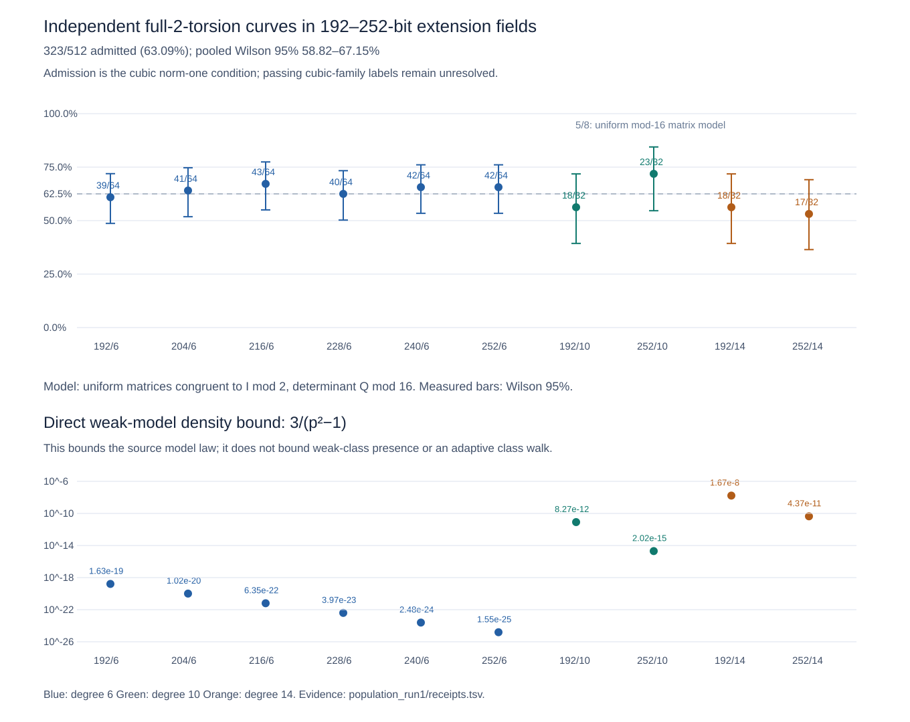
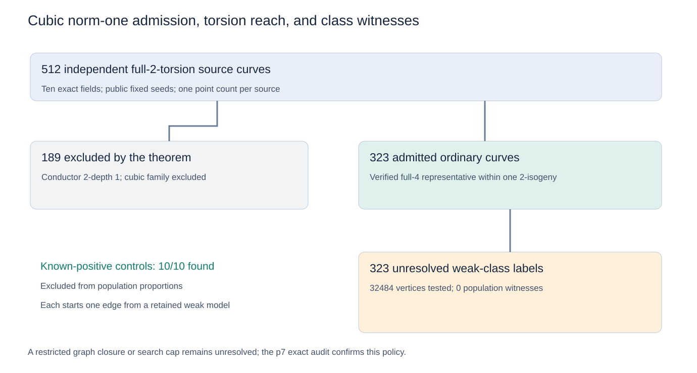
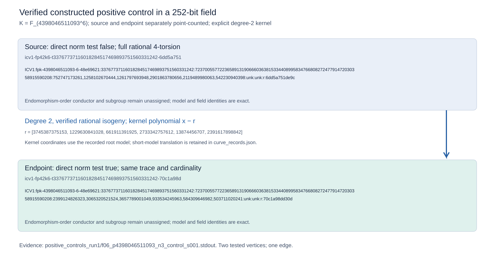

# Norm-one cubic-family admission over 192–252-bit fields

**Scope correction from the prior-work comparison:** Joux–Vitse also allow a nonsplit quadratic h. Our 63.1% measures admission to the cubic norm-one branch. A separately counted quadratic model has trace 610 over F_(7^6), although that class is empty in the cubic census. Thus the cubic exclusions and zeros are not full-family exclusions. [Contribution and verified branch comparison](PRIOR_WORK.md). At degrees 10 and 14, the rows extend the norm-one arithmetic and torsion checks; the cited genus-3 cover applies to degree 6.

We point-counted **512 independently sampled full-2-torsion curve models** in ten fields. **323/512 (63.09%)** pass the proved conductor condition; the pooled Wilson 95% interval is **58.82–67.15%**. Every admitted curve has a verified full-4-torsion representative after choosing the trace sign, at distance at most one rational 2-isogeny. The new theorem proves this torsion equivalence.

The bounded degree-2/3 searches tested **32484 vertices**, evaluated **54216 degree-2 and 38093 degree-3 edges**, and found **0 norm-one witnesses** from these independent starts. **323 admitted class labels remain unresolved**: 219 restricted-component closures and 104 vertex caps. The **189 exclusions from the cubic norm-one family** are certified by the necessary theorem. All ten independently point-counted constructed positive controls succeed after two tested vertices and one edge; they are excluded from population rates.

| Field bits | Degree | Prime p | Curves | Admitted | Admission, Wilson 95% |
| ---: | ---: | ---: | ---: | ---: | --- |
| 192 | 6 | 4294967291 | 64 | 39 | 60.9% (48.7–71.9%) |
| 204 | 6 | 17179869143 | 64 | 41 | 64.1% (51.8–74.7%) |
| 216 | 6 | 68719476731 | 64 | 43 | 67.2% (55.0–77.4%) |
| 228 | 6 | 274877906899 | 64 | 40 | 62.5% (50.3–73.3%) |
| 240 | 6 | 1099511627689 | 64 | 42 | 65.6% (53.4–76.1%) |
| 252 | 6 | 4398046511093 | 64 | 42 | 65.6% (53.4–76.1%) |
| 192 | 10 | 602233 | 32 | 18 | 56.2% (39.3–71.8%) |
| 252 | 10 | 38543917 | 32 | 23 | 71.9% (54.6–84.4%) |
| 192 | 14 | 13421 | 32 | 18 | 56.2% (39.3–71.8%) |
| 252 | 14 | 262139 | 32 | 17 | 53.1% (36.4–69.1%) |

The population law is uniform ordered distinct nonzero root pairs `(u,v)` for `y²=x(x-u)(x-v)`. It includes both twist signs. These are **curve-weighted admissions**, separately from the class-uniform small-prime census and from weak-class presence. All 512 sources are ordinary. No source starts directly on the weak locus. Every count, search and parent process completes within its stated cap.

## Theorem: an admitted torsion representative lies within one edge

For odd `Q ≡ 1 mod 4` and full rational 2-torsion, `16 | #E(K)` is equivalent to full rational 4-torsion on E or one of its rational degree-2 quotients. Therefore `t ≡ ±(Q+1) mod 16` is equivalent to that property for one twist sign.

If the curve lacks full 4-torsion but has order divisible by 16, its 2-primary group contains a rational point P of order eight. Translate `4P` to zero and write `y²=x(x²+a*x+b)`. The duplication formula gives `x(2P)=s`, with `s²=b`, and shows that s is square. Since `2P` lies on the curve, `a+2s` is square. The quotient has roots `0,a+2s,a−2s`; the product of the latter two is the square `(u−v)²`, and their difference `4s` is square. All root differences are therefore square, supplying independent rational halves of two 2-torsion points. See the complete [proof and methods PDF](REPORT.pdf) and [editable TeX](REPORT.tex). The cleared duplication identity has certificate **IDC1h40099ec00a503c89**.

An independent exhaustive check verifies all 5,264 ordered root pairs in eight fields, point-counting every rational degree-2 quotient. All 1,336 admitted cases agree with the equivalence: 592 already have full 4-torsion and 744 require an edge. [Exact theorem checks](torsion_exact.txt).

This equivalence classifies the torsion feature exactly. The additional norm-one class-intersection condition remains a separate requirement.

## Theorem: direct weak-model density

For `q=p²`, odd relative degree n and `N=(Q−1)/(q−1)`, the normalized parameter `lambda=v/u` is uniform in `K\{0,1}`. Direct weakness is exactly the union of `Norm(lambda)=1`, `Norm(lambda−1)=−1`, and `Norm((lambda−1)/lambda)=1`. Each event has `N−1` parameters, giving

`Pr(direct weak model) <= 3(N−1)/(Q−2) < 3/(p²−1)`.

This bounds the randomly drawn model, separately from isogeny-class reach. The geometric-sum identities have certificates **IDC1hc1132e34bb8c94e8**, **IDC1h547a8ae22b837173**, and **IDC1hcacc5ce8020b68ac**. Exhaustive norm-locus checks cover 192,317 parameters across three fields and match all three fiber cardinalities. [Exact output](structure_exact.txt); [native algebra replay](identity_validation.txt).

The 5/8 graph reference is an explicitly conditional matrix model: 320 of 512 matrices modulo 16, congruent to I modulo 2 and of determinant 1 or 9, satisfy the trace condition. It is not a proved finite-field population law.

## Validating witness labels

In 64 independent `F_(7^6)` controls, the complete exact census identifies 42 weak classes and 22 zero classes. The bounded search finds 38 witnesses. Of 11 component closures, seven are exact zeros and **four are weak classes that the restricted search misses**. All 15 rejected classes are exact zeros. Four constructed small-field controls also succeed. This directly validates retaining large-field closures as unresolved.

The [constructed-control records](positive_controls_run1/curve_records.json) retain the two point counts and the actual source/endpoint models and kernel. The diagram uses full ICV1 identities; its source and endpoint are distinct models in the same trace class.

## Scope and evidence

| Requested requirement | Status and evidence |
| --- | --- |
| 192–252-bit fields | Verified: six degree-6 sizes and degree-10/14 endpoints |
| Independent population measurement | Verified: 512 counts with frozen inputs, ordinary status, admission and torsion checks |
| Weak-model search | Verified bounded result: 0/323 population starts; 10/10 constructed controls |
| Large-field prediction precision | **Partial:** 323 admitted labels unresolved; identified precision interval [0,1] |
| Theorem and reproducibility | Full proofs, four identity records, native replay, raw receipts, SVGs, PDF, same PR |

The existing cubic-family CM criterion requires constructing the selected CM order support. A preflight on the first admitted 192-bit source obtains `f_pi=8` and a fundamental discriminant of 188 bits, then PARI's `polclass` stops with **overflow in t_INT-->long assignment**. This is a recorded implementation limit, not a nonexistence result. [Raw output](cm_preflight.stdout); [error](cm_preflight.stderr); [receipt](cm_preflight_receipt.json). The next exact-label step is on-demand CM support or a certified class-action traversal at these sizes.

[Protocol](PROTOCOL.md), [population summaries](population_run1/summary.csv), [512 full source records](population_run1/curve_records.json), [raw process receipts](population_run1/receipts.tsv), [source freeze](population_run1/source_freeze.txt), and [model verification](population_validation.txt) retain exact fields, seeds, inputs, caps and statuses. Native Rust orchestration runs four PARI/GP 2.17.3 workers on an Apple M4 Pro, 14 logical CPUs, 48 GiB RAM, macOS arm64. Wall times are shared-host resource receipts. Prime subgroups and endomorphism orders are unassigned.

PARI's [primary elliptic-curve documentation](https://pari.math.u-bordeaux.fr/dochtml/html/Elliptic_curves.html) specifies the finite-field counter and polynomial-kernel isogeny functions used here. The prior census continuation remains separate from these curve-weighted samples. Canonical dashboard context is updated; existing IC/rho ratio points stay tied to their earlier workloads.
