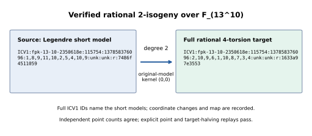
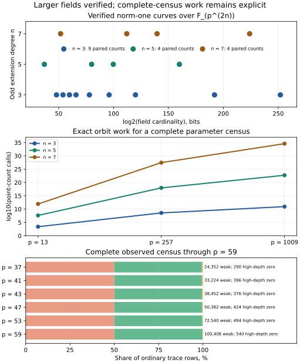

# Larger norm-one weak curves and a prime-degree orbit theorem

The norm-one construction now has verified examples across **17 fields**,
including fields with `log2(Q) = 192.000000` and `252.000000`, and total
extension degrees **10 and 14**. All **49 explicit geometric controls**
and all **17 independently counted source/target pairs** pass. The work
also proves an exact absolute-Frobenius orbit formula for every odd prime
extension degree, extending the cubic count to degrees 5 and 7.

The complete **p=59** census also finished during this round: **100,408**
weak ordinary rows out of **201,898**, zero depth-1 positives, and
**540** higher-depth zero rows. All 5,000 independent GP controls agree;
the worker has advanced to p=61.

The user requested larger primes **and** larger odd extension degrees.
The original every-prime census through p=199 remains part of the scope;
these larger-field positive controls are an additional deliverable.

| Requirement | Status | Evidence or remaining step |
| --- | --- | --- |
| Larger primes in F_(p^6) | Verified on nine fields | p=257,509,1009,2003,8191,65537,1048583,4294967311,4398046511119 |
| Larger odd extension degrees | Verified at n=5 and n=7 over F_(p^2) | p=13,257,1009,65537 in each degree; fields F_(p^10) and F_(p^14) |
| Explicit rational isogeny and target 4-torsion | Verified on 49 seeded parameters | [geometric receipts](evidence_run1/receipts.tsv), [GP source](control.gp) |
| Independent source and target cardinalities | Verified for one pair in every field | 34 point counts; all equal in pairs, divisible by 16, in Hasse, and ordinary |
| Extension-degree orbit theorem | Proved for odd prime n | [proof](REPORT.tex), [identity record](orbit_identity_certificate.json), [exact cyclic audits](orbit_validation.txt) |
| Every prime through 199 | p=59 complete; p=61 running; later primes pending | [finite launch configuration](census_launchd.plist), [dated restart status](census_restart_status.tsv) |
| Class-existence criterion | Necessary condition remains proved; sufficient criterion open | Individual norm-one positives do not classify all trace rows |

## Fields, exact models, and measured checks

Set q=p^2, Q=q^n, and draw a nonidentity norm-one parameter by
`lambda = random(z)^(q-1)`, rejecting 0 and 1. The base seed is 20261009;
curve i resets the seed to `20261009+i`. The field is the exact degree-2n
PARI field whose monic irreducible modulus is recorded in the raw FIELD
line and [curve_records.json](curve_records.json). Field and curve
coefficients use low-to-high polynomial-basis vectors modulo p.

The Legendre source is `y^2=x(x-1)(x-lambda)`. Its kernel-(0,0)
2-isogeny has target
`y^2=x[x^2+2(1+lambda)x+(1-lambda)^2]`. For a=-(1+lambda), b=lambda,
the map at x nonzero is `(x,y)->(x+a+b/x,y(1-b/x^2))`.
The retained record `IDC1he02ab9a5cf019a56` checks the cleared equation.
Every geometric case replays an explicit source point through this map
and two rational halves of independent target 2-torsion points. This
verifies full rational target 4-torsion without factoring its group order.

Each counted model is also stored in short Weierstrass coordinates,
`X=x+a2/3`, `Y=y`. The [34 full ICV1 model identifiers](curve_records.json)
follow [the canonical specification](../../../docs/curves/ICV1.md).
Endomorphism orders, volcano levels, Frobenius conductors, and
prime-subgroup orders remain explicitly null where unmeasured. The
ordinary conductor divisibility is supplied by the norm-one theorem.

| p | odd degree n | field degree | log2(Q), rounded | source count ms | target count ms |
| ---: | ---: | ---: | ---: | ---: | ---: |
| 257 | 3 | 6 | 48.033747 | 4 | 2 |
| 509 | 3 | 6 | 53.949131 | 14 | 11 |
| 1009 | 3 | 6 | 59.872263 | 27 | 26 |
| 2003 | 3 | 6 | 65.807680 | 117 | 248 |
| 8191 | 3 | 6 | 77.998943 | 182 | 411 |
| 65537 | 3 | 6 | 96.000132 | 273 | 519 |
| 1048583 | 3 | 6 | 120.000058 | 649 | 754 |
| 4294967311 | 3 | 6 | 192.000000 | 2547 | 2792 |
| 4398046511119 | 3 | 6 | 252.000000 | 7822 | 8630 |
| 13 | 5 | 10 | 37.004397 | 0 | 0 |
| 257 | 5 | 10 | 80.056245 | 202 | 473 |
| 1009 | 5 | 10 | 99.787105 | 567 | 608 |
| 65537 | 5 | 10 | 160.000220 | 1403 | 1590 |
| 13 | 7 | 14 | 51.806156 | 5 | 3 |
| 257 | 7 | 14 | 112.078744 | 911 | 1064 |
| 1009 | 7 | 14 | 139.701946 | 1358 | 1512 |
| 65537 | 7 | 14 | 224.000308 | 4716 | 4773 |

The [exact summary CSV](summary.csv) is canonical for every table entry;
these stage wall times account for resources on the ordinary host.
The geometry phase used 49 controls across these fields with a
30-second cap per field. Each cardinality cell used one pair and a
120-second cap. All cells completed. The [native driver](run_controls.rs)
retains exit codes, raw stdout/stderr, caps, elapsed time, and SHA-256.

The largest-field example has
`p=4398046511119`, `Q=7237005577480357624133357844251601109645805376271468001686387397097912389281`,
and source trace `80369948951667839190628429049567884210`.
The independently computed source and target order is
`7237005577480357624133357844251601109565435427319800162495758968048344505072`.
This order is divisible by 16. The complete modulus, lambda, short
coefficients, j-invariants, and ICV1 IDs are in its machine record.

## Exact orbit count for odd prime degree

Let p and n be odd primes, with n>=3, and put
`N=(p^(2n)-1)/(p^2-1)`, `A=(p^n-1)/(p-1)`, and `B=(p^n+1)/(p+1)`.
Let e=1 when `p^2=1 mod n`, and e=0 otherwise. Then the action generated
by absolute p-Frobenius and inversion has:

| Orbit size | Number of orbits |
| ---: | --- |
| 2 | `e*(n-1)/2` |
| 2n | `(A+B-2-e*(n-1))/(2n)` |
| 4n | `(N+1-A-B)/(4n)` |

Consequently the exact point-count requirement is
`C_(p,n)=[N+A+B-3+2*e*(n-1)^2]/(4n)`. Hilbert 90 and the two base-field
scaling square classes recover all `2*(N-1)` normalized representatives
and both trace signs. [The written proof](REPORT.tex) classifies every
stabilizer. Its cleared orbit sum has identity
**IDC1h90d58cc0e0c48fe3**, with 32 recorded and 64 fresh replay points
and mutation rejection. [Exact integer expansion](orbit_exact.txt)
independently gives zero. Eight exhaustive cyclic-group audits cover
**6,928,970** nonidentity parameters and agree in every orbit population;
45 stabilizer cases also agree. Three focused native tests pass.

For n=3 and p>3 this recovers `(p^4+3*p^2+8)/12`. At n=5 or 7 the
exceptional term depends on p modulo n. At p=13, the exact call count is
2,423 for n=3, 41,032,186 for n=5, and 837,027,639,705 for n=7.
At p=257,509,1009 with n=3 it is 363,555,713; 5,593,645,151;
and 86,374,331,401. These values are derived work counts, not timed runs.

## Persistent continuation and validation

The earlier p59 process and its temporary output directory were absent
at the start of this round. The dated October 8 snapshot is retained.
A replacement finite launchd job now runs the complete-prime census
from p=59 through 199 with four workers, independent 5,000-curve GP
controls, per-prime audits, checked compression, and the storage guard.
The output location is
`/Users/adamburan/Library/Application Support/crypto-iso1/census-20261009-run3`.
The actual queue PID and census PID are recorded in the validation receipt.

The first independent launcher could not read an external-volume script;
its [OS access errors](launchd_external_volume_failure.stderr) remain.
A verified internal-volume runtime bundle resolves that access boundary.
The provisional restart-on-exit service was stopped before completion;
its [interrupted status](interrupted_legacy_service.tsv) is retained.
The final configuration has RunAtLoad=true and KeepAlive=false, so a
completed or failed queue remains stopped. No external-volume access
permission was changed. To stop this owned service, use
`launchctl bootout gui/501/com.aburan.iso1.census.20261009.finite`.

The queue supports `ISO1_QUEUE_RUNTIME_MANIFEST_DIR` for a relocated
runtime manifest. The bundle retains source and executable hashes; the
point-count kernel and census executable are unchanged. The queue's
13 native tests pass. The full root-library test exits 101 because
`src/lib.rs` is excluded in this sparse worktree; its [raw failure](root_library_test.stderr)
is preserved. The dedicated theorem workflow on the preceding published
commit passed on Linux. Current focused replay and document checks are
recorded in [VALIDATION.md](VALIDATION.md).

[PARI's primary function reference](https://pari.math.u-bordeaux.fr/dochtml/html/Elliptic_curves.html)
documents cardinality computation over finite extensions and the available
algorithms. The necessary conductor theorem applies at every size; the
larger positive controls and orbit formula extend the tested models and
price enumeration while the remaining class-existence criterion is pursued.

## Completed p=59 census

The [archived CSV](p59_completed/p59_absolute.csv.zst) has 205,380
Hasse rows and weights to all 24,241,684 normalized representatives.
It uses 1,010,651 point counts. Of 201,898 ordinary rows, 100,408 are
weak; depth-1 weak is 0/100,950 and higher-depth zero is 540/100,948.
The [native all-row audit](p59_completed/p59_validation.txt) passes
with all 5,000 GP controls positive (4,565 distinct absolute traces).
The randomized census labels retain their stated uncertainty.

The [run receipt](p59_completed/p59_receipt.txt) records exit 0,
4,613.407 process wall seconds and the frozen census binary; its raw
statistics record 4,613.034 inner wall seconds and 554,248,010,615 charged
Fp multiplications. These are separate resource-accounting intervals.
The compressed CSV was tested and replayed to SHA-256
42a764eb83093c1afda459bf6b072036db546340b00e19b2f15253b8220ce76e.
The imported archive was independently decompressed and audited again.
The latest six-prime class panel is in the new figure; the October 8
class figure remains the dated historical snapshot.
