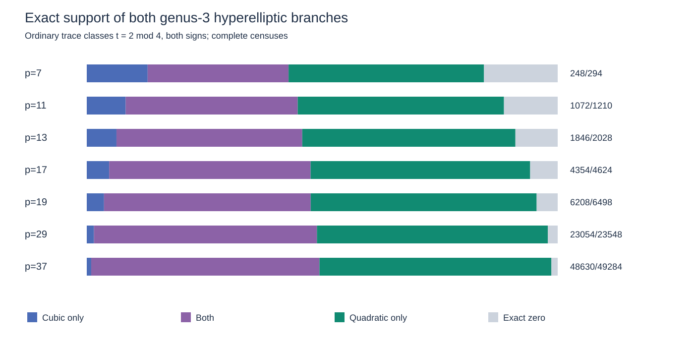
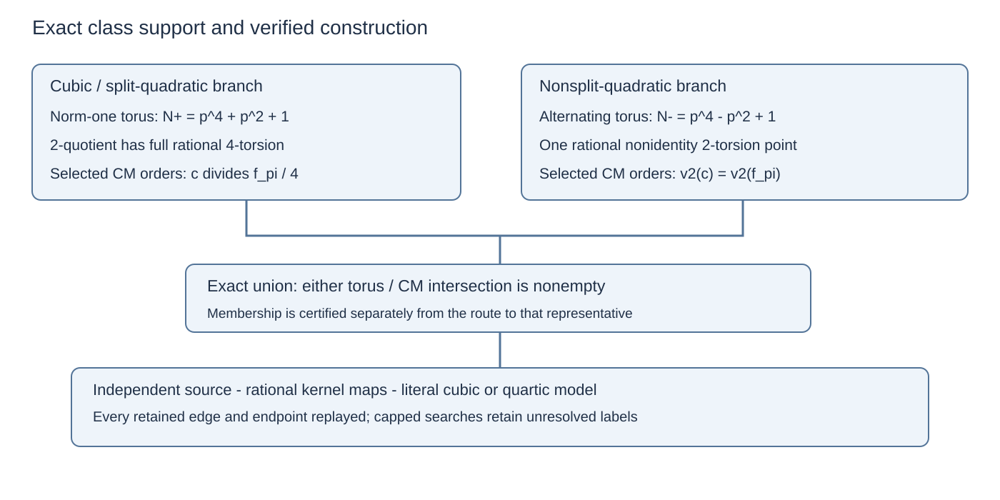
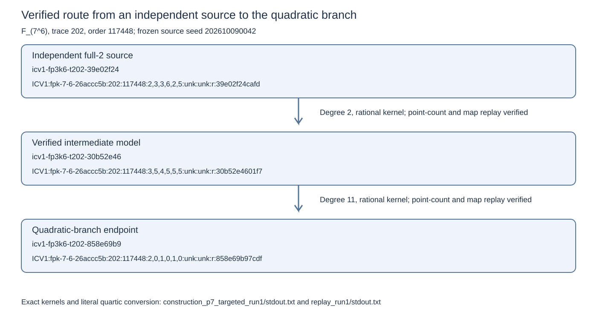

# Two genus-3 branches: exact class support and verified construction

The combined family has weak representatives in **48,630 of 49,284 ordinary
trace classes at p=37**. The cubic branch accounts for 24,352 classes and the
nonsplit quadratic branch for 48,164, with 23,886 classes in their intersection.
The **654 remaining classes are exact zeros for this genus-3 hyperelliptic
family**. A new class criterion gives the two exact torus/CM intersections;
their selected endomorphism orders differ. A construction experiment reaches
all **63 positive source fixtures among 64 independently sampled p=7 models**,
with explicit kernel maps and literal-family conversions.

The larger-field experiment now tests **all 512 frozen independent sources**
in ten 192–252-bit fields of degrees 6, 10 and 14. It visits **46,356 vertices**
and evaluates **75,996 degree-2 and 53,604 degree-3 edges**. The bounded searches
find zero endpoints: **383 restricted component closures and 129 vertex caps**
leave every large-field class label unresolved. The ordinary trace counts and
previous cubic admissions remain available in their original frozen panel.

## The exact criterion

For `K=F_(p^6)`, `q=p²`, the published genus-3 hyperelliptic family is

`y²=h(x)(x-alpha)(x-alpha^q)`, with `h in F_q[x]`, degree one or two,
and `alpha` outside `F_q`. Up to field isomorphism of the model and quadratic
twist, the linear and split-quadratic cases reduce to the cubic branch
`y²=x(x-alpha)(x-alpha^q)`. A nonsplit quadratic reduces to
`y²=(x²-d)(x-alpha)(x-alpha^q)` for a fixed base-field nonsquare `d`.
Both allowed leading-coefficient square classes occur as base-field twists.

The cubic Legendre parameter lies in the torus of order
`Nplus=p⁴+p²+1`. The quadratic cross-ratio lies in the torus of order
`Nminus=p⁴-p²+1`, inside `F_(p^12)`. Its reciprocal sum
`Y=lambda+1/lambda` lies in `K`, and its invariant satisfies

`j=256(Y-1)³/(Y-2)`.

For an ordinary trace pair with `t=2 mod 4` and fundamental discriminant
`D_K<-4`, write `t²-4*p⁶=f_pi²*D_K`. The exact criterion intersects:

- The cubic torus with the quotient invariant
  `jplus(lambda)=16(lambda²+14lambda+1)³/[lambda*(1-lambda)⁴]`, using CM
  orders `c | f_pi/4`. An empty divisor set gives no cubic support.
- The quadratic torus with the Legendre invariant, using CM orders
  `c | f_pi` with `v2(c)=v2(f_pi)`: the floor of the ordinary 2-volcano.

The trace class contains a representative of the combined family exactly
when at least one intersection is nonempty. Clearing the denominators and
taking a polynomial gcd provides a finite necessary-and-sufficient test.
The complete two-torus enumeration also handles the exceptional CM unit
cases. The [editable theorem supplement](REPORT.tex) gives the hypotheses and
full proofs, including normalization, reconstruction, the conductor filters
and the constant-degree CM-factor bound.

Every irreducible selected CM factor has degree dividing six. In the reciprocal
variable, each cleared decision polynomial has degree **at most 18**. A binary
recurrence computes the torus polynomial modulo that factor. Building the CM
support remains a separate cost; the earlier 192-bit preflight's 188-bit
discriminant still exceeds PARI's supported integer conversion in `polclass`.

## Complete censuses and independent checks

The class census retains both trace signs, one row per ordinary trace congruent
to 2 modulo 4. The counts below are class-uniform; they are separate from the
model-weighted source populations. The parameter reductions retain
`(p⁴+3p²+8)/12` cubic orbits and `(p⁴-p²)/12` quadratic orbits.

| p | Ordinary classes | Cubic | Quadratic | Union | Exact zeros |
| --- | ---: | ---: | ---: | ---: | ---: |
| 7 | 294 | 126 | 210 | 248 | 46 |
| 11 | 1,210 | 542 | 972 | 1,072 | 138 |
| 13 | 2,028 | 928 | 1,718 | 1,846 | 182 |
| 17 | 4,624 | 2,198 | 4,134 | 4,354 | 270 |
| 19 | 6,498 | 3,090 | 5,970 | 6,208 | 290 |
| 29 | 23,548 | 11,510 | 22,694 | 23,054 | 494 |
| 37 | 49,284 | 24,352 | 48,164 | 48,630 | 654 |

At p=7 the implementation checks all **117,600** eligible normalized alpha
values against the quadratic invariant set. An independent Rust field engine
then counts every retained cubic and quadratic model by evaluating all 117,649
affine x coordinates: **48,118,441 evaluations on 409 models**. Every trace
matches PARI. The cubic count at each ordinary trace also agrees with the
historical p7, p13 and p37 native censuses.

The quadratic CM gcd gives respectively **36, 12, 36, 0, 0** parameters for
trace magnitudes **10, 38, 610, 674, 682**. A separate inversion/factor method
repeats those five answers using **162 CM factors**, with largest decision
degree 18. The native checker joins these labels to the independent census.
Seven `identity.certificate/v1` records cover the alternating norm cardinality,
cross-ratio, rational 2-kernel square, reciprocal invariant, quadratic-base
norm equation, cleared genus formula and complementary cross-ratio norm;
each has 32 saved and 64 fresh
evaluations and a rejected mutation control.

## Construction from independent sources

The 64 small-field sources reuse the previous frozen uniform-root-pair law,
`y²=x(x-u)(x-v)`, with distinct nonzero u and v. Sampling precedes the weak
family tests. Repeated traces remain separate source fixtures; these are
independent class draws induced by that model law, with model weighting.

The initial degree-2/3 search constructs **55** endpoints: 37 cubic and 18
quadratic. A degree-2/3/5/7 validation plus prioritized degree-11 and degree-19
follow-ups constructs all **63** positive source fixtures. The remaining
source has trace **474** and is an exact combined-family zero. Every cap and
failed preliminary attempt remains in the evidence; `summary.json` retains
all phase costs for each attempt and joins them to the exact class label.
The adaptive protocols specify their source selection, edge order and caps.

Independent recorded-coordinate replay reconstructs **230 route edges** and
**117 literal conversions** across the successful validation runs. Those
totals include repeated controls across policies. It independently counts
each distinct model, checks every stored kernel, evaluates each map on three
fresh points, and replays the final cubic or quartic conversion. All **277**
distinct small-field models have canonical ICV1 records.

## Larger fields and larger odd degrees

The degree-6 panel contains 64 sources at each of 192, 204, 216, 228, 240 and
252 bits. The degree-10 and degree-14 panels each contain 32 sources at the
192- and 252-bit endpoints. Every source uses its original modulus, roots,
trace, order and seed. The new search retains both rational 2-torsion patterns
and tests both endpoint forms, including sources excluded by the cubic rule.

For larger odd relative degree n, the quadratic torus has order
`Nminus=(q^n+1)/(q+1)`. Constructive Hilbert 90 over `F_(q²)` solves
`gamma0^(q²-1)=lambda^(q-1)`. The scalar
`r=gamma0^(q+1)/lambda` lies in `F_q`; a quadratic-base norm solution
normalizes gamma0 to gamma with `gamma^(q+1)=lambda`. The Cayley map
`alpha=beta*(gamma+1)/(gamma-1)` then returns alpha in the requested field.
This supplies a section even when `gcd(q+1,Nminus)>1`.

All **16 separately constructed higher-degree quadratic controls** pass this
reconstruction and literal-model checks; **eight** have section gcd 5. Their
independent recorded-coordinate replay also passes after a retained initial
180-second parent cap and a 900-second replay budget. These constructed
controls stay outside the 512-source population.

The specified compositum cover has genus
`g=1+2^(n-2)*(n-2)`: **3, 25, 161** at relative degrees **3, 5, 7**. The report
proves the square-class independence, ramification count and descent datum.
The larger-degree rows therefore measure this higher-genus functional family.

The 512 bounded population searches complete with zero process failures and
zero time caps. They visit 46,356 vertices and evaluate 129,600 edges in total.
The 383 closures and 129 vertex caps leave class membership unresolved.
Each cell has a 256-vertex limit, a 90-second search cap, a 240-second parent
cap, and a 256 MiB initial GP stack; native orchestration uses four workers.
Setup, source counting/replay, search and final verification are retained
separately. Wall times are shared-host resource receipts, with no isolated
timing ratio assigned.

## Contribution relative to the papers

The weak covering families and the cover/decomposition algorithm are supplied
by [Joux–Vitse](https://eprint.iacr.org/2011/020), building on classifications
such as [Momose–Chao](https://eprint.iacr.org/2009/236). The ordinary volcano
framework is standard; see [Sutherland's primary lecture notes](https://math.mit.edu/classes/18.783/2023/LectureNotes22.pdf).

This round adds the exact combined class-support test, the distinction between
the selected CM orders for the two branches, the quadratic endpoint and
reconstruction implementation, complete per-trace censuses, and verified
source-dependent construction attempts. The degree-18 result bounds the
finite-field decision step after the CM factors are available. The next
scaling step is to obtain that support on demand for an independent large-field
class and retain a complete verified route from the source.

## Requirement status and reproducibility

The separate cubic continuation completed two additional primes with its
recorded probabilistic two-point Hasse-BSGS counter and 5,000 independent
PARI controls per prime. The retained status is
`COMPLETE_DIAGNOSTIC_WITH_GP_CONTROL`; it stays separate from the combined
two-branch censuses above.

| p | Ordinary rows | Cubic-positive rows | Depth-1 positives | High-depth zero rows |
| --- | ---: | ---: | ---: | ---: |
| 61 | 223,260 | 111,084 | 0 | 546 |
| 67 | 296,274 | 147,496 | 0 | 640 |

The [completed archives and controls](cubic_continuation_completed/) retain
the compressed CSVs, replay hashes and receipts. The finite worker stopped
before p71 at `STOPPED_STORAGE_PREFLIGHT`: it observed 756,305,920 available
bytes against 1,173,957,184 required. After storage became available, a fresh
finite queue resumed at **p71**, with 38,786,592,768 bytes available at launch.
It uses the same frozen binary, four CPU threads, the original per-prime
storage guard and the authorized range through p199. The
[restart receipt](cubic_continuation_completed/continuation_resume.json)
records the running service and preserves the stopped queue separately.

| Requirement | Status | Evidence or remaining step |
| --- | --- | --- |
| Criterion covering both genus-3 hyperelliptic branches | Verified | Full normalization and CM proof, exact finite criterion and seven censuses |
| Explicit usable representative | Verified from passing parameters | Cubic Hilbert 90 and quadratic Cayley/norm reconstruction, literal point maps |
| Route from independent source classes | Verified for the 64 small-field fixtures | All 63 positives constructed; trace 474 classified as zero |
| Construction cost in 192–252-bit fields | Verified bounded measurement | All 512 original sources, phase costs, 46,356 vertices, 129,600 edges, all caps retained |
| Exact large-field class prediction and positive-route cost | Partial | 512 unresolved class labels; on-demand CM support and route construction required |
| Larger primes and extension degrees | Verified expansion | Combined census through p37; degree-10/14 reconstruction, searches and 16 controls |
| Reviewed publication and PR | Local report and PDF verified; remote checks tracked | Existing PR 1588 updated; merge requires completed passing checks |

[Native summary](summary.json), [302 independently replayed model records](curve_records.json),
[validation](VALIDATION.md), [reproduction](REPRODUCE.md), [protocol](PROTOCOL.md),
and the evidence SHA manifest retain parameters, exact inputs, status and costs.
Prime subgroups, generators and complete endomorphism orders remain null in
the class-study records. The Frobenius-order conductor is stored separately
from any proved endomorphism property.

Fifteen launcher receipts observed an edited launcher source file while the
executed binary stayed frozen; fourteen belong to the degree-6 population.
The original receipts are intact. [The provenance correction](provenance_correction.json)
binds their actual execution to the archived v1 source and recorded binary
hash. The arithmetic scripts and input fixtures stayed frozen. A disk-full
packaging interruption was resolved by removing this worktree's failed root
build cache and rebuilding the report outputs.
