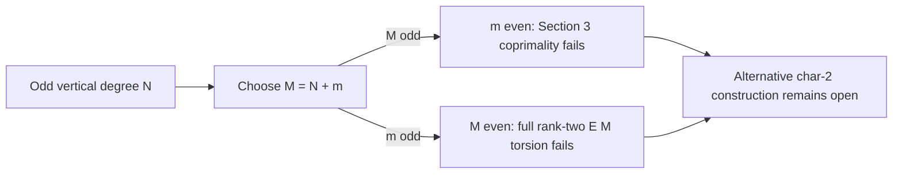

# E8: characteristic-two audit of the odd-torsion Kani route

**Status:** bounded source and arithmetic preflight. No isogeny representation,
point transfer, or cost comparison is established.

## Source and question

Galbraith, [*Climbing and Descending Tall Isogeny Volcanos*, ePrint
2024/924](https://eprint.iacr.org/2024/924), Sections 3-4 and Theorem 1,
constructs a smooth-degree Kani representation from a given odd-degree
isogeny. The question here is whether that proof, as written, instantiates
for the degree-73 inert step in the C37 family over characteristic two.

The input surface curve is `K0: y^2 + xy = x^3 + 1` over `F_(2^37)`, with
`tau^2 + tau + 2 = 0`, trace `-534059`, and order `137439487532`. Its
Frobenius-order conductor has a factor `73`. A curve at the inert 73-level
is the intended other endpoint, but this preflight does not select an
endpoint model or a subgroup generator. It therefore cannot be a point
transfer or discrete-logarithm experiment.

## Frozen preflight protocol

1. Audit the exact hypotheses in Sections 3-4 of ePrint 2024/924, including
   the requirement there that the degrees of both input isogenies and the
   Kani degree be coprime to the characteristic. Distinguish those
   hypotheses from a possible extension using non-etale group schemes.
2. Check the parity identity for an odd vertical degree `N`: writing the
   smooth Kani degree as `M = N + m`, odd `M` makes auxiliary degree `m`
   even; odd `m` makes `M` even. This is an obstruction to applying the
   cited proof unchanged, not a theorem excluding all characteristic-two
   constructions.
3. Use the native Rust source `e8_char2_kani_preflight.rs` to calculate
   `pi = tau^37` in `Z[tau]/(9)` and `Z[tau]/(81)`, its trace and norm, and
   its exact orders. `M = 81 = 9*9` and `m = 8 = 2^2 + 2^2` are a small
   explicit candidate. The order of `pi mod 9` gives the extension degree
   for full odd 9-torsion on the surface curve, because its endomorphism
   ring is `Z[tau]` and 9 is prime to the characteristic.
4. Stop at the source-hypothesis and torsion preflight. In particular, do
   not infer a Kani construction, a map to the 73-level curve, a transfer
   cost, or a change in ECDLP work from these calculations.

The reproducible command is `rustc --edition=2021 --test
e8_char2_kani_preflight.rs -o /private/tmp/e8-preflight-test` followed by
`/private/tmp/e8-preflight-test`; compile the same source without `--test`
and save its single JSON line as `e8_char2_kani_preflight.json`. This
preflight uses exact integer arithmetic and no CPU timing. The source and
JSON receipt are committed together. Its earlier local development run is
not an independent confirmation of the frozen result.

## Source-hypothesis audit

Section 3 requires `M`, `#H1`, and `#H2` to be coprime to the field
characteristic. In Section 4, `#H1 = N`, `#H2 = m`, and the proof chooses
an odd smooth `M = 3^u A_S^2 = N + m`. For odd `N` in characteristic two,
this forces even `m`. The proof's separability hypothesis for `H2` is then
unmet. Taking odd `m` instead forces even `M`; full rank-two `E[M]` is
unavailable on an ordinary elliptic curve in characteristic two because
the geometric 2-primary torsion has one etale cyclic factor. These are
limits of the cited construction under its stated hypotheses. They leave
open whether a different auxiliary isogeny, non-etale kernel formalism,
or characteristic-two splitting algorithm can repair it.

The earlier E8 first pass also treated full rational `E[M]` over one
extension as a necessary bottleneck. Section 4 of the paper explicitly
works prime by prime with Frobenius eigenbases and avoids materializing
the whole compositum in its efficient implementation. The torsion-field
cost needs a prime-by-prime audit for any proposed characteristic-two
adaptation; the blanket full-`M` rationality objection is too strong.

## Frozen-result receipt

Pending execution after the protocol and source are committed. The receipt
will report only the exact modular arithmetic and explicit hypothesis gate.

## Remaining obligation

To advance E8 to its C37 prototype, give an applicable characteristic-two
Kani or analogous theorem, construct the explicit map between registered
curve models, certify its kernel and subgroup action, and count complete
`F_(2^37)` operations for setup and transfer. Only after that would an
`n=131` cost model have an executable basis.
