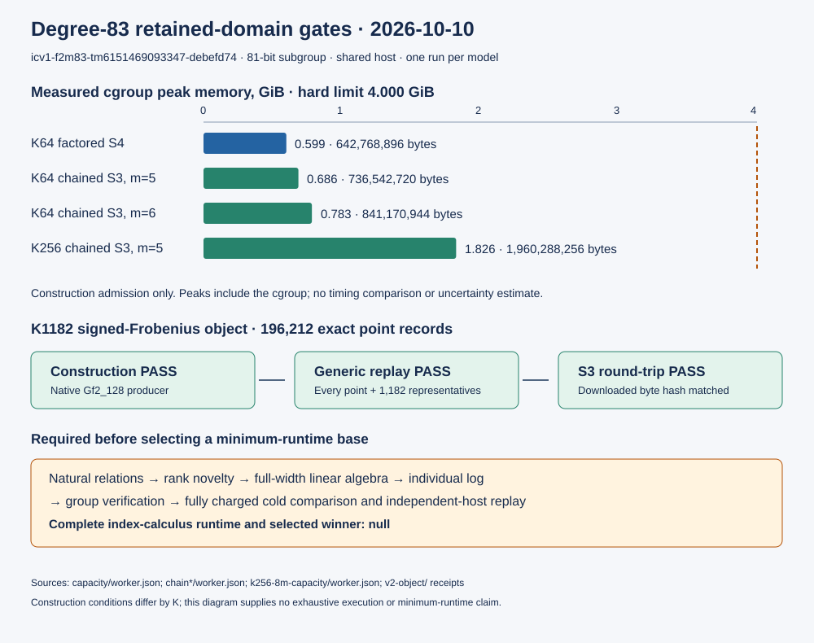

# N83 retained-domain gates and K1182 storage extension

Dated 2026-10-10. The complete cold index-calculus runtime and selected
minimum-runtime factor base remain unmeasured. This round establishes exact
stored-object and model-construction coverage under fixed resource guards;
it does not execute the entire declared design or rank bases by total cost.

## Exact workload and frozen method

Primary model `icv1-f2m83-tm6151469093347-debefd74` has equation
`y² + xy = x³ + 1`, modulus `z^83 + z^45 + z² + z + 1`, subgroup order
`2417851639230796216685689`, cofactor 4, and generator polynomial words
`(0x477f77103dfad59850800, 0x2fa5e737d542c4e4fd5c3)`.
The 53-bit diagnostic subgroup is a separate workload. All data are public
fixtures. Source revision is `85e14930ff0aab0d50e8fb12ee7ca382e5e2f8e2`;
the compiled worker and source/input hashes are retained beside each receipt.

The owner allowed two hours total. Prior frozen charge was
3,593.092994294 seconds; the extension permits at most 3,606.907005706
seconds. The native Linux worker rebuild is charged. Construction/search
use one pinned Docker CPU, a 4 GiB cgroup ceiling, zero swap, no network,
read-only inputs and root, immutable local image IDs, explicit process-wall
caps and verified cleanup. The VM is arm64 and the static worker x86-64.
Shared-host L0 times are informational and for budget accounting; source
validation is identified separately, with no timing ratio or speedup claim.

## Measured observations

| Gate | Observation | Admission |
| --- | --- | --- |
| Source-matched Linux rebuild | Exit 0; 872 conservatively charged seconds under a 900-second cap | Executable source prerequisite |
| K64 factored S4 | 127,404 variables; 1,490,138 clauses; 1,074 XOR rows; 642,768,896-byte cgroup peak | Construction PASS, search/lifting false |
| K64 m5 chained S3 all-affine pattern | 84,743 variables; 2,100,012 clauses; 1,660 XOR rows; 1,851,925 domain clauses; 736,542,720-byte cgroup peak | Construction PASS, search false |
| K64 m5 zero-trial preflight | 10,624 points; 64 orbit columns; zero SAT calls and relations | PREFLIGHT_ONLY |
| K64 m5 one-trial search | One SAT call, 10,000 conflicts, zero models/relations/rank rows; 927,731,712-byte cgroup peak | `UNKNOWN_solver_cap` |
| K64 m6 chained S3 all-affine pattern | 105,908 variables; 2,532,398 clauses; 2,222,310 domain clauses; 841,170,944-byte cgroup peak | Construction PASS |
| K64 m6 zero-trial preflight | Zero SAT calls and relations | PREFLIGHT_ONLY |
| K64 m6 one-trial attempt | Docker daemon EOF; recovered exact container exited 255 with no worker summary, without OOM | `PRODUCER_FAILURE`; solver verdict null |
| K256 m5, first domain limit | Exact preflight required 7,195,450 domain clauses, above fixed 3,000,000 cap | `UNKNOWN_domain_clause_cap` |
| K256 m5, separately frozen 8-million-clause limit | 84,743 variables; 7,443,537 clauses; 1,960,288,256-byte cgroup peak | Construction PASS |
| K256 m5 zero-trial preflight | 42,496 points; 256 orbit columns; zero SAT calls | PREFLIGHT_ONLY |
| K256 m5 one-trial search | One SAT call, 10,000 conflicts, zero models/relations/rank rows; 2,207,604,736-byte cgroup peak | `UNKNOWN_solver_cap` |
| K1182 native construction | 196,212 records; 1,182 signed-Frobenius columns; 5,956,114 compressed bytes | Construction PASS |
| K1182 generic arithmetic replay | 196,212 points and 1,182 representatives checked by generic multi-limb BinaryCurve against producer Gf2_128 | PASS; separate implementation/process, same host/repository |
| K1182 S3 round-trip | Downloaded compressed BLAKE3 equals `76e1cbe4ea5a9d26e5b24a2d27f9401271dc471846529190a0416d8e09837a92` | Storage PASS |

The memory observations have sample count one per model. They show admission
under the stated ceiling; there is no uncertainty estimate or performance
comparison. The factored source bound is before finite-domain/order clauses,
whereas the measured construction includes them; those counts have different
scopes and are not a before/after timing result.

The K64 and K256 m5 one-trial cases used the same fixed source, public target,
one-model and 10,000-conflict ceilings, but K256 needed a separately declared
8,000,000 domain-clause admission cap after its first 3,000,000-clause gate
stopped. Both trials exhausted the same conflict allowance. Their censored
solver outcomes supply no relative completion time or base ranking.

The K1182 point-set BLAKE3 is
`429cde4bc514bf1026e4993e269192f858cb7410ade777178a1c0db7dbf0001a`.
Its full object lives at
`s3://crypto-autoresearcher/factor-bases/icv1/etc/koblitz_n83_factor_base_sweep_20261008/v2-size-frontier/a0/objects/76e1cbe4ea5a9d26e5b24a2d27f9401271dc471846529190a0416d8e09837a92.jsonl.gz`.
Manifests, replay and storage receipts accompany the object. Full point files
remain outside Git; receipt hashes identify their durable storage.

## Retained failures and open source gates

The first v2 launch exited 1 before object creation because container Git
rejected checkout ownership. A read-only diagnostic exposed the exact cause.
The retry supplies a process-local safe.directory for the exact mounted
checkout, preserves the failed launch, and uses a fresh output directory.
The first host build succeeded but its zsh receipt wrapper then rejected a
reserved variable; the failure log and clean corrected build are retained.
During the K64 m6 trial, Docker returned an unexpected EOF. The original
outer receipt's cleanup flag was invalid because its `docker ps` query could
fail and appear empty. The recovered container state showed exit 255 and no
worker summary; the exact container was removed and independently checked
absent. The guard was fixed before K256 launched. The m6 solver outcome is
unobserved, not a mathematical refutation or a wall-capped solver sample.
Synthetic guard controls cover successful exit, a wall-capped native worker,
and an invalid receipt. These are supervisor controls, not N83 measurements.

A proposed K1182 construction admission check was not launched: the audited
construction-only CLI accepts K64/K256/K600, while the search CLI accepts v2
sizes. Extending and validating that source gate remains required. WDSat and
FES width/system gates, the large-prime partial producer and full-width sparse
LA remain unresolved. An available enum or finite-grid ordinal proves design
coverage only. UNKNOWN outcomes remain censored, never UNSAT or winners.

## Validation and limits

The source-matched exporter example passed 19/19 release tests. The study
regression suite passed 22/22 and the boundary suite 39/39. Focused release
library checks passed for chained S3 (6), factored S4 (23), SAT (16), the
wide relation solver (13), and six N83 driver tests. The full release library
command was run with a 2,200-second process guard and ended at that guard
while the unrelated upstream `jv_isogeny_walk::end_to_end_from_a_non_weak_curve_recovers_and_verifies`
test was still active; it is not a passing full-suite receipt. A broader
Koblitz-driver filter also reached its 240-second guard on the unrelated
`the_u64_factorisation_matches_trial_division` test; the six relevant driver
tests passed separately. These source-validation caps are not N83 solver
verdicts or measurements.

The full site build stopped on
`research/polynomial_reuse_20260914/RESULTS.md`, omitted by this sparse
checkout. The panel-index check and three direct scoreboard integrity checks
passed. The SVG passed XML validation; the three-page PDF was rendered to
page images and inspected for labels, tables and legibility. Remote CI and
external-host arithmetic replay remain separate checks.

## Requested scope versus evidence

| Requirement | Status |
| --- | --- |
| Repository prior art | Source-pinned inventory and refreshed integration audit retained in PRIOR_ART.md and SOLVER_GATES.md |
| Every possible combination | Partial: 57,024,000 finite tuples are addressable; most are unexecuted; parameter values outside the declared grid remain unsearched |
| All named techniques | Partial: named axes and explicit compatibility gates; executable construction/search coverage is separately receipted |
| Factor bases in S3 | Verified for the 54 historical objects plus one K1182 object |
| Empirical minimum complete runtime | Pending: natural relation/rank evidence, complete pipeline cost, matched control and external independent replay |

## Visual and canonical graphs

`report-figure.svg` is editable vector source; `report-workflow.mmd` retains
the workflow description. The canonical scoreboard receives a source-linked
capacity/storage coverage panel. `docs/ic/progress-timeline.json`, the cold
leaderboard, `docs/curves/` and `docs/performance-gains/` were checked. No new
admitted cold ratio, exponent or curve-map fact is present, so their runtime
series and verdicts stay unchanged. No algebraic identity is claimed here.

Exact worker/outer receipts, source/input hashes, commands, failure logs,
budget accounting and validation logs are retained in this directory. Read
the original protocol and supplementary arity protocol before replay.
The extension stopped at 2,461 conservatively charged wall seconds, so the
prior-plus-extension total is 6,054.092994294 of 7,200 authorized seconds.
Source validation after experimental stop is accounted for separately.
