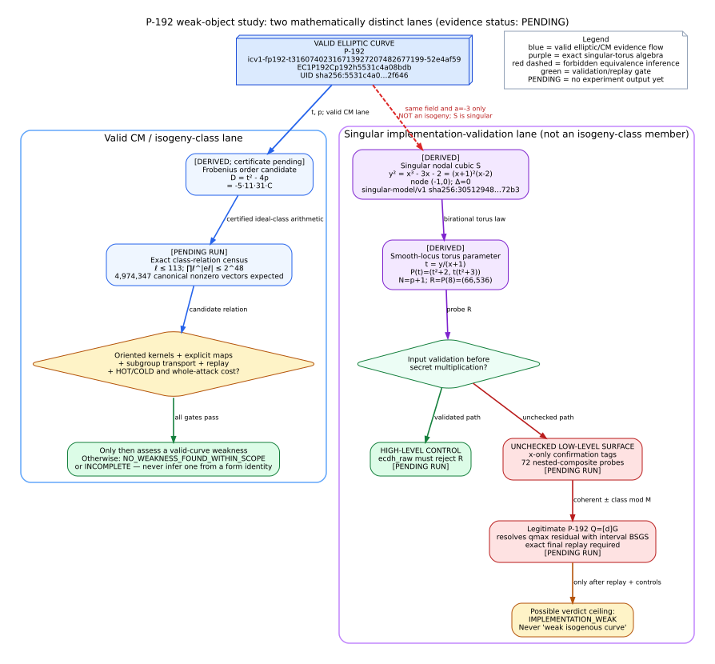
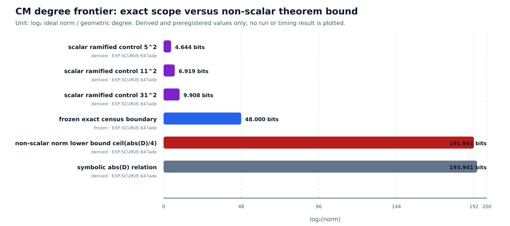

# Status and verdict

**Evidence cutoff: 2026-10-06. Experimental verdict: PENDING.** This is the
source-linked report scaffold for two approved native experiments. It contains
derived algebra, frozen inputs, claim gates, and prior-art provenance. It does
**not** contain an observed recovery, a completed CM census, a timing result, or
a new weakness claim. Every empirical result cell remains `PENDING` until it is
filled from hashed run artifacts and independently replayed.

The work uses one fixed, public, synthetic scalar. It does not target deployed
keys, live services, or private data. Its purpose is to distinguish an
implementation-validation failure from a property of a valid elliptic curve.

Two hypotheses are deliberately kept separate:

1. **Singular implementation-validation lane.** A nodal cubic shares the
   P-192 field and coefficient `a=-3`, but it is not an elliptic curve and is
   not isogenous to P-192. The experiment asks whether an unchecked low-level
   multiplication surface can turn x-only confirmation tags into recovery of
   the fixed synthetic scalar. The strongest admissible verdict is
   `IMPLEMENTATION_WEAK`.
2. **Valid CM/isogeny-class lane.** An exact, bounded class-relation census is
   run in the endomorphism order attached to the valid P-192 isogeny class.
   A form relation is not a weakness: global orientation, explicit maps,
   subgroup transport, point replay, and fully charged payoff must all pass.
   The preregistered negative verdict is only
   `NO_WEAKNESS_FOUND_WITHIN_SCOPE` for the frozen box.



# Evidence labels

Statements in this report use the following labels.

| label | meaning |
|:--|:--|
| **FROZEN** | Fixed by approved protocol before execution. |
| **DERIVED** | Algebraically derived from stated inputs; not a run measurement. |
| **INDEPENDENTLY VERIFIED — PRIOR** | Replayed evidence from an earlier committed/archived run. |
| **MEASURED** | Hashed native run plus replay receipt. No new item has this label yet. |
| **PENDING** | Required evidence does not yet exist in this report package. |

# Exact object identities

## Valid elliptic curve

The valid object is P-192, registered as
`icv1-fp192-t31607402316713927207482677199-52e4af59`.

- **Field prime `p` (FROZEN):**

  `6277101735386680763835789423207666416083908700390324961279`.
- **Short-Weierstrass coefficients (FROZEN):** `a=p-3`; exact `b`:

  `b=2455155546008943817740293915197451784769108058161191238065`.
- **Prime group order `n` (FROZEN):**

  `6277101735386680763835789423176059013767194773182842284081`.
- **Trace `t=p+1-n` (DERIVED):** `31607402316713927207482677199`.
- **Compact representation:** `EC1P192Cp192h5531c4a08bdb`.
- **Full representation UID:** prefix `urn:ec-record:1:sha256:` followed by

  `5531c4a08bdb64b6e86a6e30e9a08aa57edef7af15ac5f6d4d2a83a53bf2f646`.

The exact registry source is
[`docs/curves/registry.json`](../../docs/curves/registry.json) at base revision:

`0dc6b7f4a03253e7c7641f99700f7f423f8d07e0`.

Its source SHA-256 is recorded in the artifact index.

## Singular companion: a typed non-curve object

**DERIVED.** Define over the same field

$$
S: y^2=x^3-3x-2=(x+1)^2(x-2).
$$

For a short-Weierstrass model, the discriminant is
`-16(4a^3+27b^2)`. At `a=-3,b=-2`, the inner term is
`4(-27)+27(4)=0`; therefore `S` is singular, with node `(-1,0)`. It is
not assigned ICV1, EC1, or a curve UID. The exact non-curve preimage is stored
in [`singular-model.canonical.json`](singular-model.canonical.json) with type
`singular-model/v1`; its SHA-256 is
`305129485b8a281f5cd73a7a0ec4d82a7f84f432847c1b9d5eb1734983db72b3`.

The probe `R=(66,536)` satisfies
`536^2=66^3-3*66-2=287296`, is away from the node, and is not on the valid
P-192 model because the valid `b` differs. Sharing `p` and `a` does not define
an isogeny, an isomorphism, or a curve-family member.

# Experiment A — native singular-companion recovery

Protocol: `EXP-SCURVE-29040c`, approved by `DEC-20261006-af8214`.
Exact inspected protocol SHA-256:
`5de49bcf72cc676290982314046c6579b10473372aed822c6955813660e9030e`.
Its archive/commit receipt is PENDING; see
[`ARTIFACT_INDEX.md`](ARTIFACT_INDEX.md).

## Frozen algebra and attack path

On the smooth locus set `t=y/(x+1)`. The inverse parameterization and group
law used by the independent arithmetic control are

$$
P(t)=(t^2+2,\;t(t^2+3)), \qquad
t_1\star t_2=\frac{t_1t_2-3}{t_1+t_2}.
$$

The identity is `t=∞`, inverse is `t -> -t`, and `R=P(8)=(66,536)`.
Because `p mod 12 = 11` and `-3` is a nonsquare, this is the nonsplit nodal
torus with order

$$
N=p+1=
2^{64}\cdot3\cdot5\cdot17\cdot257\cdot641\cdot65537\cdot274177
\cdot6700417\cdot67280421310721.
$$

The frozen point-order certificate must prove `[N]R=O` and
`[N/q]R != O` for every distinct prime factor `q`. It may not be inferred from
the factorization alone.

The largest factor and its cofactor are

```text
qmax = 67280421310721             (log2 ≈ 45.93525)
M    = 93297598515282145091939986791922449178951680
```

The x-only oracle is sign-invariant. Nested composite-order probes therefore
retain one coherent pair `{r,-r mod m}` rather than independently choosing a
sign for every factor. The frozen sequence contains 64 lifts by two and eight
odd factors, so the expected primary-oracle count is exactly 72. Candidate
comparisons are counted separately and must not be relabelled as oracle calls.

After recovery modulo `M`, the legitimate public key `Q=[d]G` on P-192 is
required to solve the remaining interval. One shared negation-BSGS table is
frozen at `table_bits=24`, `m=5,800,019`, stride `11,600,037`, no more than
`5,800,018` finite baby entries, and no more than `5,800,018` giant positions
per orientation. Every fingerprint hit requires exact replay.

## Fixed public synthetic fixture

- **Seed:** `P192-SINGULAR-V1`; hex
  `503139322d53494e47554c41522d5631`.
- **Scalar mapping:** `1 + OS2IP_BE(SHA256(domain || seed)) mod (n-1)`.
- **Expected `d` in hex:**

  `8b70f85429c81223e88be1a60590627a3c8e558a24dd5180`.
- **Expected `d` in decimal:**

  `3419090462492416794041408622244871729251768983841006244224`.
- **Unordered residues modulo `M`:**

  - `78222222987683236539393919745863586265518464`.
  - `15075375527598908552546067046058862913433216`.
- **True residual `k`:** `36647143301682`. Check only after recovery; never
  use it to prune the search.

## Success, falsification, and controls

An `IMPLEMENTATION_WEAK` result requires all of the following, not merely
successful torus arithmetic:

- the exact P-192 and singular-point/order certificates pass;
- the actual unchecked `scalar_mul_secret` surface is used for every primary
  query and exposes only the frozen x-derived HMAC tag;
- one coherent plus/minus class is recovered after exactly 72 primary calls;
- the legitimate P-192 residual solve returns the fixed `d`;
- independent final replay proves `[d]G=Q`;
- the safe high-level `ecdh_raw` path rejects every singular probe before
  multiplication; and
- exhaustive `p=59`, wrong-parameter, mutated-transcript, full-point positive,
  and independent-torus controls all give their preregistered verdicts.

If instrument controls pass but the x-only transcript cannot recover the
coherent class, or neither residual orientation replays to `Q`, the hypothesis
is falsified. A timeout, OOM, or missing receipt is `INCOMPLETE`, not evidence
that the valid curve is strong.

## Result table — PENDING

No speedup is asserted. Counts below are the frozen boundaries; observed
values must be copied from `recovery.json` and `phase-metrics.json` only.

| phase | frozen boundary/reference | observed |
|:--|:--|:--|
| Valid P-192 reference | approximately `sqrt(n)` group work; matched native reference not run | PENDING |
| Nested residue recovery | exactly 72 oracle queries; comparisons separate | PENDING |
| Two-orientation BSGS | at most 5,800,018 babies and 5,800,018 giants/orientation | PENDING |
| Whole pipeline | certification, probes, comparisons, table, giants, replays | PENDING |

Correctness and the ratio to a matched reference are both PENDING. A ratio is
not meaningful until every phase is expressed in the same counted unit.

Wall time is secondary engineering evidence. A performance claim additionally
requires the repository's isolated A/A and interleaved paired-measurement
protocol; a single recovery run is a feasibility result, not a confidence
interval.

# Experiment B — exact weighted CM class-relation census

Protocol: `EXP-SCURVE-647ade`, approved by `DEC-20261006-af8214`.
Exact inspected protocol SHA-256:
`0fe122a0c6be3e2118b4d9c276a1085285c7e6a2cee38d15bbeed8099fa17145`.
Its archive/commit receipt is PENDING.

## Frozen order and generator set

**DERIVED; certificate PENDING.** The Frobenius discriminant is

$$
D=t^2-4p=-24109379060336110122544161233113975664949272517896865359515
=-5\cdot11\cdot31\cdot C,
$$

where
`C=14140398275856956083603613626459809774163796198179979683`.
The run must emit and replay a recursive Pocklington certificate for `C`.
Only after that proof may it conclude that `D` is squarefree and fundamental,
the Frobenius conductor is one, and `End(E)=Z[pi]=O_D`.

The frozen ramified roots are `5:[2]`, `11:[3]`, and `31:[7]`. The frozen
split roots are:

| `ell` | roots of `X^2-tX+p mod ell` |
|--:|:--|
| 13 | 2, 5 |
| 23 | 21, 22 |
| 37 | 12, 35 |
| 43 | 8, 26 |
| 73 | 60, 67 |
| 89 | 6, 83 |
| 101 | 17, 70 |
| 103 | 5, 36 |
| 107 | 56, 68 |
| 113 | 26, 42 |

Each root and orientation must be recomputed. A positive split generator uses
the smaller root; global conjugates are canonicalized by requiring the first
nonzero split exponent to be positive. Ramified exponents are unsigned.

## Exact boundary and theorem control

The census includes every canonical exponent vector with
`L=product ell^|e_ell| <= 2^48`; empirical weights may rank but may not prune.
The preregistered cardinalities are 9,948,061 oriented vectors, 4,974,348
canonical vectors including zero, and 4,974,347 canonical nonzero vectors,
under a hard cap of 5,000,000 canonical states. A differing count invalidates
the run.

For a non-scalar `alpha=u+v*pi`, the protocol must independently certify

$$
N(\alpha)\ge \left\lceil\frac{|D|}{4}\right\rceil
=6027344765084027530636040308278493916237318129474216339879
\approx2^{191.941}.
$$

If all premises pass, the exact `2^48` lane can contain only scalar ramified
relations. This is a proof-controlled scope statement, not a claim about all
relations or all attack mechanisms.



The controls are `g5^2`, `g11^2`, and `g31^2` on P-192; the positive
non-scalar toy relation `g2^3=1` at `D=-23`; and the symbolic P-192 relation
`g5*g11*g31*gC=1` with `alpha=sqrt(D)=2*pi-t`. The last relation is genuine
algebraically but is outside the buildable `ell<=113` set: a `C`-degree edge
is unavailable, and its action on `E(F_p)[n]` does not by itself improve a
DLP. It must remain a rejected symbolic control.

## Payoff gate and result table — PENDING

Every gate is currently **PENDING**:

1. **Order/CM proof:** P-192 tuple/order, `C` certificate, fundamental `D`,
   and conductor one. Without it there is no search claim.
2. **Exact membership:** both enumeration orders, exact counts, and boundary
   digest. This can establish only finite-scope completeness.
3. **Algebraic relation replay:** reduced forms, vectors, `alpha`, norm,
   lambda, and ideal-HNF checks. This can establish only an algebraic identity.
4. **Global map realization:** oriented kernels, explicit chains and endpoint
   IDs, maps, and point replay. This establishes buildability, not payoff.
5. **HOT/COLD accounting:** raw operation tuples and calibration dispersion,
   including construction, evaluation, verification, and serialization.
6. **Whole payoff:** a fully charged canonicalization or DLP inequality against
   the declared baseline. Only this gate can support a valid-curve weakness.

The current native implementation may explicitly report map calibration as
unsupported. If so, the exact census can still establish a bounded negative
algebraic result, but the map and payoff layers remain `INCOMPLETE`; no proxy
cost may be substituted for measured HOT/COLD tuples.

# What will count as “weak”

The word *weak* is reserved for an auditable statement with an exact object,
threat model, boundary, and verified advantage.

- **`REJECTED_AS_DESIGNED`:** the validated public path rejects the singular
  probe before secret multiplication. This says nothing about unchecked
  low-level callers.
- **`IMPLEMENTATION_WEAK`:** the actual unchecked surface, fixed x-only oracle,
  end-to-end planted-key recovery, independent replay, and every control pass.
  The singular cubic is still not a weak elliptic or isogenous curve.
- **`STRUCTURAL_CURVE_WEAK`:** a valid nonsingular curve identity, certified
  map/attack, subgroup transport, verified solve, complete operation accounting,
  and material advantage over a matched reference all pass. A small coefficient,
  form relation, or walk alone is insufficient.
- **`NO_WEAKNESS_FOUND_WITHIN_SCOPE`:** the frozen CM box is exhausted with
  exact counts, proofs, and replay, and no candidate passes the buildability and
  payoff gates. This is not a proof of global security or absence beyond the box.
- **`INCOMPLETE`:** any mandatory certificate, map, cost, control, or replay is
  missing. Resource exhaustion is not strength evidence.

P-192's roughly 96-bit generic security level and legacy status are baseline
properties, not discoveries of this campaign.

# Confidence model

## Deterministic claims

Primality, factorization use, point order, class-group products, HNF identities,
enumeration membership, map equations, and final scalar replay are deterministic
claims. Statistical confidence is the wrong tool for them. Confidence comes
from self-contained certificates, exact counts/digests, a second enumeration
order, mutation-negative controls, and an independent verifier that does not
trust the producer's intermediate state.

An exhaustive negative statement is therefore conditional but crisp:
*given the certified order and the exact generator/boundary definition, every
state in that finite set was enumerated and no state passed the declared gate*.
It cannot be widened by a confidence interval.

## Timing and implementation variability

Any wall-clock comparison must first measure A/A spread, then interleave
baseline and candidate for at least five paired rounds under the repository's
isolated runner. Report counted native operations as primary, plus median,
minimum, contention flags, and a 95% paired confidence interval. A runtime
improvement is supported only if the interval excludes no improvement and all
outputs/digests match. No such comparison is present yet.

## Generalizing beyond one fixture

One fixed synthetic scalar can demonstrate a mechanism and exact recovery; it
cannot estimate a prevalence rate across keys, implementations, or curves. A
later population claim would require a preregistered sampling frame, independent
holdouts, multiple keys per implementation, explicit failure retention, exact
binomial intervals, and multiplicity control across curve/candidate searches.
No such population inference is made here.

# Prior evidence and non-duplication

The prior committed P-192 isogeny walk
[`research/isogeny_walk_p192_20261004/README.md`](../isogeny_walk_p192_20261004/README.md)
is **INDEPENDENTLY VERIFIED — PRIOR**, not a result of these experiments. Its
20,000-curve run is `p192-71c04205135fcf8f`, archived under
`s3://crypto-autoresearcher/isogeny-walk/runs/p192-71c04205135fcf8f`.
It reported 20,000 valid curve records, 128,700 edges, zero failures, and replay
pass, but explicitly established no DLP weakness or per-curve IC difference.
The new exact CM census asks a different, relation-focused question and must not
rewrite that frozen evidence.

The repository's typed-link rules
([`docs/curves/ic/curve-links/README.md`](../../docs/curves/ic/curve-links/README.md);
source hash in the artifact index)
require exact endpoints, kernels/maps, dual status, subgroup transport, and
replay before an isogeny route can carry a DLP claim. That rule is the basis of
the CM payoff gate and the red “NOT an isogeny” separation in the diagram.

# Open obligations

- Execute and independently replay `EXP-SCURVE-29040c` at the committed native
  revision; fill the result table from immutable artifacts.
- Execute the full exact census for `EXP-SCURVE-647ade`; preserve the second
  enumeration-order digest and every excluded relation class.
- Treat explicit global maps and HOT/COLD calibration as open if the backend
  reports them unsupported. Do not fabricate them from the degree-linear proxy.
- Regenerate this report and PDF after evidence lands, then hash and inspect all
  derived artifacts as described in the artifact index.
- Do not extend the conclusion to sect113r1, other standardized curves, other
  APIs, or a population of implementations without separately frozen inputs
  and evidence.

# Sources and provenance

## Repository and protocol sources

1. P-192 registry entry: [`docs/curves/registry.json`](../../docs/curves/registry.json),
   exact EC1/UID above; source hash and revision recorded in the artifact index.
2. Repository curve parameters: [`src/ecc/curve_zoo.rs`](../../src/ecc/curve_zoo.rs),
   source hash recorded in the artifact index.
3. Prior P-192 walk: [`research/isogeny_walk_p192_20261004/README.md`](../isogeny_walk_p192_20261004/README.md),
   with report, run, and store hashes in the artifact index.
4. Frozen experiment records `EXP-SCURVE-29040c` and `EXP-SCURVE-647ade`,
   approved by `DEC-20261006-af8214`; exact inspected hashes are recorded above.
5. Evidence and accounting rules: [`AGENTS.md`](../../AGENTS.md), SHA-256
   recorded in the artifact index.

## External parameter and terminology sources

- NIST, [FIPS 186-4](https://csrc.nist.gov/pubs/fips/186-4/final), archived
  standard containing the legacy NIST prime-curve parameters.
- SECG, [SEC 2 version 2.0](https://www.secg.org/sec2-v2.pdf), secp192r1
  domain parameters.
- Andrew V. Sutherland, [“Isogeny Volcanoes”](https://msp.org/obs/2013/1-1/obs-v1-n1-p25-s.pdf),
  for isogeny-volcano terminology. The report does not treat terminology as a
  certificate for any new edge.

The complete expected artifact set and all PENDING receipts are in
[`ARTIFACT_INDEX.md`](ARTIFACT_INDEX.md).
