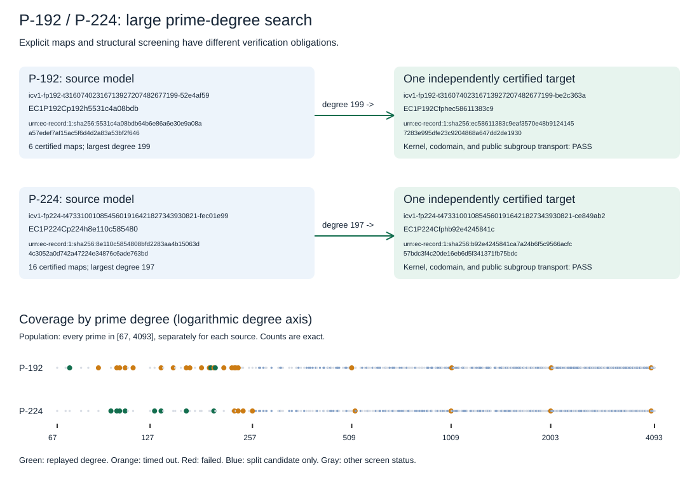

# P-192 / P-224 large prime-degree isogeny search

Dated 2026-10-08. The requested search used the new native algorithms and extended prime-degree screening beyond 1009, through 4093. Construction and structural screening are reported separately.

| Source | Prime degrees screened | Split | Inert | Repeated eigenvalue | Attempts | Completed degrees | Timeouts | Failed | Certified maps | Largest certified degree |
|---|---:|---:|---:|---:|---:|---:|---:|---:|---:|---:|
| P-192 | 546 | 271 | 275 | 0 | 24 | 3 | 21 | 0 | 6 | 199 |
| P-224 | 546 | 246 | 299 | 1 | 16 | 8 | 8 | 0 | 16 | 197 |

The frozen [protocol](PROTOCOL.md) attempted every split prime from 67 through 257 plus the first split prime at or above 509, 1009, 2003 and 4000 for each source. Each child process had a 180-second construction budget. All remaining split primes are candidate degrees without constructed maps. Each accepted degree supplied two maps, with explicit monic kernel polynomials, codomains and rational x-maps.

The [independent replay](evidence-v4/replay.json) uses the existing walker's separate field, polynomial, division-polynomial torsion, subgroup-closure and Velu codomain implementations. Each map also passed 20 public scalar-transport checks on fresh deterministic points. The standard generator's image was nonidentity and satisfied the published prime group order. Exact registered target models, generators and EC1 representations are in [curves.json](evidence-v4/curves.json). This replay is independent by implementation on the same host.



## Construction beyond 1009

| Source | Degree | Outcome | Evidence |
|---|---:|---|---|
| P-192 | 1013 | TIMEOUT | [receipt](evidence-v4/p192/ell-1013.receipt.json) |
| P-192 | 2011 | TIMEOUT | [receipt](evidence-v4/p192/ell-2011.receipt.json) |
| P-192 | 4001 | TIMEOUT | [receipt](evidence-v4/p192/ell-4001.receipt.json) |
| P-224 | 2003 | TIMEOUT | [receipt](evidence-v4/p224/ell-2003.receipt.json) |
| P-224 | 4001 | TIMEOUT | [receipt](evidence-v4/p224/ell-4001.receipt.json) |

A split degree is a structural candidate. A failed or timed-out construction leaves its explicit map unresolved and does not prove nonexistence. Construction beyond 1009 remains unresolved where the individual receipts time out. The search measured no ECDLP-cost change. Process elapsed values are operational time-budget records on a shared host, without isolated benchmark measurements.

## Validation, source and delivery status

Two native implementation fixes were required. The initial P-192 preflight exposed a limb-dispatch bug; the failed launch remains in [evidence/](evidence/) and [SEARCH.log](SEARCH.log). The dispatcher now chooses the exact Montgomery limb count. P-224's Hecke modular-polynomial precondition used the low-word characteristic accessor, whose value is 1 for this 224-bit prime. The precondition now uses an exact characteristic comparison, which also forwards through the existing quadratic-field wrapper. Its regression compares the Hecke polynomial with the separate linear-algebra route and requires two verified maps at a split degree. The final [standalone release suite](validation/algorithms-tests-final.log) passed all 111 tests. The [search example](validation/example-tests-final.log) passed both tests. The [exact map-identity tests](validation/exact-map-tests.log) passed, including rejection of a changed numerator and changed target coefficient.

The final table counts distinct planned degrees. [evidence-v2/search.json](evidence-v2/search.json) preserves the first complete 40-degree search, including the 16 P-224 assertion failures before its fix. It also retains one interrupted P-192 degree-149 invocation without a completed receipt, separately from the sealed retry. Final [evidence-v4/](evidence-v4/) reuses all 24 sealed P-192 trials and their screen byte for byte after command/digest checks; the P-224 trials were executed fresh with the corrected CLI. The original CLI is preserved locally as `isogeny-algos-pre-p224-fix`, with its digest in the manifest.

[evidence-v3/](evidence-v3/) preserves a P-224 preflight RSS-monitor shutdown race without reclassifying its receipt. The corrected supervisor retains the 180-second deadline and sampled 8 GiB RSS cap, samples every 25 ms, and allows at most 100 ms of transient unavailable samples while the child exits. Persistent unavailability fails closed. The final receipts include missing-sample counts and the grace interval. Brief memory growth between samples remains possible.

The mandatory root release-library check failed to compile with 643 existing errors before and after rebasing onto upstream `2fe5cec8a4a9d8d55c8e0abec9fe22852f3a3726`. Its [original log](validation/lib-test.log) and [post-rebase log](validation/lib-test-after-rebase.log) are retained. The independent replay executable imports the original five walker modules directly; every completed map passes kernel checks, exact polynomial substitution, and fresh public subgroup transport. The repository-wide validation and pre-push publication gate remains unresolved until the baseline compiles. See [execution notes](EXECUTION_NOTES.md).

The target registry is updated natively from frozen replayed models. Native cover certificates and the linked cover graph, aliases, leaderboard curve rosters, and browser curve identities are refreshed together. The catalogue tools reproduce the existing outputs exactly before extension. Existing IC measurement bytes are preserved. The boundary ledger, performance scoreboard, progress timeline, and older walker guide receive no new performance row: the experiment supplies maps and exact models without an IC/rho ratio or boundary promotion.

| Catalogue obligation | Status and evidence |
|---|---|
| Registry, mapped generators and EC1 identities | 22 verified targets added; 343 models total; existing record bytes and order preserved. |
| Covers and linked cover graph | [Native replay](validation/catalogue-covers-check-preserved-order.log): all 343 models verified, zero invalid or unsupported inputs. |
| Aliases, leaderboard roster and browser identities | [Native refresh](validation/catalogue-views-preserved-order.log): 22 added roster rows; existing IC board bytes preserved; identity and source-digest joins checked. |
| Dependent traits catalogue | BLOCKED. [Native exporter build](validation/curve-traits-build.log) failed with 485 existing root-library errors. The old 121-row file remains unchanged and was already stale against the 321-model base registry. Static inspection of its parser also shows that existing Montgomery and Edwards forms need upstream support before whole-catalogue regeneration. |
| Performance scoreboard, progress timeline, performance-gains figures and existing theory figures | Checked for impact; no cost measurements, fitted exponents, boundary promotions or old-walker integrations were supplied by this round. Their measured and theoretical results are unchanged. |

All finished search work is committed locally on `codex/p192-p224-large-degree-isogenies-20261008`. The owner's verify-before-push rule requires the root library failures to be fixed first, so branch publication, PR creation and merge remain blocked. The [post-catalogue root check](validation/lib-test-post-catalogue.log) again reports 643 compiler errors. These are separate from the passing standalone suite and map/covers replay.

Sources: [BMSS](https://arxiv.org/abs/cs/0609020), [native CLI/API](../../isogeny_algos/docs/USAGE.md), [existing walker](../../docs/isogeny-walk/README.md). The vector and PDF share editable [report.rs](report.rs) source; [SEARCH.pdf](SEARCH.pdf) includes the report and visual.

## Reproduction

```sh
cargo build --manifest-path isogeny_algos/Cargo.toml --locked --release --bin isogeny-algos --example p192_p224_large_degree_search
isogeny_algos/target/release/examples/p192_p224_large_degree_search isogeny_algos/target/release/isogeny-algos NEW_EVIDENCE_DIR c70c32d486a3ac7531fe27f7193d9f09caa58344
cargo build --manifest-path research/p192_p224_large_degree_isogenies_20261008/Cargo.toml --locked --release --offline --bins
research/p192_p224_large_degree_isogenies_20261008/target/release/replay NEW_EVIDENCE_DIR docs/curves/registry.json
```

[COMMANDS.md](COMMANDS.md) records the actual multi-phase execution and catalogue closeout. [MANIFEST.json](MANIFEST.json) binds the frozen protocol, source files, executable versions, canonical outputs, and evidence bytes. Failed builds and preflight launches remain preserved in their original directories.
