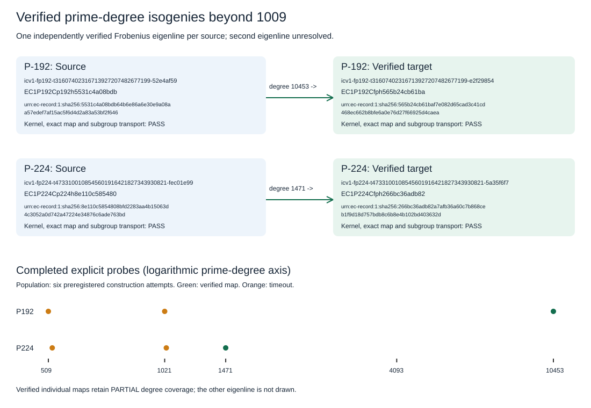

# Verified high-prime isogeny continuation

2026-10-09. Continuing the requested P-192/P-224 search produced explicit, independently verified rational maps beyond degree 1009 on both sources. Each new map covers one selected Frobenius eigenline; complete enumeration of the two eigenlines remains unresolved. The previous 22 maps and all earlier failures remain preserved.

| Source | Degree | Extension degree | Kernel degree | Numerator / denominator coefficients | Verified maps | Degree coverage |
|---|---:|---:|---:|---:|---:|---|
| P-192 | 10453 | 3 | 5226 | 10454 / 10453 | 1 | PARTIAL, one of two eigenlines |
| P-224 | 1471 | 5 | 735 | 1472 / 1471 | 1 | PARTIAL, one of two eigenlines |

The [kernel-first protocol](KERNEL_PROTOCOL.md) fixes the source traces, seed, extension validation, eigenlines, budgets and unchanged mathematical map checks. Native finite extensions pass Rabin irreducibility checks. Nonzero prime-degree torsion and the selected Frobenius eigenvalue are checked, and every kernel coefficient must descend to the source prime field. The existing native Kohel API constructs the map. Independent replay proves squarefreeness, division-polynomial torsion, subgroup closure and the Velu codomain, checks exact rational-map substitution, and verifies 20 fresh public scalar transports plus the mapped generator's published subgroup order.

## Preserved full-Hecke outcomes

| Source | Degree | Method | Budget seconds | Outcome | Receipt |
|---|---:|---|---:|---|---|
| p192 | 509 | full Hecke/Newton | 600 | TIMEOUT | [receipt](run-p192-509/p192/ell-509.receipt.json) |
| p224 | 521 | full Hecke/Newton | 600 | TIMEOUT | [receipt](run-p224-521/p224/ell-521.receipt.json) |
| p192 | 1021 | full Hecke/Newton | 1800 | TIMEOUT | [receipt](run-p192-1021/p192/ell-1021.receipt.json) |
| p224 | 1031 | full Hecke/Newton | 1800 | TIMEOUT | [receipt](run-p224-1031/p224/ell-1031.receipt.json) |
| p224 | 1471 | kernel-first, one eigenline | 1800 | PASS | [receipt](kernel-p224-1471/p224/ell-1471.receipt.json) |
| p192 | 10453 | kernel-first, one eigenline | 1800 | PASS | [receipt](kernel-p192-10453/p192/ell-10453.receipt.json) |

All four full-Hecke jobs retained their two-map acceptance rule and completed with bounded timeouts. The separately preregistered kernel-first route certifies individual maps and records degree coverage PARTIAL; it makes no full-enumeration claim. Process elapsed values and RSS samples are operational receipts on a shared host. No matched speed ratio or ECDLP-cost improvement was measured.

## Implementation and validation

The modular-series setup now uses a field-valued divisor sieve and avoids u64 cube/sum overflow. The standalone release suite passed 114 tests; the supervisor passed both structural tests; extension arithmetic passed four tests including a separately enumerated point-count fixture. Independent verification uses the original walker field and exact kernel conditions. High-degree polynomial multiplication, reciprocal reduction, memoized division recurrences and block modular composition are checked against the unchanged schoolbook/Horner/all-index routines. All 12 verifier tests pass, and the known-answer single-map control passes the full replay. No mathematical verification is omitted.

P-224 degree-1471 replay passed with the original all-index kernel routine. The initial P-192 eager replay was stopped before it produced a certificate; its construction bytes and logs remain preserved. The validated memoized verifier then completed degree-10453 replay with every original kernel and exact-map check.

Sources and reproduction are in [COMMANDS.md](COMMANDS.md) and [execution notes](EXECUTION_NOTES.md). [P-192 replay](kernel-p192-10453/replay.json), [P-224 replay](kernel-p224-1471/replay.json), exact registered models and mapped generators in each run's curves.json, and [MANIFEST.json](MANIFEST.json) bind the evidence. The [PDF](SEARCH.pdf) and vector share editable [report.rs](report.rs) source. Native catalogue/aliases/rosters/browser refresh accompanies these two models; existing IC measurement bytes are preserved. The root-library and stale traits-catalogue publication gates are recorded in the execution notes and are not promoted as passing checks.
