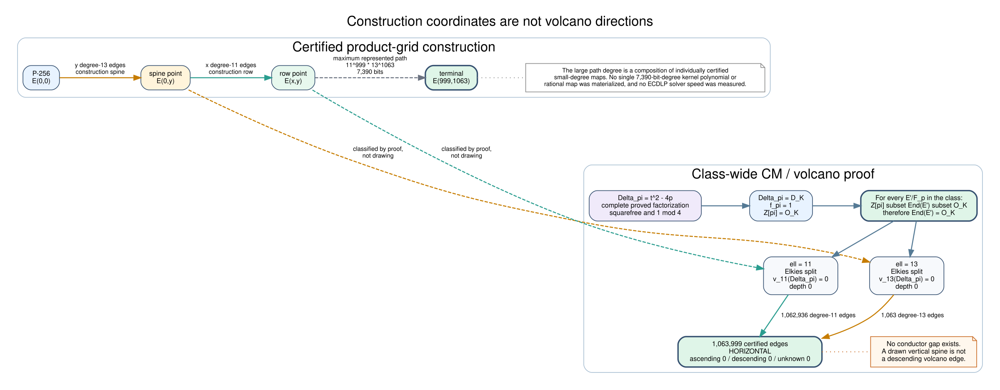
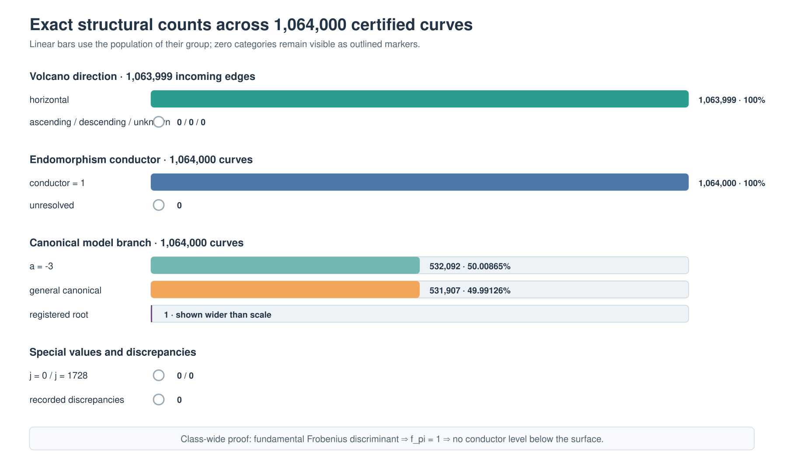

# P-256 isogeny structural trait census: 1,064,000 curves

Status: **complete and independently replayed under the v1 census schema;
class-wide conductor obstruction proved; ECDLP advantage unset**

Date: 2026-10-08

Result class: **exact structural census of the frozen certified population,
not an exhaustive list of all mathematical properties, not all P-256
isogenies, and not an index-calculus speedup**

## Outcome

The native census derived one trait record for each of the **1,064,000**
previously certified, pairwise-distinct P-256-isogenous curves. Independent
source replay reconstructed all **2,983,712,323** uncompressed bytes and
matched the artifact byte for byte. The terminal record-chain SHA-256 is
`9368fc972d7c93c7c2c425f63092464bdda504f87ea2f9a4011e8a4c48e950b1`.
There are no recorded discrepancies and no unresolved direction or conductor
statuses.

The strongest result is class-wide rather than sample-wide. The P-256
Frobenius discriminant is

```text
-455213823400003756884736869668539463648899917731097708475249543966132856781915
```

and its complete proved factorization is squarefree. Because the signed
discriminant is also `1 mod 4`, it is a fundamental quadratic discriminant.
Thus the Frobenius order already equals the maximal order:

```text
Z[pi] = O_K,  f_pi = 1.
```

For every curve `E'/F_p` in the P-256 isogeny class,
`Z[pi] subset End(E') subset O_K`; both endpoints are equal, so every such
endomorphism ring is maximal. There is **no conductor gap anywhere in the
F_p-isogeny class**. In particular, all **1,063,999** certified degree-11 and
degree-13 edges are volcano-horizontal. Counts for ascending, descending and
unknown edges are all zero.

No recorded trait establishes an easier discrete logarithm. The artifact
retains `ecdlp_speedup: null`.

## Requirement-to-evidence accounting

- **Census every previously certified curve — verified:** 1,064,000 inputs,
  unique full-width j-invariants and output records.
- **Retain class, model, path and edge traits — verified under schema v1:**
  deterministic JSONL plus complete byte replay.
- **Separate construction axes from volcano directions — verified:** separate
  fields; every certified edge is horizontal.
- **Find conductor gaps or downward routes — refuted class-wide:** the
  fundamental discriminant forces conductor 1.
- **Account for large factors — verified:** complete proved class-integer
  factorizations.
- **Find one large-prime-degree isogeny — not attempted:** source edge degrees
  are only 11 and 13.
- **Represent a large composite degree — verified symbolically:**
  `11^999 * 13^1063`, 7,390 bits.
- **Exhaust `2^32` curves or all P-256 isogenies — not achieved:** the exact
  population is 1,064,000.
- **Determine every possible curve property — not a finite target:**
  completeness is under schema v1.
- **Establish index-calculus / ECDLP speedup — not established:** no complete
  solver or matched rho.

## Construction axes versus volcano directions



The grid's degree-13 **spine** is drawn vertically and its degree-11 **rows**
are drawn horizontally. Those are construction coordinates only. Volcano
direction is determined by endomorphism orders, not by page geometry.

The largest recorded path reaches `(999,1063)` and has composite degree
`11^999 * 13^1063`. Degree is multiplicative under composition, so the
symbolic representation is exact. The run did not materialize one kernel
polynomial or one rational map of that 7,390-bit degree, did not time point
transport through the chain, and did not search for an alternative
large-prime-degree route.

## CM-order and volcano certificate

For P-256, the exact field prime, group order and trace are:

```text
p = 115792089210356248762697446949407573530086143415290314195533631308867097853951
N = 115792089210356248762697446949407573529996955224135760342422259061068512044369
t = 89188191154553853111372247798585809583
```

The native certificate verifies `t^2 <= 4p`, `gcd(t,p) = 1`, and
`Delta_pi = t^2 - 4p`. The group order `N` is proved prime, so the rational
group is cyclic of prime order.

The absolute Frobenius discriminant factors as

```text
3
* 5
* 456597257999
* 1428624589419343516204097
* 46523541035814968339936406074986559003387
```

All five factors are proved prime and occur to exponent one; the largest is
136 bits. Small factors use deterministic 64-bit Miller--Rabin. Larger
factors use recursive Pocklington `n-1` certificates, and exact multiplication
recovers the declared integer. Ten recursive large-prime certificates are
embedded in the class header.

Because `Delta_pi` is fundamental, `f_pi = 1`. For the two executed edge
degrees:

| `ell` | `Delta_pi mod ell` | splitting | `v_ell(Delta_pi)` | depth | rational neighbors | certified direction |
|--:|--:|:--|--:|--:|--:|:--|
| 11 | 3 | Elkies / split | 0 | 0 | 2 | horizontal, proved |
| 13 | 10 | Elkies / split | 0 | 0 | 2 | horizontal, proved |

The order inclusion and volcano interpretation follow the ordinary finite-
field classification of [Waterhouse (1969)](https://www.numdam.org/item/ASENS_1969_4_2_4_521_0/),
Kohel's 1996 thesis *Endomorphism rings of elliptic curves over finite
fields*, and [Sutherland's isogeny-volcano treatment](https://doi.org/10.1112/S1461157012001089).
The last source is also available as [arXiv:1208.5370](https://arxiv.org/abs/1208.5370).

FactorDB was consulted after protocol freeze to discover candidate factors.
It is not the acceptance oracle: the artifact independently proves primality
and exact products in native Rust. Its query links for the two nontrivial
factored values are the
[Frobenius discriminant](https://factordb.com/index.php?query=455213823400003756884736869668539463648899917731097708475249543966132856781915)
and [twist order](https://factordb.com/index.php?query=115792089210356248762697446949407573530175331606444868048645003556665683663535).

## Exact population counts



| population | exact count |
|:--|--:|
| curves / unique j-invariants | 1,064,000 / 1,064,000 |
| incoming edges | 1,063,999 |
| degree-11 row edges | 1,062,936 |
| degree-13 spine edges | 1,063 |
| horizontal / ascending / descending / unknown | 1,063,999 / 0 / 0 / 0 |
| conductor-one / unresolved curves | 1,064,000 / 0 |
| registered-root / `a=-3` / general models | 1 / 532,092 / 531,907 |
| `j=0` / `j=1728` | 0 / 0 |
| discrepancies | 0 |

The `a=-3` and general branches occupy 50.0086466% and 49.9912594% of the
population, respectively; the registered root is the remaining single
record. The row count is 1,064 complete rows times 999 incoming degree-11
edges; the spine count covers global coordinates 1 through 1,063.

## Field-character structure and anomaly screen

The exact quadratic-character totals are:

| value | nonresidue | zero | residue |
|:--|--:|--:|--:|
| `a` | 531,907 | 0 | 532,093 |
| `b` | 533,126 | 0 | 530,874 |
| `j` | 531,907 | 0 | 532,093 |
| `4a^3+27b^2` | 1,064,000 | 0 | 0 |
| `c4` | 531,907 | 0 | 532,093 |
| `c6` | 533,126 | 0 | 530,874 |

The all-nonresidue denominator initially looks anomalous, but it is forced by
the group structure. The odd prime order gives no rational 2-torsion, so
`x^3+ax+b` has no root and is irreducible. Frobenius acts on its three roots
as a 3-cycle, hence the polynomial discriminant
`-(4a^3+27b^2)` is a square. Since P-256 has `p = 3 mod 4`, `-1` is a
nonresidue, forcing `4a^3+27b^2` to be a nonresidue. This is a consistency
identity, not evidence of a weak model.

The inherited 64-probe quadratic-residue screen has mean **31.996157895** and
population variance **16.302705163**. Its range is 13 through 51, with zero
records at the comparison threshold 52 or primary threshold 54. There are 12
records at least 49 and 14 records at most 15.

- Minimum `qr_prefix_64 = 13`: coordinate `(133,1046)`, UID digest
  prefix `7079df18c4322662...`,
  ICV1 suffix `c036a1fb`.
- Maximum `qr_prefix_64 = 51`: coordinate `(935,866)`, UID digest
  prefix `0cab9d6f7b3526de...`,
  ICV1 suffix `418b9695`.
- Minimum signed `b` length, 233 bits: coordinate `(293,3)`, UID digest
  prefix `dee17fc049efad0c...`,
  ICV1 suffix `c58c6345`.
- Minimum general-model signed `a` length, 236 bits: coordinate `(186,142)`,
  UID digest prefix `5864c4b56e6d6a6a...`,
  ICV1 suffix `3b7c1fdd`.

The full UIDs and identities remain in the byte-replayed curve records.

These extrema are descriptive. None crosses its frozen positive-screen
threshold, and no relation-generation or solver inference is attached to it.

## Large factors are not large-degree maps

The twist order is

```text
3 * 5 * 13 * 179
* 3317349640749355357762425066592395746459685764401801118712075735758936647
```

with a proved 241-bit largest prime factor. The target rational group order is
itself a proved 256-bit prime. No embedding degree was found through the
frozen bound 1,000.

These values answer the class-integer factor question but do not provide
isogeny degrees. Likewise, the 136-bit prime factor of `abs(Delta_pi)` is not
a certified rational isogeny degree. The executed map certificates have prime
degrees only 11 and 13, and every large path degree factors entirely over
those two primes. Horizontal isogenies of other degrees may exist; this run
did not enumerate or materialize them.

## Independent replay and negative controls

Generation and verification agree on every population count, histogram,
source binding, artifact digest, and summary field. Verification reopened the
two original certificates and regenerated the complete artifact into a
comparison writer rather than trusting its recorded derived fields.

| control | expected result | observed |
|:--|:--|:--|
| adjacent legacy grid plus continuation strip | pass | pass, 12/12 unique in fixture |
| overlapping source list | reject | rejected |
| changed source byte | reject | rejected |
| changed direction byte | reject | rejected at byte replay |
| omitted required direction-reason field | reject | rejected by strict schema |
| unresolved direction with status and reason | accept as typed unknown | accepted in focused fixture |
| unresolved direction without reason | reject | rejected |
| known strong pseudoprimes | reject | rejected by deterministic-u64 fixture |
| recursive factor certificates | prove exact class integers | pass |

Focused census tests: **5 passed, 0 failed**. Clippy passed with warnings
denied, the release binary checked successfully, `git diff --check` passed,
and Cairn scan/hook reported no findings before production.

## Transfer and solver boundary

The companion [typed transfer assessment](TRANSFER_ASSESSMENT.json) separates
the following obligations:

- **Small-map existence and execution:** supported by the replayed source
  certificates.
- **Prime-order subgroup preservation:** supported; 11 and 13 are coprime to
  `N`.
- **Conductor gap or vertical route:** refuted class-wide.
- **One executable 7,390-bit-degree map:** not materialized.
- **Large-prime-degree map:** not attempted.
- **Point transport, exceptional cases and recovery:** unknown / not measured.
- **Relation yield, matrix cost, individual-log descent and cold comparison
  with matched Pollard rho:** not attempted.

The weakest unresolved obligation remains destination solving. Faster known-
scalar map evaluation would not by itself imply faster unknown-scalar
recovery. No canonical ECDLP scoreboard is changed.

## Execution receipt

The clean source revision embedded in the artifact is:

```text
f343b90b19cae368afd4fac1db81302435bc8504
```

The release binary is 5,691,464 bytes with SHA-256:

```text
7e3668a7538a33576de168b2df54cadb0c7e0a58205cf93b98e19fd6a72d18c9
```

| phase | wall | user CPU | system CPU | peak RSS |
|:--|--:|--:|--:|--:|
| generation | 210.541 s | 209.473 s | 1.059 s | 184,426,496 B |
| independent replay | 167.653 s | 166.936 s | 0.710 s | 184,356,864 B |

Generation is measured from source audit through the final uncompressed
record; replay is measured through the final byte comparison. The CLI computes
the artifact digests after each core receipt interval. Host: Linux 6.18.44
x86-64, five exposed CPUs,
18,882,699,264 bytes RAM, Rust 1.98.0. The census path is streaming and
single-process; no remote compute or S3 mutation occurred.

```text
p256_isogeny_million trait-census \
  --source p256-grid-1m.jsonl.gz \
  --source p256-strip-y1000-h64.jsonl.gz \
  --source-commit f343b90b19cae368afd4fac1db81302435bc8504 \
  --output traits.jsonl.gz

p256_isogeny_million verify-trait-census \
  --input traits.jsonl.gz \
  --source p256-grid-1m.jsonl.gz \
  --source p256-strip-y1000-h64.jsonl.gz
```

| artifact | bytes |
|:--|--:|
| canonical gzip | 468,711,780 |
| exact decompression | 2,983,712,323 |
| generation receipt | 6,466 |
| replay receipt | 6,491 |

Full SHA-256 digests:

- gzip: `46230554061c4ea0bf859978a5ce3c18d8f0fd0500a92d1c2d9449a2297c1c35`
- decompression: `469664171037bd06d28479f920ad1213af4e2f702e63d86b27852976256353f3`
- generation receipt:
  `0e7eb6b809a4b81a4fe681e2a09ed1588c61223d1fa18190cb262ad42e4c5155`
- replay receipt:
  `1f538b43b83208957ff13d46cb184f4baf0b24d24ab6aedabbb26e874226bdd3`

The gzip used 87.3044% of the frozen 512 MiB artifact cap. Minimum free
temporary storage observed at completion remained above the 512 MiB floor.

The full artifact remains at
`/tmp/p256-isogeny-traits-20261008/traits.jsonl.gz` for this task. That is
local evidence, not durable publication. The managed environment reports no
configured AWS outbound identity, secret binding or destination bucket, so no
S3 upload was attempted. Chat-provided access keys are not protocol inputs.
Durable publication is blocked on an ambient worker identity and an explicit
destination, not on artifact preparation.

## Retained failure

The first launcher used unavailable `/usr/bin/time` and exited 127 before the
census program started or an artifact was opened. Its empty stdout receipt
and 60-byte stderr are retained. Their SHA-256 digests are, respectively:

```text
e3b0c44298fc1c149afbf4c8996fb92427ae41e4649b934ca495991b7852b855
3e737f6a9117cec194b02103b357f8668fae9adb86a8a8cd0bf25efab8948548
```

The failed launcher is not counted as a scientific run.

## Conclusion and next obligations

Within the exact 1,064,000-curve population, every v1 trait is accounted for,
every certified edge is horizontal, every endomorphism conductor is one, and
no discrepancy or frozen detector hit appears. More strongly, the conductor
and absence of vertical `F_p` routes are settled for the entire P-256
isogeny class by the fundamental discriminant proof.

What remains genuinely open is different: horizontal routes of other degrees,
an executable single large-degree map, and any destination representation
with lower end-to-end discrete-log cost. A follow-up large-prime-degree search
must freeze its prime family and map-construction budget. A solver claim still
requires a separate preregistered cold one-target experiment including setup,
map transport, relation collection and verification, linear algebra,
individual-log descent, recovery, independent answer checking, and matched
Pollard rho.
