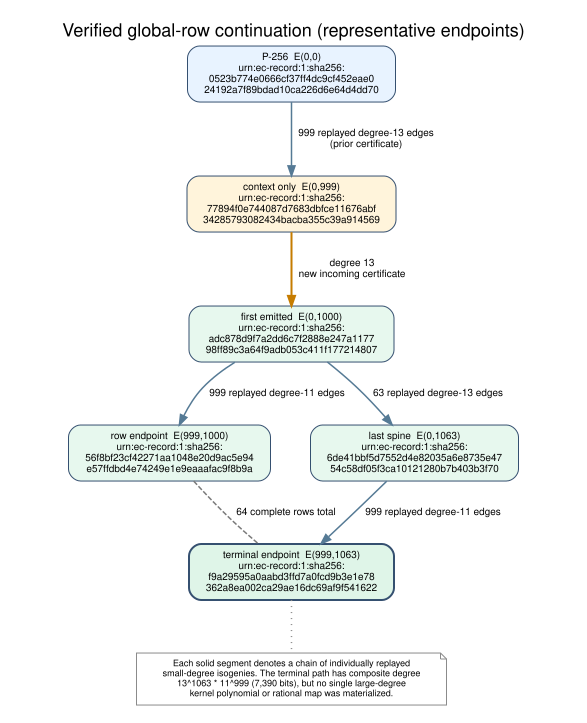
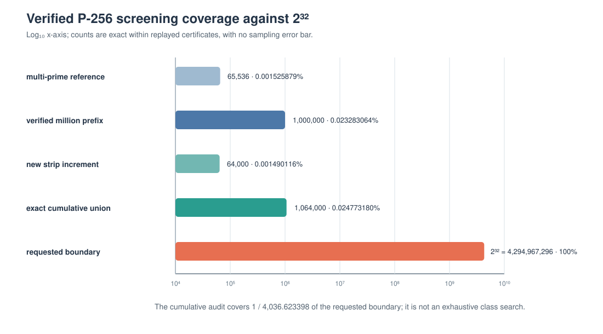

# P-256 global-row continuation: 64,000 new curves

Status: **complete; verified negative frozen screen; solver advantage unset**

Date: 2026-10-07

## Outcome

The frozen continuation generated and independently replayed exactly **64,000
new P-256-isogenous curves** at global coordinates
<code>0 &lt;= x &lt; 1000, 1000 &lt;= y &lt; 1064</code>. Every emitted curve has a
replayed incoming degree-11 or degree-13 kernel certificate. The exact
streaming union of this strip with the immutable million-curve certificate
contains **1,064,000 inputs and 1,064,000 distinct canonical 256-bit
j-invariants**.

No frozen structural screen fired:

- <code>qr_prefix_64</code> ranged from 13 through 48, with zero values at the
  comparison threshold 52 or primary threshold 54;
- minimum canonical signed <code>b</code> length was 240 bits, above 224;
- minimum signed <code>a</code> length among models without
  <code>a = -3</code> was 239 bits, above 224; and
- no j-invariant, canonical model, full ICV1 identity, 48-bit EC1 alias or
  full UID repeated inside the strip.

One expected 32-bit display-slug collision occurred inside the strip. It is
not a full-identity collision. The cross-certificate auditor found no repeated
full-width j-invariant.

The registered rule therefore selected no candidate for a factor-base test or
whole index-calculus solve. **ECDLP speedup remains unset.**

## Requirement-to-evidence accounting

| requirement | status | acceptance evidence |
|:--|:--|:--|
| continue beyond the million prefix | verified | 64 complete new rows, global <code>y = 1000..1063</code> |
| preserve exact isogeny evidence | verified | 64,000 incoming kernels, Velu codomains and target isomorphisms independently replayed |
| prove cumulative identity count | verified for j | [union receipt](runs/p256-strip-y1000-h64/J_UNION.json) reports 1,064,000 distinct canonical j values |
| retain frozen anomaly rules | verified | no adaptive threshold or detector change |
| establish an index-calculus speedup | not established | relation generation, matrix work, transport, recovery and matched rho were not run |
| exhaust 2^32 or the full class | not established | cumulative coverage is 0.024773180% of 2^32 |

The evidence sources are the [frozen protocol](PROTOCOL.md), exact
[generation receipt](runs/p256-strip-y1000-h64/GENERATE.json), independent
[replay receipt](runs/p256-strip-y1000-h64/VERIFY.json), exact
[j-union receipt](runs/p256-strip-y1000-h64/J_UNION.json), and typed
[transfer assessment](TRANSFER_ASSESSMENT.json). The implementation is in
[window.rs](../../src/cryptanalysis/isogeny_walk/million/window.rs) and the
[native CLI](../../src/bin/p256_isogeny_million.rs).

## Construction and map boundary

The context curve at <code>(0,999)</code> was reconstructed from P-256 and was
not counted again. The first emitted curve <code>(0,1000)</code> carries the
new degree-13 certificate from that context. Every subsequent spine or row
curve carries its ordinary incoming certificate. Generation used one
deterministic order audit point per curve; replay used two fresh points
beginning at <code>x = 7</code>.

The endpoint <code>(999,1063)</code> is connected to P-256 by a chain whose
composite degree is <code>13^1063 * 11^999</code>, a 7,390-bit integer. This
is a compact chain representation. The experiment did **not** materialize a
single large-degree kernel polynomial, a single rational map of that degree,
or time payload transport through the complete chain.

Every small edge is a separable cyclic isogeny over <code>F_p</code>. Because
11 and 13 are coprime to the prime P-256 group order, the induced map is an
isomorphism on the rational prime-order subgroup. That establishes subgroup
preservation, not a lower discrete-log cost on the destination model.

## Population and correctness gates

| gate | generation | independent replay | result |
|:--|--:|--:|:--|
| new unique curves | 64,000 | 64,000 | pass |
| incoming parent edges | 64,000 | 64,000 | pass |
| kernel certificates | 64,000 | 64,000 | pass |
| prime-order audits | 64,000 at one point | 64,000 at two new points | pass |
| nonsingular / valid generator | 64,000 / 64,000 | same | pass |
| unique j / model / full ICV1 / EC1 / UID within strip | 64,000 each | same | pass |
| exact uncompressed bytes | 114,464,825 | 114,464,825 | pass |
| strip record-chain SHA-256 | full digest below | same | pass |
| union with million prefix | — | 1,064,000 / 1,064,000 unique j | pass |

The strip record-chain SHA-256 is
<code>7d542b93aec2f21d9237e86f9d079cee4f858b5650bc0995c2f85ca0857cf87d</code>.

The union reader verified the schema, terminal summary, curve count and
rolling chain of each input before inserting canonical 256-bit j values. A
focused fixture supplied the same certificate twice and was rejected with
both duplicate coordinates, so overlap is a tested failure path rather than
an assumed invariant.

## Structural screens

| statistic | frozen threshold | observed in new strip | decision |
|:--|:--|:--|:--|
| <code>qr_prefix_64</code> primary | at least 54 | maximum 48; zero hits | no candidate |
| <code>qr_prefix_64</code> comparison | at least 52 | zero hits | no candidate |
| canonical <code>b</code> signed bits | at most 224 | minimum 240 at <code>(209,1007)</code> | no candidate |
| non-<code>a=-3</code> signed <code>a</code> bits | at most 224 | minimum 239 at <code>(531,1047)</code> | no candidate |

The new strip's QR-count mean was 31.987078 and population variance was
16.380380. Combining its histogram with the prior million gives mean
31.996158 and variance 16.302705. These are descriptive calculations over
the deterministic screen, not independent-sample inference.

The single value at 13 is a post-execution low-tail observation and was not a
frozen trigger. Under only the simple <code>Binomial(64, 1/2)</code>
reference, <code>P[X &lt;= 13] = 9.4048e-7</code>, or 0.0602 expected values in
64,000 trials; the probability of at least one is about 5.84%. The probes and
isogenous models are not assumed independent, so this calculation neither
establishes nor rules out a structural effect.

The strongest cumulative screen values remain in the prior million prefix:
maximum QR count 51, minimum signed <code>b</code> length 233, and minimum
non-<code>a=-3</code> signed <code>a</code> length 236. The continuation does
not change the frozen candidate decision.

## Coverage boundary

| population | exact unique curves | fraction of 2^32 | coverage percent | ECDLP speedup |
|:--|--:|--:|--:|:--|
| prior million prefix | 1,000,000 | 0.0002328306437 | 0.023283064% | unset |
| new strip increment | 64,000 | 0.00001490116119 | 0.001490116% | unset |
| exact cumulative j union | 1,064,000 | 0.0002477318048 | 0.024773180% | unset |
| requested boundary | 4,294,967,296 | 1 | 100% | unset |

The cumulative count is one part in 4,036.623398 of 2^32. The frozen protocol
printed 4,036.624060 in its planned reciprocal row; that was an arithmetic
transcription error. Its exact count and percentage were correct, and the
frozen file has not been rewritten after seeing results.

Neither grid coordinates nor path degree define all distinct curves in the
P-256 isogeny class. This is exact coverage of two replayed certificates, not
an exhaustive class enumeration and not evidence about unexecuted
coordinates.

## Execution receipt

The clean implementation commit bound into the new certificate is
<code>581aeff3d89b412e718207e05f4002808271f1ef</code>. The release binary was
4,874,560 bytes with SHA-256
<code>1591684928920cc67e7be5b44d50d76b8489560189ef59d072faa8800be1d8c3</code>.

| phase | threads | wall | user CPU | system CPU | peak RSS |
|:--|--:|--:|--:|--:|--:|
| generation, one audit point | 4 | 369.899 s | 1,380.471 s | 0.300 s | 86,233,088 B |
| replay, two audit points | 5 | 411.530 s | 1,409.073 s | 0.145 s | 88,707,072 B |
| two-certificate j union | 1 | 19.514 s | 19.588 s | 0.416 s | 183,721,984 B |

Host: Linux 6.18.44 x86-64 KVM, five exposed AMD EPYC 9V74 cores,
18,882,699,264 bytes RAM; Rust
<code>1.98.0 (88d9e12ae 2026-08-18)</code>.

~~~text
p256_isogeny_million --threads 4 generate-strip \
  --width 1000 --y-start 1000 --height 64 --batch-rows 8 \
  --audit-points 1 \
  --source-commit 581aeff3d89b412e718207e05f4002808271f1ef \
  --output p256-strip-y1000-h64.jsonl.gz

p256_isogeny_million --threads 5 verify-strip \
  --input p256-strip-y1000-h64.jsonl.gz \
  --audit-points 2 --audit-seed-x 7 --batch-rows 8

p256_isogeny_million audit-j-union \
  p256-grid-1m.jsonl.gz p256-strip-y1000-h64.jsonl.gz
~~~

| artifact | bytes | SHA-256 |
|:--|--:|:--|
| new canonical gzip | 33,739,337 | <code>90f22f7aadae…3f701</code> |
| new exact decompression | 114,464,825 | <code>a24593f9d1d1…714b1</code> |
| generation receipt | 4,921 | <code>f8965169b464…68305</code> |
| replay receipt | 4,963 | <code>a11ab708d6b3…26619</code> |
| union receipt | 1,654 | <code>44f5e746668b…086bb</code> |

Full SHA-256 digests:

- canonical gzip:
  <code>90f22f7aadaef78cff5a72889e5539b2ae81459d57d7a84b37a9009e96a3f701</code>
- exact decompression:
  <code>a24593f9d1d1c880b63f1da86d10e375981f72aaa358e1eae428e63b3d4714b1</code>
- generation receipt:
  <code>f8965169b464dc8db294be0534d04c1963d2022ca2a7ef2049ffcd5d4f868305</code>
- replay receipt:
  <code>a11ab708d6b3192faf1a4052ef2820bd8c6a43ffe14540af52b54970f8f26619</code>
- union receipt:
  <code>44f5e746668bb797d51bcbcc26a795c1b32e83dae8c96dcd877167b97de086bb</code>

The large certificate remains local at
<code>/tmp/p256-j-strip-20261007/runs/p256-strip-y1000-h64/</code>. A local
path is not durable publication. No S3 upload or Cairn network submission was
attempted because this environment has no configured ambient AWS identity,
destination bucket, Cairn objective or signing identity. The implementation
can stage and validate content-addressed storage once those are provided
through the worker environment.

## Validation and retained failures

- focused generation/replay, deterministic identity, boundary-tamper and
  parent-tamper tests passed;
- adjacent small strips replayed and unioned to 20 distinct j values;
- a deliberately overlapping small union failed with both locations;
- the legacy small-grid replay/tamper test passed;
- native check and clippy with warnings denied passed;
- focused Rust formatting and <code>git diff --check</code> passed before
  production.

Two pre-production failures are retained rather than overwritten:

1. a debug build exhausted its disposable target filesystem and failed with
   <code>No space left on device</code>; the disposable target alone was
   removed, then rebuilt with incremental compilation and debuginfo disabled;
   and
2. the first production launcher used unavailable <code>/usr/bin/time</code>
   and exited 127 before the program started. Its empty receipt and stderr
   remain beside the successful attempt locally.

Neither failed attempt is counted as a passing run.

## Scoreboards and conclusion

Canonical ECDLP and solver scoreboards remain unchanged because this
enumeration measured no relation yield, linear algebra, target-log recovery,
matched Pollard rho or end-to-end time. The only quantitative additions are
curve coverage, construction/replay cost and exact union identity count.

Within the executed continuation, there is no frozen structural candidate and
no full-width j discrepancy. The result does not support the claim that index
calculus is faster on an isogenous P-256 model.

The next defensible step is another disjoint, preregistered global-row strip,
followed by the same replay and union gates. A solver experiment should begin
only if a frozen detector selects a curve; then it must compare cold,
full-pipeline index calculus with matched Pollard rho while including map
transport and recovery costs.
