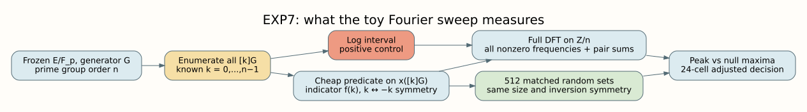
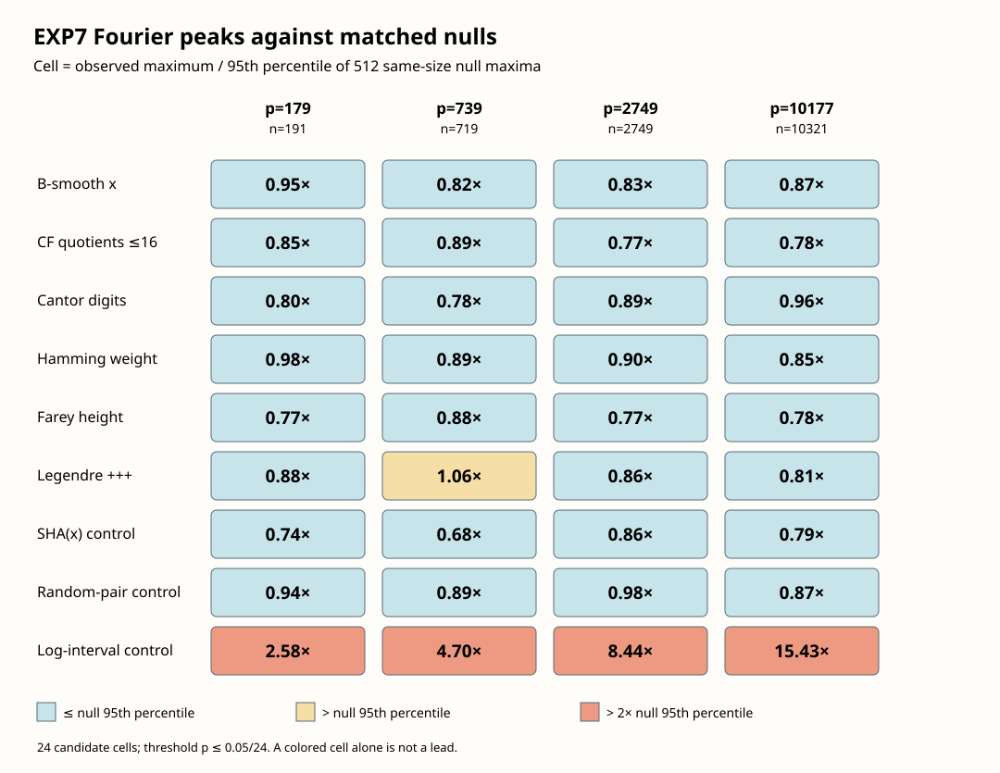

# EXP7: Fourier flatness sweep on toy prime curves

**Run date:** 2026-10-08 (UTC; see the [date erratum](ERRATA.md)). **Status:** measured toy diagnostic; no adjusted
candidate lead. This is the first item of the proposed six-item program. Items
2–6 were not run in this work.

## Question, scope, and evidence

Does a cheap predicate of a point's affine abscissa select an unusually
structured subset of the cyclic elliptic-curve group when points are indexed
by their discrete logarithms? The [frozen protocol](PROTOCOL.md) specifies six
candidate predicates, two null controls, one log-aware positive control, four
prime-order curves, 512 matched random sets per case, and the decision rule.
The [Rust sweep](../../examples/exp7_fourier_flatness.rs) produced the complete
[raw result](results.json); the [peak-ratio table](peak_ratios.csv) is a compact
derived view. The measured source revision is
`2e3e894a45ea3cfd9490349b95081073a85c6a5f`; the baseline is
`30da958ed337fb3d7522d7fd691aa15e6c733a97`.

For `P=[k]G`, let `f(k)` be 1 if `P` passes the predicate and 0 otherwise.
The program computes every coefficient
`F(j)=Σ_k f(k) exp(-2πijk/n)`, tests the maximum for `j≠0`, and normalizes by
`sqrt(m(1−m/n))` with `m=Σ_k f(k)`. It compares this maximum with 512
independent random sets of the same size. The nulls for abscissa predicates
select `k` and `−k` in pairs, preserving the exact symmetry induced by
`x(P)=x(−P)`. The log interval uses unconstrained random sets. The program
also computes the full ordered-pair sum vector by inverse transforming
`F(j)^2`, stores each membership bitset, and records the eight largest
coefficients. The full bitset permits exact replay of every coefficient and
pair-sum count.



The pipeline diagram's editable source is [pipeline.dot](pipeline.dot), and its
PDF copy is [pipeline.pdf](pipeline.pdf).

## Exact measured populations

All four curves are short-Weierstrass `y²=x³+ax+b` over `F_p` with prime group
order `n`, cofactor 1, and generator `G`. They were selected by the repository
constructor with curve seed `20261007`; their complete point lists in log
order are in [results.json](results.json).

| Requested bits | `p` | `a` | `b` | `n` | `G=(x,y)` | Exact ICV1 |
| ---: | ---: | ---: | ---: | ---: | --- | --- |
| 8 | 179 | 51 | 41 | 191 | (108,39) | `ICV1:fp-179:-11:191:96:unk:unk:r:a52b529ce9ce` |
| 10 | 739 | 242 | 567 | 719 | (559,630) | `ICV1:fp-739:21:719:614:unk:unk:r:a47a74d0df47` |
| 12 | 2749 | 1936 | 200 | 2749 | (1388,830) | `ICV1:fp-2749:1:2749:2173:unk:unk:r:096cb4f9e068` |
| 14 | 10177 | 3690 | 7829 | 10321 | (3481,6440) | `ICV1:fp-10177:-143:10321:5678:unk:unk:r:b65f5c0e2b63` |

For each curve, enumeration verified `n` distinct points, every point on the
curve, and `[n]G=O`; the counted enumeration used exactly `n` additions and
zero doublings or scalar multiplications. Curve search and its costs are in
the repository's `find_prime_order_curve` constructor, not these enumeration
counts. The sweep requires the known log `k` of every toy point and therefore
is not an unknown-log membership oracle.

## Results



The plot's editable [Rust source](render.rs), [Cargo wrapper](../../examples/exp7_render.rs),
[CSV data](peak_ratios.csv), and [PDF copy](peak_ratios.pdf) are committed with
the raw output. Each cell is observed normalized maximum divided by the
matched-null 95th percentile. A ratio above 1 is descriptive only; the
preregistered lead rule is the empirical `p ≤ 0.05/24 = 0.00208333` for any
of the **24 candidate cells**. None met it.

| Candidate predicate | Smallest empirical `p` across four curves | Largest observed/null-95 ratio |
| --- | ---: | ---: |
| `x` B-smooth | 0.08187 | 0.952 |
| Every partial quotient of `x/p` at most 16 | 0.17154 | 0.890 |
| Base-3 Cantor digits of `x` | 0.12865 | 0.960 |
| Low base-2 Hamming weight of `x` | 0.06628 | 0.977 |
| Bounded Farey height of `x` | 0.30994 | 0.879 |
| Legendre `(x,x+1,x+2)=(+,+,+)` | **0.01754** | **1.058** |

The Legendre cell at `p=739`, `n=719`, has `m=84`, observed peak
`Z=4.00516`, matched-null 95th percentile `Z=3.78610`, and 8 of 512 null
maxima at least as large, giving `(8+1)/513=0.01754`. Its Bonferroni
adjusted value is `min(1,24×0.01754)=0.42105`; it is an unadjusted outlier,
not a preregistered lead. With 512 nulls the minimum possible empirical
`p=1/513=0.00194932`, so the declared threshold is crossed only if **zero**
nulls exceed the observed maximum. The data support the stated bounded
decision, not a universal flatness conclusion.

| Control | `p=179` | `p=739` | `p=2749` | `p=10177` |
| --- | ---: | ---: | ---: | ---: |
| SHA-256 of `x`, peak/null-95 | 0.740 | 0.678 | 0.862 | 0.789 |
| Uniform inversion-pair set, peak/null-95 | 0.940 | 0.888 | 0.980 | 0.874 |
| Log interval, peak/null-95 | **2.583** | **4.702** | **8.442** | **15.432** |

The log interval exceeds its null 95th percentile on all four curves,
satisfying the positive-control gate. Each log interval's empirical
`p=1/513`. The SHA and random-pair controls did not exceed their own matched
null 95th percentiles. There are 36 observed spectra and 18,432 null spectra
in the complete four-curve sweep. All case sizes, peaks, frequencies, null
distributions, and bitsets are preserved in [results.json](results.json).

The largest inverse-FFT pair-count distance to an integer is
`7.19×10⁻⁹`; the largest relative Parseval error is `1.46×10⁻¹²`.
The reported maximum pair-sum deviation is dominated for paired sets by the
forced `k+(−k)=0` count. It is retained as a complete-convolution check, but
that scalar maximum alone is not an independent additive-structure claim.
If the earlier `P+Q∈S` count is desired, it is exactly
`Σ_t (f*f)(t)f(t) = (1/n)Σ_j F(j)²F(−j)`, recoverable from the stored bitsets;
that **triple** count was not separately calibrated in this run. A maximum
Fourier peak can flag a pattern missed by one sum count, but neither scalar
statistic is universally more sensitive.

## Reproduction and validation

From the repository root, with Rust 1.99 and the checked-in lockfile:

```sh
cargo test --locked --release --example exp7_fourier_flatness
cargo run --locked --release --example exp7_fourier_flatness -- \
  research/prime_fourier_flatness_exp7_20261007/results.json
cargo run --locked --release --example exp7_render -- \
  research/prime_fourier_flatness_exp7_20261007
dot -Tsvg research/prime_fourier_flatness_exp7_20261007/pipeline.dot \
  -o research/prime_fourier_flatness_exp7_20261007/pipeline.svg
bash research/prime_fourier_flatness_exp7_20261007/build_report.sh
```

The measured `results.json` is **1,419,454 bytes**, SHA-256
`cf763916bff2972d47a915c1d6dabd1c2953ecde2e82ce688ba0f5adb0655067`.
A date label in the frozen protocol and study-directory name says October 7;
the commit and file timestamps establish the actual UTC date as October 8.
The [erratum](ERRATA.md) preserves this correction without rewriting the
premeasurement protocol.
A second execution with the same code and settings produced a byte-identical
JSON file. Four focused tests pass: Bluestein versus direct DFT and inverse,
pair-sum convolution versus direct counts, predicate/null behavior, and exact
group enumeration. An initial premeasurement test assertion incorrectly
expected `n−1` counted group additions; it was corrected to `n`, including
the final addition returning to `O`, before the code was frozen and measured.
`rustfmt --check` passes. Strict Clippy reports a pre-existing unrelated lint
at `src/symmetric/modes/pmac.rs:112`; targeted Clippy with
`-A clippy::mismatched_bit_width_type` passes for the example.

The algorithm pays for whole-group enumeration plus 512 FFT spectra per case;
no per-target DLP cost or speedup is measured. The point lists, membership
bits, null seeds, and protocol in the committed files define the exact replay.
This diagnostic neither establishes the user's broad Weil/Deligne statement
for every algebraic predicate nor the asserted hardcore-bit implication for
every cheap predicate and arbitrary Fourier character; such claims require
their own hypotheses and reductions. These toy outcomes also say nothing
conclusive about larger curves.

## Repository graph review and next obligations

Reviewed the canonical [index-calculus scoreboard](../../docs/index-calculus-scoreboard.html),
[progress data](../../docs/ic/progress-timeline.json), `docs/curves/`,
`docs/performance-gains/`, and `figures/`. EXP7 introduces no IC/rho ratio,
new curve registry entry, verified attack performance, or curve transport
edge, so no canonical panel or published copy changes. This study's graph and
diagram record the new diagnostic directly. The proposed low-degree sweep,
learned classifier, jet-space descent, lift-height control, and isogeny-rank
control remain unimplemented items 2–6; they are not inferred from EXP7.
