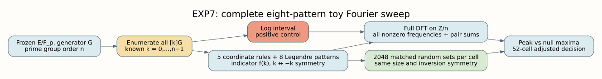
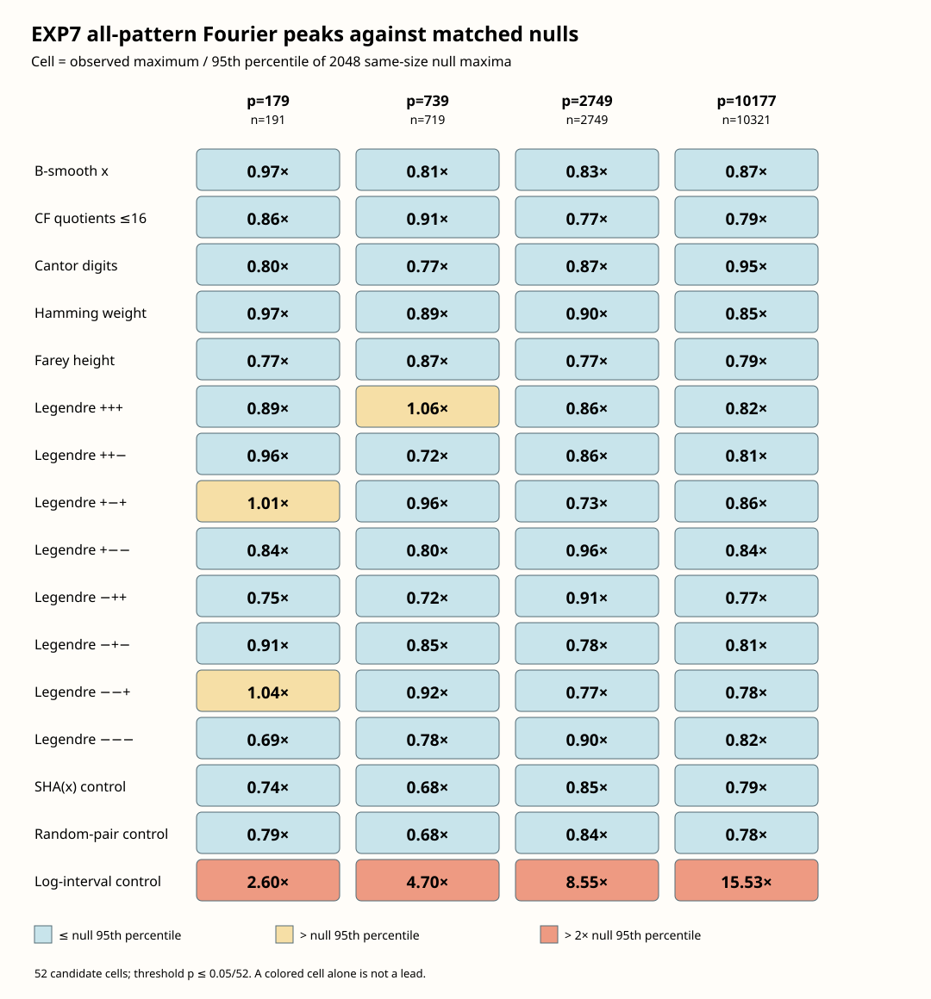

# EXP7: complete Legendre-pattern Fourier sweep

**Measured 2026-10-08 UTC.** The 20261007 study-directory label is corrected
in the [date erratum](ERRATA.md). This is the completed first item of the
proposed six-item list, on four **toy** prime-order curves. No candidate met
the declared adjusted lead rule. Items 2–6 were not run.

## Protocol, sources, and population

The [original protocol](PROTOCOL.md) and its [precommitted all-pattern
extension](PROTOCOL_ALL_PATTERNS.md) define the membership rules, nulls,
controls, and decisions. The original [512-null run](results.json) tested
only the `+++` Legendre pattern and is preserved with its [pilot
report](RESULT.md). The final [2048-null run](results_all_patterns.json)
tests all eight sign patterns of the Legendre symbols of `x`, `x+1`, `x+2`,
alongside B-smooth `x`, bounded continued-fraction quotients of `x/p`,
base-3 Cantor digits, bounded base-2 Hamming weight, bounded Farey height,
SHA-256 of `x`, one random inversion-pair set, and a log interval. Zero
Legendre values belong to none of the eight sign-pattern cells. The
[implementation](../../examples/exp7_fourier_flatness.rs) at measured revision
`d3c26e537cdbd2e081f38631d4cd1784e03e407c` was committed before the
run. The [compact CSV](peak_ratios_all_patterns.csv) and quantitative figure
are derived from the complete JSON.

For `P=[k]G`, the indicator `f(k)` selects points satisfying one predicate.
The arbitrary-length FFT computes all nonzero character coefficients
`F(j)=Σ_k f(k) exp(-2πijk/n)` and records the maximum normalized by
`sqrt(m(1−m/n))`, where `m` is the set size. Each coordinate case is compared
with 2048 uniformly sampled, exact-size random sets of inversion pairs
`{k,−k}`. This matches the unavoidable `x(P)=x(−P)` symmetry. The log interval
is compared with unrestricted exact-size random sets. The null statistic is
the **maximum across all nonzero frequencies**, not a prespecified frequency.
The program also inverse-transforms `F(j)^2` to check ordered-pair sum counts
and saves every membership bitset for exact spectral replay.



Editable [Graphviz source](pipeline_all_patterns.dot) and [vector PDF](pipeline_all_patterns.pdf)
accompany the diagram.

| Bits | `p` | `a` | `b` | Prime `n` | `G=(x,y)` |
| ---: | ---: | ---: | ---: | ---: | --- |
| 8 | 179 | 51 | 41 | 191 | (108,39) |
| 10 | 739 | 242 | 567 | 719 | (559,630) |
| 12 | 2749 | 1936 | 200 | 2749 | (1388,830) |
| 14 | 10177 | 3690 | 7829 | 10321 | (3481,6440) |

| `p` | Exact ICV1 |
| ---: | --- |
| 179 | `ICV1:fp-179:-11:191:96:unk:unk:r:a52b529ce9ce` |
| 739 | `ICV1:fp-739:21:719:614:unk:unk:r:a47a74d0df47` |
| 2749 | `ICV1:fp-2749:1:2749:2173:unk:unk:r:096cb4f9e068` |
| 10177 | `ICV1:fp-10177:-143:10321:5678:unk:unk:r:b65f5c0e2b63` |

Each curve has cofactor 1 and `[n]G=O`. Exact enumeration checked `n`
distinct on-curve points and counted exactly `n` group additions, zero
doublings, and zero scalar multiplications per curve. The complete points in
log order and `f(k)` bitsets are in the JSON. This diagnostic starts with
every toy log `k` known; it is not a cheap membership oracle for an unknown
log. Curve search cost is outside the enumeration count.

## Observations and declared decision



The chart has editable [Rust source](render_all_patterns.rs), a [Cargo
wrapper](../../examples/exp7_render_all_patterns.rs), [CSV
data](peak_ratios_all_patterns.csv), and a [vector PDF](peak_ratios_all_patterns.pdf).
Each ratio is the observed normalized maximum divided by the 95th percentile
of its 2048 null maxima. Yellow marks a ratio above 1, which alone is **not**
the adjusted lead rule.

The predeclared family has 13 coordinate predicates × 4 curves = **52
candidate cells**, so a lead needs empirical `p ≤ 0.05/52 = 0.000961538`.
The minimum possible empirical `p=1/2049=0.000488043`; only zero null
exceedances can cross the threshold. The JSON reports **zero** adjusted
leads. The smallest candidate empirical value is the `+++` Legendre cell on
`p=739, n=719`: `m=84`, observed `Z=4.005158`, null 95th percentile
`Z=3.761062`, ratio `1.064901`, and **31** of 2048 null maxima at least as
large. Thus `p=(31+1)/2049=0.0156174`, and its Bonferroni adjusted value is
`0.812103`. It remains the largest candidate ratio and smallest candidate
`p`, without meeting the lead rule.

| Candidate | Minimum empirical `p` across curves | Maximum peak/null-95 ratio |
| --- | ---: | ---: |
| B-smooth `x` | 0.07028 | 0.969 |
| Continued fraction ≤16 | 0.16057 | 0.912 |
| Base-3 Cantor digits | 0.11713 | 0.954 |
| Base-2 Hamming weight | 0.07565 | 0.972 |
| Farey height | 0.29575 | 0.871 |
| Legendre `+++` | **0.01562** | **1.065** |
| Legendre `++−` | 0.08541 | 0.964 |
| Legendre `+−+` | 0.04783 | 1.007 |
| Legendre `+−−` | 0.10249 | 0.962 |
| Legendre `−++` | 0.22596 | 0.913 |
| Legendre `−+−` | 0.15471 | 0.914 |
| Legendre `−−+` | 0.02879 | 1.041 |
| Legendre `−−−` | 0.26696 | 0.898 |

The three candidate cells above their own null 95th percentiles are
`+++` at `p=739` (`p=0.01562`), `+−+` at `p=179` (`p=0.04783`), and `−−+`
at `p=179` (`p=0.02879`). All other candidate ratios are below 1.
The SHA control ratios across ascending `p` are `0.737, 0.683, 0.854,
0.794`; the random-pair control ratios are `0.792, 0.680, 0.837, 0.785`.
The log-interval positive-control ratios are **2.595, 4.701, 8.549,
15.534**; each has empirical `p=1/2049` and passes its 95th-percentile
gate. The complete run has 64 observed spectra and **131,072 null spectra**.

The maximum inverse-FFT distance of a pair count from an integer is
`7.19×10⁻⁹`; maximum relative Parseval error is `1.46×10⁻¹²`. For
inversion-symmetric sets, the forced `k+(−k)=0` count dominates the maximum
pair-sum deviation. That scalar is retained as a numerical check; it is not
evidence of an exploitable relation. The full spectrum determines the
ordered-pair sum vector and the earlier `P+Q∈S` triple count through
`(1/n)Σ_j F(j)²F(−j)`. The triple count itself was not separately calibrated.
The maximum Fourier peak tests a different statistic from one triple count;
no universal power ordering follows from this run.

## Requirement status and interpretation limits

| Requested element | Status |
| --- | --- |
| Predicate panel | Measured: five thresholds and eight signs; sizes and bitsets in [JSON](results_all_patterns.json). |
| Null controls | Measured: SHA and random sets, 2048 matched nulls per cell. |
| Positive control | Measured: four of four log intervals pass. |
| FFT and convolution | Verified by direct DFT and pair-count tests. |
| Triple-count nulls | Not run; `P+Q∈S` count is recoverable from bitsets. |
| Other proposed items | Items 2–6 not attempted here. |

These observations are bounded to four toy curves and the specified predicate
thresholds. The null ensemble conditions on set size and inversion symmetry;
it does not prove that every algebraic or cheap predicate is flat. General
Weil/Deligne estimates require a precisely specified sum and hypotheses, and
the asserted hardcore-bit implication for arbitrary cheap-predicate/Fourier
correlation needs a reduction with its own advantage and access assumptions.
Neither claim is established by these measurements. A toy Fourier peak also
does not imply a faster unknown-log algorithm. The user can treat the three
unadjusted cells as data for future hypotheses; under this run's declared
decision they are not leads.

## Reproduction, validation, and repository graphs

From the repository root, with Rust 1.99 and the lockfile:

```sh
study=research/prime_fourier_flatness_exp7_20261007
cargo test --locked --release --example exp7_fourier_flatness
cargo run --locked --release --example exp7_fourier_flatness -- \
  "$study/results_all_patterns.json"
cargo run --locked --release --example exp7_render_all_patterns -- \
  "$study"
bash "$study/build_report_all_patterns.sh"
```

The measured JSON is **5,054,651 bytes**. Its SHA-256 is:

`9322025e326761cf6e36b4fc67c85c12fe39300a3e365e005b7b6b78ee32de1c`

Its source revision is recorded in the file. A same-command repeat written to
`/tmp/exp7-all-patterns-repeat.json` was byte-identical (`cmp` exit 0;
the same SHA-256). Four focused tests pass: FFT versus direct DFT and
inverse, convolution versus direct pair counts, exact group enumeration, and
predicate/null checks including all eight Legendre patterns. Targeted
`rustfmt --check` and Clippy with the known unrelated
`clippy::mismatched_bit_width_type` lint suppressed pass. Strict Clippy
reports the existing `src/symmetric/modes/pmac.rs:112` lint; repository-wide
`cargo fmt --all -- --check` also reports pre-existing formatting elsewhere.
Neither was caused by EXP7. The pilot report records its corrected
premeasurement test assertion.

The sweep charged whole-group enumeration and all 131,072 null FFTs. It
contains no timed-ratio, online DLP, or speedup claim. The canonical
[index-calculus scoreboard](../../docs/index-calculus-scoreboard.html),
[progress data](../../docs/ic/progress-timeline.json), `docs/curves/`,
`docs/performance-gains/`, and `figures/` were checked. EXP7 creates no
IC/rho ratio, curve registry change, verified attack performance result, or
curve edge, so those panels are unchanged. This study's new graph and
diagram show the measured diagnostic and are kept with their editable
sources and PDF copies.
