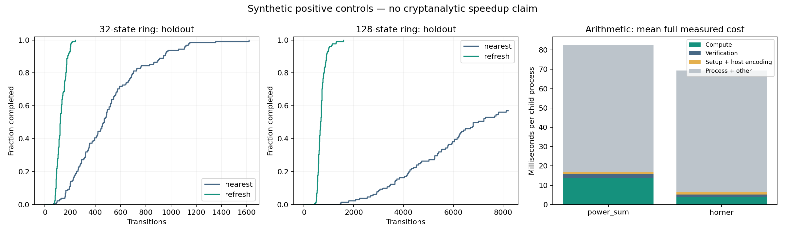

# Synthetic performance study

These are known numerical positive controls, not new cryptanalytic algorithms. There is no elliptic-curve arithmetic, key input, discrete-log solver, or GPU backend in this suite.

## Operation-count distribution

Each trial covers every state of a finite ring. The baseline takes nearest-neighbor random steps; the candidate refreshes to an independent uniform state. This changes the transition law. It is not a drop-in walk optimization for a collision solver. One transition counts as one operation; its machine cost need not be equal between variants. The initial state is free in both variants.

Intervals are descriptive 95% paired percentile bootstrap intervals (1,000 resamples). Ratios are baseline/candidate. All capped trials contribute their full budget to the restricted mean E[min(T, budget)]. The ratio is not an estimate of uncensored mean completion-time speedup.

| Split / states | Baseline completed | Candidate completed | Restricted mean ratio [95% CI] |
|---|---:|---:|---:|
| discovery/32 | 128/128 | 128/128 | 4.023× [3.598, 4.510] |
| discovery/128 | 81/128 | 128/128 | 8.961× [8.285, 9.646] |
| holdout/32 | 128/128 | 128/128 | 3.901× [3.502, 4.354] |
| holdout/128 | 73/128 | 128/128 | 9.126× [8.521, 9.714] |

## Exact arithmetic and full measured cost

The candidate is ordinary Horner evaluation; the baseline sums modular powers. Both evaluate degree-24 polynomials modulo 257. Every sampled polynomial is checked at all 257 field elements against an independent unbounded-integer power-sum reference. Every timed output is also verified, and paired input/output digests must agree.

Timing uses fresh child processes, identical fixtures within each pair, and randomized variant order. Full measured cost includes initialization, host input encoding/decoding, warmup, computation, output encoding, exhaustive verification, interpreter startup/teardown, and subprocess IPC. The final run also includes parent receipt parsing. Report generation and final artifact writes are outside per-trial timing. No GPU, PCIe, or network transfer has been measured.

| Split | Verified and paired | Compute ratio [95% CI] | Full wall ratio [95% CI] | Decision |
|---|---|---:|---:|---|
| discovery | True | 3.803× [3.359, 4.392] | 1.159× [1.082, 1.227] | finite_end_to_end_improvement |
| holdout | True | 3.646× [3.071, 4.275] | 1.193× [1.142, 1.246] | finite_end_to_end_improvement |

A decision requires every arithmetic timing and memory trial to complete and verify. Failed, incorrect, or timed-out trials remain in the ledger and block a speedup claim. Coverage caps are intentionally retained as censored observations. The holdout fixtures are disjoint from discovery, and variants are fixed before either split. Confidence intervals describe this process and machine sample, not all hardware or later workloads.

## Memory (separate instrumented passes)

| Split / variant | Python traced peak bytes | Process peak RSS bytes |
|---|---:|---:|
| discovery/power_sum | 184759 | 26263552 |
| discovery/horner | 184759 | 26345472 |
| holdout/power_sum | 184759 | 26263552 |
| holdout/horner | 184759 | 26214400 |

Memory timing is excluded from speed ratios. RSS is a process high-water mark including the interpreter; traced memory covers Python allocations and is not equivalent to RSS. One memory pass per variant and split is diagnostic, not a statistically established memory improvement.

## Provenance

- Platform: `macOS-26.6-arm64-arm-64bit-Mach-O`
- Python: `3.13.1 (v3.13.1:06714517797, Dec  3 2024, 14:00:22) [Clang 15.0.0 (clang-1500.3.9.4)]`
- Study source SHA-256: `b7b6642c7278212759af79b41e2335224f791f69054338b6a940e4f0a747e344`
- Trial ledger SHA-256: `1d85720337efa0f20263257a42e2e563119a6218279641b7d72542a928bb61b8`
- Coverage trials per split/size/variant: 128
- Coverage operation budget: 8192
- Arithmetic pairs per split: 24
- Timed evaluations per arithmetic trial: 4096
- Child watchdog: 15 seconds

The host was not isolated from other workloads. No CPU affinity, frequency lock, or GPU measurement was used. Startup and scheduling variation may dominate small workloads. These results support only the stated finite numerical comparisons.

