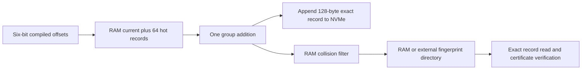

# Compiled reservoir-guided archive walk

Date: 2026-09-21

Status: fully specified theoretical candidate with finite public-synthetic
controls, probabilistic-sketch verification, cross-order scaling, and exact
1 TB RAM / 100 TB disk capacity calculations.  It provides a finite online
group-addition improvement after target-independent compilation.  It does not
establish asymptotic, end-to-end, hardware, cryptanalytic, or novelty claims.

The working label is **compiled reservoir-guided archive walk**.  It is related
to additive rho walks, but it is not a classical fixed iteration function on the
projected group state.

## [R1] Design split

The construction separates a reusable **coefficient compiler** from an
**online exact archive executor**.

The compiler depends on the public prime order, budget, and public seed.  It
does not depend on a target group element or discrete logarithm.  It emits a
compact schedule of backward addend offsets.

The online executor replays that schedule for one or more public targets in the
same group.  It performs no coverage planning, slope calculations, reservoir
maintenance, or Bloom queries.  Each online step performs one group addition,
one exact archive append, and one collision-directory probe.

This split matters for cost accounting.  The finite group-addition advantage
is an online result.  Compilation must either be charged to one instance or
amortized over a declared number of targets.

## [R2] Coefficient compiler

Begin with public coefficient records

    R_0=(0,0), R_1=(1,0), R_2=(0,1).

At compiler step `t`, let the newest record be current.  Keep:

- the most recent 64 coefficient records as the legal addend window;
- a bottom-`k` reservoir of 32 or more coefficient records, maintained
  incrementally by public hash priority;
- a no-delete Bloom sketch of sampled finite slopes already produced; and
- a small public candidate count, normally four.

For each candidate addend `R_j` from the hot window, compute the coefficient
sum

    Z_j = R_current + R_j

without invoking the group oracle.  For every reservoir witness `W`, compute
the finite coefficient slope from `Z_j` to `W`.  Score the candidate by the
number of sampled slopes absent from the sketch.  Public pseudorandom rank,
freshness, and locality break ties.  Append only the winning coefficient sum
and insert its sampled slopes into the sketch.

The selected addend is recorded as a backward offset

    d_t = new_record_index - selected_addend_index,
    1 <= d_t <= 64.

Six bits encode each offset.

The finite checkers use exact sampled-slope membership as an observer and a
1,048,576-bit, seven-hash Bloom filter as the planner.  Across 64 retained
Bloom trials, the filter produced five false-positive queries, zero false
negatives, and zero changed addend decisions.

```latex
\begin{algorithm}[t]
\caption{Compile a reservoir-guided hot-addend schedule}
\begin{algorithmic}[1]
\State $A\gets[(0,0),(1,0),(0,1)]$; $S\gets\emptyset$
\For{$t=0$ to $C-1$}
  \State $W\gets\textsc{BottomKReservoir}(A,k)$
  \State $J\gets\textsc{PublicHotCandidates}(|A|,w,q)$
  \For{$j\in J$}
    \State $Z_j\gets A_{|A|-1}+A_j$ \Comment{coefficient arithmetic only}
    \State $g_j\gets|\{\operatorname{slope}(Z_j,W_i)\notin S\}|$
  \EndFor
  \State $j^*\gets\textsc{ArgMaxPublicTieBreak}(g_j)$
  \State append $A_{|A|-1}+A_{j^*}$ to $A$
  \State insert its sampled witness slopes into $S$
  \State emit $d_t=|A|-1-j^*$
\EndFor
\end{algorithmic}
\end{algorithm}
```

The checker recomputes bottom-`k` from the finite list for clarity.  A physical
compiler maintains the priority reservoir incrementally with a size-`k` heap;
it does not rescan the disk archive.

## [R3] Online executor

For a target `Q=xP`, initialize exact group/coefficient records for `O`, `P`,
and `Q`.  Given compiled offsets `d_t`, execute

    X_(t+1) = X_t + X_(t+1-d_t).

The current record and the last 64 addend records remain in RAM.  The selected
addend therefore never requires a dependent NVMe read.  Each result is appended
to the exact disk archive and probed against the shared collision directory.

If exact canonical encodings satisfy `X_i=X_j`, then

    x = -(a_i-a_j) * (b_i-b_j)^(-1) mod n

when the denominator is nonzero, followed by exact verification `xP=Q`.
Same-coefficient repeats are degenerate and yield no result.



The projected group sequence is time- and history-dependent.  Equal group
states at different archive lengths need not have equal successors, so standard
rho path coalescence does not apply.  The exact archive is the correctness and
collision-recognition mechanism.

## [R4] Finite walk-constrained result

At order 65,537 and 427 charged additions, every candidate transition is
`current + selected hot addend`.  Guided and control members share the same
seed, candidate addends, exploration ranking, hot window, and budget.  Only the
sampled-slope score differs.

| Candidates / reservoir | Endpoint wins / ties / losses | Prefix wins / ties / losses | Mean endpoint gain | Mean censored-addition gain |
| --- | ---: | ---: | ---: | ---: |
| 4 / 32 | 32 / 0 / 0 | 32 / 0 / 0 | 239.56 slopes | 1.50 additions |
| 4 / 64 | 32 / 0 / 0 | 32 / 0 / 0 | 418.25 slopes | 2.26 additions |
| 8 / 32 | 30 / 0 / 2 | 32 / 0 / 0 | 268.97 slopes | 1.68 additions |
| 8 / 64 | 32 / 0 / 0 | 32 / 0 / 0 | 516.84 slopes | 2.86 additions |
| 16 / 64 | 32 / 0 / 0 | 32 / 0 / 0 | 660.69 slopes | 3.45 additions |

The low-cost 4/32 guided walks have censored means between 290.33 and 291.14
additions, with mean 290.77.  Their paired controls average 292.28.  The 16/64
guided walks average 288.83 versus 292.28 for their controls.

All guided configurations beat their paired controls on prefix mean in all 32
public seeds.  These are descriptive finite comparisons, not a stopping-time
theorem or a wall-clock measurement.

The 4/32 compiler performs approximately:

- 1,707 candidate evaluations;
- 52,913 sampled-slope queries;
- 13,195 insertion attempts;
- 427 batch-inversion groups if denominators are batched by step;
- 2 KB of coefficient-reservoir RAM;
- 4 KB of hot-parent coefficient RAM; and
- zero planning archive reads.

Its emitted 427-step schedule occupies 321 packed bytes.

### Exact all-target certificate

One low-cost schedule is frozen as `certified_compiled_walk_schedule.bin`:

- order: 65,537;
- budget: 427 additions;
- candidates: 4;
- reservoir: 32;
- public compiler seed: 20,261,305;
- packed size: 321 bytes; and
- schedule SHA-256:
  `3a07aeaf38483b9facabe21ef8415be95617534af03a6328d05d846a2efbccd3`.

The certification checker replays every one of the 65,537 target logs with an
exact collision directory and independently compares the resulting stopping
histogram with the coefficient-slope prefix calculation.  Both derivations give

    guided mean = 19027631 / 65537,
    control mean = 19114086 / 65537.

The exact finite improvement is

    86455 / 65537 = 1.3189... additions,

or a 0.4523% reduction in the capped uniform-target group-addition mean after
compilation.  This is an exhaustive finite theorem for the pinned order,
schedule, budget, and control.  It is not an asymptotic or wall-clock theorem.

## [R5] Reusable compilation scaling

The schedule is target-independent and can be replayed across targets.  Fixed
32-record and `sqrt(n)/8` scaled reservoirs were screened at three public prime
orders:

| Order | Budget | Reservoir | Trials | Prefix wins / losses | Mean guided | Mean control | Saved additions |
| ---: | ---: | ---: | ---: | ---: | ---: | ---: | ---: |
| 65,537 | 427 | 32 | 16 | 16 / 0 | 290.846 | 292.349 | 1.503 |
| 1,048,583 | 1,536 | 32 | 16 | 14 / 2 | 1,112.758 | 1,113.251 | 0.493 |
| 1,048,583 | 1,536 | 128 | 4 | 4 / 0 | 1,111.517 | 1,113.283 | 1.767 |
| 4,194,301 | 3,072 | 32 | 8 | 7 / 1 | 2,224.882 | 2,225.226 | 0.344 |
| 4,194,301 | 3,072 | 256 | 2 | 2 / 0 | 2,222.795 | 2,225.300 | 2.505 |

A fixed reservoir's benefit shrinks with order in these tests.  Scaling the
reservoir restores an absolute finite gain, but the relative gain still falls
and the small scaled trial counts cannot establish a trend.  The scaled
compiler performs linear-in-order sampled-slope insertions and queries.

The larger compiled schedules occupy 1,152 bytes at order 1,048,583 and 2,304
bytes at order 4,194,301.  Online replay remains cheap even when compilation is
expensive.

## [R6] 1 TB RAM / 100 TB disk envelope

The exact capacity checker gives the compiler 800 GB of RAM for a seven-hash
Bloom sketch and 200 GB for runtime, buffers, reservoir, candidate batches, and
schedule construction.  A separate capacity-only mode places a phase-reused
100 TB sketch externally.  The compiler sketch can be deleted after schedule
generation, allowing the online exact archive to reuse the disk.

| Compiler | Sketch placement | Maximum order | Floor log2 | Schedule steps | Packed schedule | Online peak disk |
| --- | --- | ---: | ---: | ---: | ---: | ---: |
| Fixed reservoir 32 | 800 GB RAM | 193,184,680,645,152,996,804 | 67 | 20,848,633,803 | 15.64 GB | 6.82 TB |
| Fixed reservoir 32 | 100 TB external, capacity only | 42,282,698,372,372,756,016,196 | 75 | 308,441,358,021 | 231.33 GB | 99.999999999776 TB |
| Scaled `sqrt(n)/8` | 800 GB RAM | 3,558,157,870,864 | 41 | 2,829,462 | 2.12 MB | 65.92 GB |
| Scaled `sqrt(n)/8` | 100 TB external, capacity only | 444,770,806,368,100 | 48 | 31,634,385 | 23.73 MB | 75.25 GB |

The external rows prove only byte fit.  A Bloom-guided compiler issues random
bit probes; no 100 TB NVMe service model has been shown to support them.

The fixed reservoir reaches the online archive's 75-bit record ceiling but its
measured gain shrinks with order.  The scaled reservoir uses approximately

    (sqrt(n)/8) * (1.5*sqrt(n)) = 0.1875*n

sketch insertions.  This restores more finite signal at the cost of linear
compiler storage/work and lowers the capacity ceiling to 41 bits in RAM or 48
bits externally.

Neither compiler mode approaches a 256-bit group.  The online archive alone
would require about `1.5*2^128` records, and the scaled compiler requires on the
order of `0.1875*2^256` sampled-slope insertions.

## [R7] Amortization and speed condition

Let:

- `P` be compiler time;
- `K` be the number of targets in the same group/order;
- `E_c-E_g` be saved online group additions per target;
- `C_G` be time per group addition; and
- `Delta_S` be any extra online storage time per target.

Compilation produces an end-to-end gain only if

    K * ((E_c-E_g)*C_G - Delta_S) > P.

For the 65,537-order 4/32 finite row, the compiler performs about 52,913 sampled
slope queries to save about 1.503 group additions per target.  Ignoring other
compiler work and online storage differences gives the necessary condition

    K > 35,196 * (sampled-slope-query cost / group-addition cost).

At order 1,048,583 with the scaled reservoir, about 754,929 sampled-slope
queries save 1.767 additions, increasing that coefficient to roughly 427,000.
At order 4,194,301, about 3,017,201 queries save 2.505 additions, increasing it
to roughly 1.20 million.

The finite online addition reduction is real in the declared model.  The
amortized wall-clock inequality is not established and becomes less favorable
over the tested scaling points.

## [R8] Prior-art and novelty boundary

Bernstein and Lange already perform exact greedy finite-slope searches over
legal addition chains and explicitly optimize average slope discovery for small
primes.  The coefficient-coverage objective and offline chain compilation are
therefore prior art.
[Bernstein--Lange](https://eprint.iacr.org/2012/294.pdf)

Teske-style fixed `r`-adding walks, history storage, bottom-`k` sampling, Bloom
membership, and external collision directories are also established
ingredients.  Scoped searches for adaptive addend selection, sampled-slope
reservoirs, Bloom-guided `r`-adding walks, and compiled bottom-`k` Pollard walks
did not locate this exact combination.  That supports treating it as a
falsifiable proposal, not claiming independent originality.

The critical distinction from classical rho is unchanged: the compiled
transition is indexed by time and history, not solely by the current group
element.  It lacks path coalescence and requires exact archive collision
detection.

## [R9] Decision

This is the strongest retained candidate from the storage-tier investigation:

- it is a legal current-plus-archived-addend walk;
- its coefficient compiler is target-independent;
- its online schedule is compact and requires no planner or random addend I/O;
- Bloom and exact sampled membership agree in all retained finite trials;
- it improves finite endpoint and stopping objectives against matched controls;
- its improvement persists, but weakens, across three tested orders; and
- its exact RAM/disk ceilings and amortization inequality are explicit.

It does not yet satisfy the full speedup claim.  The relative advantage is not
shown to persist, scaled compilation is linear in the group order, the external
sketch lacks a service model, and the closest mathematical objective is known
prior art.  Promotion requires either a proof of nonvanishing stopping gain for
a sublinear compiler or an implementation showing positive amortized wall-clock
gain under equal hardware.

## [R10] Reproducibility

Primary artifacts:

- `check_certified_compiled_walk.py`
- `certified_compiled_walk.json`
- `certified_compiled_walk_schedule.bin`
- `check_walk_reservoir_guided.py`
- `walk_reservoir_guided_checks.json`
- `check_walk_reservoir_bloom.py`
- `walk_reservoir_bloom_checks.json`
- `check_compiled_walk_scaling.py`
- `compiled_walk_scaling_checks.json`
- `check_compiled_walk_capacity.py`
- `compiled_walk_capacity.json`

Supporting bounded-planner controls:

- `check_sampled_guided_chain.py`
- `sampled_guided_chain_checks.json`
- `check_reservoir_guided_chain.py`
- `reservoir_guided_chain_checks.json`
- `check_reservoir_paired_control.py`
- `reservoir_paired_control_checks.json`
- `check_duty_guided_chain.py`
- `duty_guided_chain_checks.json`
- `check_probe_guided_chain.py`
- `probe_guided_chain_checks.json`
- `check_epoch_probe_chain.py`
- `epoch_probe_chain_checks.json`

All experiments are public synthetic coefficient-plane calculations.  No
external or private target interface is present.
