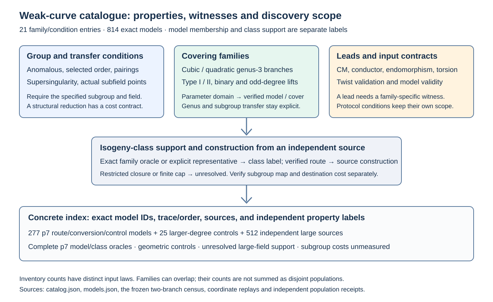

# Weak-curve family catalogue

The first catalogue contains **21 family or condition entries** and **814 exact model records**. It separates subgroup reductions, covering geometry, isogeny-class support, structural leads and input contracts. Each entry supplies its domain, recognition condition, finite construction/enumeration description, subgroup requirements, source and evidence status.

[Searchable catalogue](../../docs/curves/weak-families/index.html), [canonical family data](../../docs/curves/weak-families/catalog.json), and [model index](../../docs/curves/weak-families/models.json) are generated with the native tool.



## What is classified

A family-level theorem and an individual model record answer different questions. The catalogue asks whether the stated model condition holds, whether its isogeny class has a family representative, whether that representative can be constructed from the supplied source, and whether a specified subgroup has an established lower-cost route. A result at one level is not promoted to the next.

The inventories retain their input laws: 277 p7 models come from postselected route, conversion and control replays; 25 larger-degree models come from constructed controls; 512 large models are the original independent source draws. Inventory counts are not family-density estimates. Exact p7 labels use a complete parameter image and a complete ordinary trace oracle with t = 2 modulo 4. The larger source labels remain unresolved after the bounded searches.

## Family records

The published reductions and covering families retain their original attribution. Momose–Chao supply the Type I/II covering classification and its hyperelliptic subcases; Joux–Vitse supply cover/decomposition index calculus. The ISO-1 contribution attached here is the exact ordinary isogeny-class support criterion for the two hyperelliptic branches, the complete finite class oracles, and independently replayed source constructions. The catalogue adds a shared identity and evidence schema across these mechanisms.

### Anomalous prime-field curves

`WCF1:anomalous-prime` — subgroup reduction; published reduction.

**Domain:** Nonsingular E over F_p, p prime, selected group E(F_p).

**Recognition:** Exact N = p, equivalently trace t = 1. Near equality is a different condition.

**Find members:** For a fixed prime, a certified trace-one enumeration or trace-prescribed construction gives members. Exact counting certifies the predicate.

**Completeness:** All nonsingular prime-field models whose certified trace equals one; equivalent models require identity-aware deduplication.

**Subgroup gate:** Specify the characteristic-order group and the hypotheses of the cited p-adic reduction.

**Cost gate:** Retain construction/counting and reduction verification costs for an implementation.

**Local status:** literature baseline. Sources: smart.

**Properties:** The selected full group has characteristic order p. Prime-field and extension-field hypotheses are recorded separately.

### Insufficient selected-subgroup size

`WCF1:small-selected-subgroup` — subgroup reduction; published reduction.

**Domain:** A specified cyclic subgroup with verified order r and a declared work/security target.

**Recognition:** Assess generic work against r, rather than field bit length or the ambient curve order.

**Find members:** Fix the required subgroup-size contract and enumerate/count admissible models in a bounded parameter family.

**Completeness:** Exact only for the declared subgroup-order threshold and counted family.

**Subgroup gate:** Order and subgroup definition or generator must be known.

**Cost gate:** Use the same-target generic reference and resource envelope when measuring a comparison.

**Local status:** literature baseline. Sources: endo-rules.

**Properties:** A large field can contain a small selected group. There is no context-free bit-length threshold in this catalogue.

### Smooth or highly factored selected group order

`WCF1:smooth-selected-order` — subgroup reduction; published reduction.

**Domain:** A cyclic selected group with certified factorization r = product of prime powers.

**Recognition:** The relevant factorization is that of the selected group order. A small ambient cofactor does not establish this condition.

**Find members:** Use order-prescribed bounded families and retain a certified order factorization.

**Completeness:** All selected orders satisfying the stated smoothness bound within the counted family.

**Subgroup gate:** Factorization of r and the chosen cyclic group are required.

**Cost gate:** Charge order factoring and component costs; a factorization alone is not a measured runtime.

**Local status:** literature baseline. Sources: ph.

**Properties:** Prime-power component structure controls the known decomposition of the group problem. Unfactored orders remain unknown.

### Low embedding-degree pairing reductions

`WCF1:pairing-transfer` — conditional transfer; published reduction.

**Domain:** E over F_Q, prime r distinct from the characteristic, with a nondegenerate suitable pairing and embedding degree k.

**Recognition:** Compute k = ord_r(Q) and verify the transfer hypotheses for the selected r-subgroup.

**Find members:** Enumerate trace/order or pairing-family parameters in a declared finite domain; certify r and k.

**Completeness:** Relative to the fixed family, subgroup and embedding-degree bound.

**Subgroup gate:** Nondegeneracy and preservation of the selected r-subgroup must be established.

**Cost gate:** Include transfer and the destination field model/cost, compared on the same target contract.

**Local status:** literature baseline. Sources: mov.

**Properties:** MOV and related Tate-pairing reductions lead to finite-field groups. Small k is a structural fact; comparative weakness depends on the target field Q^k and group r.

### Supersingular elliptic curves

`WCF1:supersingular` — conditional transfer; published reduction.

**Domain:** E over F_(p^m), with prime r different from p and the small exceptional subgroup cases handled explicitly.

**Recognition:** Supersingularity is exact from the characteristic/trace criterion or a certified endomorphism computation.

**Find members:** Use published supersingular parameter families or a complete bounded trace/model enumeration.

**Completeness:** For a fixed finite field, complete supersingular enumeration has an explicit finite domain.

**Subgroup gate:** Record r and the actual embedding field; supersingularity alone is not the selected-subgroup cost comparison.

**Cost gate:** Pairing transfer and destination field cost remain separate.

**Local status:** literature baseline. Sources: mov, volcano.

**Properties:** Supersingular elliptic curves have bounded pairing embedding degree for the relevant prime-to-characteristic subgroups. The ordinary quadratic-order volcano model does not apply.

### Genus-3 cubic norm-one branch

`WCF1:g3-cubic` — cover family; native verified geometry.

**Domain:** K = F_(p^6), q = p^2, p > 3; nonsingular y^2 = x(x-alpha)(x-alpha^q), alpha outside F_q, with allowed twists.

**Recognition:** Model: norm-one Legendre parameter. Class: the exact cubic torus/CM intersection for ordinary t = 2 modulo 4 and D_K < -4; the complete finite oracle handles exceptional units.

**Find members:** Enumerate nonidentity parameters in the torus of order p^4+p^2+1. Hilbert 90 supplies alpha; quotient by documented equivalences.

**Completeness:** Complete for the declared hyperelliptic branch. Seven complete class censuses are available through p37.

**Subgroup gate:** The covering and any source route need kernel/order compatibility for a specified subgroup.

**Cost gate:** CM support generation, parameter reconstruction, source route and destination computation have separate costs.

**Local status:** complete small field census. Sources: mc, jv, iso1.

**Properties:** Full rational 2-torsion. v2(f_pi) >= 2 is necessary, with f_pi the Frobenius-order conductor. Selected 2-quotient CM orders have c dividing f_pi/4.

### Genus-3 nonsplit quadratic branch

`WCF1:g3-quadratic` — cover family; native verified geometry.

**Domain:** K = F_(p^6), q = p^2, p > 3; y^2 = (x^2-d)(x-alpha)(x-alpha^q), d a base-field nonsquare, alpha outside F_q.

**Recognition:** Model: the quadratic torus test on j. Class: the exact selected-floor CM intersection for ordinary t = 2 modulo 4 and D_K < -4; exceptional-unit cases use the complete finite oracle.

**Find members:** Enumerate nonidentity parameters in the torus of order p^4-p^2+1 in F_(p^12), then use the proved Cayley reconstruction and allowed twists.

**Completeness:** Complete for the declared branch and its finite torus domain.

**Subgroup gate:** Specify subgroup compatibility for cover and source transport.

**Cost gate:** The degree-18 per-factor decision does not include CM support generation.

**Local status:** complete small field census. Sources: mc, jv, iso1.

**Properties:** Exactly one rational nonidentity 2-torsion point; a rational 2-quotient has full 2-torsion. Selected CM conductors satisfy c | f_pi and v2(c) = v2(f_pi). The invariant has exact absolute degree six.

### Cubic-extension (2,2) Type I coverings

`WCF1:g3-type-i` — cover family; published geometry.

**Domain:** K = F_(q^3), q odd; the four roots alpha, alpha^q, beta, beta^q are distinct, with alpha,beta outside F_q and the published leading-coefficient condition.

**Recognition:** Membership uses the Type I condition of Momose-Chao; their direct test is a quadratic-equation test.

**Find members:** Use y^2 = (x-alpha)(x-alpha^q)(x-beta)(x-beta^q), with the recorded exclusions and model equivalences.

**Completeness:** This parameter family under the paper's isogeny condition; no complete local isogeny-class support census is yet attached.

**Subgroup gate:** Use the actual covering kernel and selected subgroup.

**Cost gate:** Cover construction and destination geometry/solver cost require their own receipts.

**Local status:** recognizer not yet implemented. Sources: mc.

**Properties:** Full rational 2-torsion after normalization. The resulting genus-3 covering may be hyperelliptic or non-hyperelliptic.

### Cubic-extension (2,2) Type II coverings

`WCF1:g3-type-ii` — cover family; published geometry.

**Domain:** K = F_(q^3), L = F_(q^6), q odd; alpha in L outside F_(q^2) and K.

**Recognition:** The published conjugate-root configuration and its Legendre normalization determine membership and twist conditions.

**Find members:** Enumerate the admissible alpha domain of the published quartic; retain its field of definition and normalization.

**Completeness:** The specified Type II family under the isogeny condition; no local fast recognition or complete class oracle is claimed here.

**Subgroup gate:** Establish the covering's field and kernel on the selected subgroup.

**Cost gate:** Construction and destination computation are unmeasured locally.

**Local status:** recognizer not yet implemented. Sources: mc.

**Properties:** Root configuration alpha, alpha^(q^3), alpha^q, alpha^(q^4). The Legendre leading-coefficient square class depends on q modulo four.

### Hyperelliptic locus within the (2,2) families

`WCF1:g3-hyperelliptic-22` — cover family; published geometry.

**Domain:** An admissible Type I or Type II configuration from Momose-Chao.

**Recognition:** The stated PGL2(F_q) transformation represented by a trace-zero invertible matrix relating the two root parameters is the hyperellipticity condition.

**Find members:** Apply the paper's involution condition to the admissible root parameters, retaining its hypotheses.

**Completeness:** The conditional locus within the published (2,2) configurations.

**Subgroup gate:** Use the chosen covering and subgroup, rather than inferring transfer from a family name.

**Cost gate:** A geometric test has a different cost from complete source construction and solving.

**Local status:** recognizer not yet implemented. Sources: mc.

**Properties:** This is a geometric subcase of the Type I/II families, rather than a disjoint count. Different coverings of an elliptic model can coexist.

### Characteristic-two GHS descent families

`WCF1:binary-ghs` — cover family; published geometry.

**Domain:** Ordinary binary curves over a chosen extension K/F_q satisfying the published descent hypotheses.

**Recognition:** Compute the Frobenius span of the coefficients, then verify the descended cover genus and geometry.

**Find members:** Choose bounded coefficient/Frobenius-span families, construct the published cover, and verify its map.

**Completeness:** Only the declared descent construction and bounded coefficient space.

**Subgroup gate:** The induced transfer must preserve the selected subgroup and avoid its kernel.

**Cost gate:** Include cover construction, field conversion and the destination solver; genus alone is insufficient.

**Local status:** literature baseline. Sources: hess.

**Properties:** The coefficient span and extension structure govern the cover. An extension degree alone is not a weakness certificate.

### Generalized Weil-descent cover families

`WCF1:generalized-weil-descent` — cover family; published geometry.

**Domain:** A specified extension field, descent construction and covering hypothesis.

**Recognition:** A verified covering and its induced group map establish geometry; the resulting genus may exceed the original GHS case.

**Find members:** Enumerate the prescribed coefficient space for a chosen published construction, with maps and genus retained.

**Completeness:** Construction-specific, rather than all extension-field curves.

**Subgroup gate:** Selected subgroup preservation is required.

**Cost gate:** Measure the resulting destination problem and all construction phases.

**Local status:** literature baseline. Sources: hess.

**Properties:** Generalizations enlarge the parameter family. They can change hyperellipticity and destination arithmetic.

### Larger odd-degree cubic norm-one models

`WCF1:odd-cubic-lifts` — cover family; native verified geometry.

**Domain:** K = F_(q^n), q = p^2, n odd, n >= 3; alpha outside F_q and lambda of relative norm one.

**Recognition:** The norm-one model condition and rational 2-quotient torsion controls are proved in the larger-degree evidence.

**Find members:** Use nonidentity relative norm-one parameters and constructive Hilbert 90.

**Completeness:** The explicit functional model family; efficient large-field class-support discovery remains unresolved.

**Subgroup gate:** Record the actual cover and selected subgroup for the extension degree.

**Cost gate:** Larger-degree arithmetic controls do not supply a destination-solver comparison.

**Local status:** verified controls and bounded population. Sources: iso1-odd, iso1-large.

**Properties:** The cubic 2-depth restriction extends to the recorded odd-degree domain. The degree-six CM class theorem is not silently promoted to every n.

### Larger odd-degree quadratic Cayley models

`WCF1:odd-quadratic-lifts` — cover family; native verified geometry.

**Domain:** K = F_(q^n), L = F_(q^(2n)), q odd and n >= 3 odd; nonidentity lambda in the torus of order (q^n+1)/(q+1).

**Recognition:** Constructive quadratic-base Hilbert 90 and a base norm equation recover alpha even when the inverse exponent does not exist.

**Find members:** Enumerate torus parameters in a finite chosen field, then apply the proved reconstruction.

**Completeness:** The functional family and specified cover; no minimum-genus or universal class-support statement is added.

**Subgroup gate:** A specified subgroup and induced covering map remain separate requirements.

**Cost gate:** Controls establish reconstruction and geometry; source discovery and destination solving retain separate costs.

**Local status:** verified controls and bounded population. Sources: iso1.

**Properties:** Sixteen degree-10/14 controls pass; eight have noncoprime section gcd five. For prime relative n, the specified compositum cover has genus 1+2^(n-2)(n-2), giving 25 and 161 at n=5,7.

### Selected points contained in a proper subfield group

`WCF1:proper-subfield-points` — conditional transfer; published reduction.

**Domain:** E and the selected group/points are actually defined over a proper subfield.

**Recognition:** Verify Frobenius-fixed coefficients and points, and the selected subgroup's membership in the smaller group.

**Find members:** Construct over a chosen subfield and explicitly specify the subgroup retained on extension.

**Completeness:** Relative to the chosen subfield and point/group condition.

**Subgroup gate:** Actual selected points and group must be contained in the subfield model.

**Cost gate:** Compare the smaller-field problem and any coordinate conversion.

**Local status:** literature baseline. Sources: endo-rules.

**Properties:** Ambient field bit length can overstate the selected problem's field. Coefficients in a subfield alone do not establish point or subgroup containment.

### Isogeny classes containing a covering-family representative

`WCF1:isogenous-cover-support` — class transfer; native verified geometry.

**Domain:** An ordinary class over a specified field, a covering family, and a source model.

**Recognition:** An exact class oracle or a verified witness establishes support. A capped or restricted walk leaves the label unresolved.

**Find members:** Use the selected-family class criterion and reconstruct a passing representative; retain a certified route from the fixed source when one is constructed.

**Completeness:** Only the class/family oracle whose completeness is proved; finite walk policies are separately bounded.

**Subgroup gate:** Every route degree and kernel must be compatible with the specified subgroup.

**Cost gate:** CM support, failed attempts, route maps, transport, reconstruction and destination solving are separate phases.

**Local status:** complete small field oracle large labels unresolved. Sources: iso1, volcano.

**Properties:** Model membership and class support differ. The p7 combined oracle is exact; 512 large-field bounded searches leave class labels unresolved.

### CM field, class number and conductor signals

`WCF1:cm-conductor-lead` — structural lead; structural only.

**Domain:** Ordinary curves with exact or explicitly bounded order information.

**Recognition:** Separate the Frobenius conductor from the actual endomorphism-order conductor and retain uncertainty.

**Find members:** Organize certified discriminants/orders and investigate a declared family-specific criterion.

**Completeness:** A signal inventory; no universal weakness classification follows from this property.

**Subgroup gate:** Needed only after an actual map or solver route is proposed.

**Cost gate:** No solver or end-to-end gain is assigned from class number alone.

**Local status:** structural index. Sources: volcano, iso1, endo-rules.

**Properties:** Class number can inform enumeration and route hypotheses. Equal class numbers can coexist with different covering-family support.

### Efficient endomorphisms and Frobenius symmetries

`WCF1:endomorphism-symmetry-lead` — structural lead; structural only.

**Domain:** A specified curve and subgroup on which the endomorphism action is established.

**Recognition:** Record the actual map, its subgroup action and orbit/decomposition properties.

**Find members:** Use published endomorphism families with exact parameters and independent map checks.

**Completeness:** The named construction or symmetry family.

**Subgroup gate:** Verify preservation and the correct eigenvalue/action, rather than selecting an unverified polynomial root.

**Cost gate:** Arithmetic and generic constants need their own measured contracts.

**Local status:** structural index. Sources: endo-rules.

**Properties:** GLV/GLS or Frobenius structure can improve scalar arithmetic and generic constants. A known endomorphism is not automatically a special curve-class reduction.

### Rational torsion and twist/order patterns

`WCF1:torsion-lead` — structural lead; structural only.

**Domain:** A curve over a fixed field, with certified torsion and twist/order information.

**Recognition:** Record exact rational torsion and the family it informs; retain unfactored group orders as unknown.

**Find members:** Use torsion-prescribed models and certify their group conditions.

**Completeness:** The torsion property or a declared torsion-prescribed family.

**Subgroup gate:** Specify the chosen group and treatment of the cofactor.

**Cost gate:** A structural filter is not a completed source-to-destination cost.

**Local status:** structural index. Sources: iso1, endo-rules.

**Properties:** Full 2-torsion and one rational 2-point distinguish the two ISO-1 model branches. A small torsion factor alone does not determine selected-subgroup weakness.

### Twist and subgroup validation conditions

`WCF1:twist-input-contract` — implementation condition; conditional property.

**Domain:** A specified point-input and validation contract, together with curve/twist subgroup data.

**Recognition:** Assess permitted point domains and subgroup checks under the actual contract.

**Find members:** Maintain defensive validation fixtures for the explicitly supported curve and twist domains.

**Completeness:** The declared validation contract and allowed point domains.

**Subgroup gate:** The protocol's subgroup/cofactor policy is part of the record.

**Cost gate:** No curve-level comparative solver cost is inferred.

**Local status:** contract reference. Sources: sec1, rfc7748.

**Properties:** Twist order is relevant to some input contracts. This is an implementation condition, not a universal curve hardness label.

### Singular cubic input domain

`WCF1:singular-model-domain` — input domain; conditional property.

**Domain:** A purported elliptic model whose discriminant vanishes.

**Recognition:** Certify nonsingularity before admitting an elliptic-curve record.

**Find members:** Retain boundary fixtures for the model-validity check; catalogue them as rejected elliptic inputs.

**Completeness:** The exact model-validity predicate.

**Subgroup gate:** Nonsingular group definitions are required for elliptic entries.

**Cost gate:** No elliptic solver benchmark is attached to a rejected model.

**Local status:** contract reference. Sources: sec1.

**Properties:** A singular cubic has different geometry and group structure. It is kept outside the nonsingular elliptic-family inventory.

## Inventory counts

These are counts of exact model records under the stated inventory laws. Model membership and class support counts overlap and must not be added as disjoint populations.

| Label | Records |
| --- | ---: |
| `combined_class:exact_family_zero` | 1 |
| `combined_class:geometric_support_exact` | 276 |
| `combined_class:outside_domain` | 153 |
| `combined_class:unresolved` | 384 |
| `higher_family_class:geometric_control_witness` | 25 |
| `higher_family_class:outside_domain` | 384 |
| `higher_family_class:unresolved` | 128 |
| `inventory:independent_model_law_large_source` | 512 |
| `inventory:postselected_replayed_route_or_control` | 302 |
| `model_g3_cubic:no` | 263 |
| `model_g3_cubic:outside_domain` | 153 |
| `model_g3_cubic:unclassified_in_this_index` | 384 |
| `model_g3_cubic:yes` | 14 |
| `model_g3_quadratic:no` | 267 |
| `model_g3_quadratic:outside_domain` | 153 |
| `model_g3_quadratic:unclassified_in_this_index` | 384 |
| `model_g3_quadratic:yes` | 10 |

## Sources

The browser also exposes the complete ordinary p7 trace table separately from the model inventory: 294 eligible classes, 126 cubic-support classes, 210 quadratic-support classes, 88 in both, 248 in the union and 46 zero for these two branches. A zero for this union does not classify other covering families.

- **smart:** [Smart: The Discrete Logarithm Problem on Elliptic Curves of Trace One (1999)](https://link.springer.com/article/10.1007/s001459900052).
- **ph:** [Pohlig-Hellman: An Improved Algorithm for Computing Logarithms over GF(p) (1978)](https://ee.stanford.edu/~hellman/publications/28.pdf).
- **mov:** [Menezes-Okamoto-Vanstone: Reducing elliptic curve logarithms to finite-field logarithms (1991/1993)](https://doi.org/10.1145/103418.103434).
- **mc:** [Momose-Chao: Elliptic curves with weak coverings over cubic extensions (2009, revised 2013)](https://eprint.iacr.org/2009/236).
- **jv:** [Joux-Vitse: Cover and Decomposition Index Calculus (2011, EUROCRYPT 2012)](https://eprint.iacr.org/2011/020).
- **hess:** [Hess: The GHS Attack Revisited (EUROCRYPT 2003)](https://www.iacr.org/archive/eurocrypt2003/26560374/26560374.pdf).
- **volcano:** [Sutherland: Isogeny volcanoes, MIT 18.783 Lecture 22 (2023)](https://math.mit.edu/classes/18.783/2023/LectureNotes22.pdf).
- **sec1:** [SEC 1 v2: Elliptic Curve Cryptography (2009)](https://www.secg.org/sec1-v2.pdf).
- **rfc7748:** [RFC 7748: Elliptic Curves for Security (2016)](https://www.rfc-editor.org/rfc/rfc7748).
- **iso1:** [ISO-1: exact two-branch support, independent census and construction (2026)](../../research/iso1_weak_classes_20261007/two_branch_20261009/REPORT.md).
- **iso1-large:** [ISO-1: frozen independent 192-252-bit population (2026)](../../research/iso1_weak_classes_20261007/large_population_20261009/REPORT.md).
- **iso1-odd:** [ISO-1: larger odd extension degrees and norm-one controls (2026)](../../research/iso1_weak_classes_20261007/larger_fields_20261009/REPORT.md).
- **endo-rules:** [Repository: curve-structure and endomorphism contracts](../../docs/endomorphism-rules.md).

## Finding all members, and extending the catalogue

For a fixed field and a parametrized family, exhaustive coverage means enumerating its complete admissible parameter set and quotienting only by documented equivalences. It does not follow from a successful bounded walk. For class support, a complete oracle or a verified representative provides the appropriate label; restricted closures and caps remain unknown. The source and subgroup requirements make the claimed object precise.

The next catalogue rungs are independent Type I/II recognizers and witnesses, binary-descent fixtures, and trace/order-based baseline fixtures with specified subgroups. Efficient on-demand CM support and verified large-field source routes remain open. Canonical curve IDs and source hashes allow new families to be attached without rewriting earlier measurements.

The existing IC ratio graphs and two-branch census figures were checked for affected claims. Their numerical values are unchanged: this round organizes established evidence rather than providing a new paired cost. The new classification diagram and inventory table expose the additional catalogue scope.

[Protocol](PROTOCOL.md), [native builder](catalog.rs), and [derived summary](summary.json) retain the input binding and status contract.

## Reproduction and validation

From the repository root, use the focused native workspace:

```sh
cargo test --release --locked --manifest-path research/iso1_weak_classes_20261007/report_check_runtime/Cargo.toml --bins --lib
cargo run --release --locked --manifest-path research/iso1_weak_classes_20261007/report_check_runtime/Cargo.toml --bin weak_curve_catalog -- check .
```

Use `build .` to regenerate the model and class index, followed by `render .` to regenerate the HTML, Markdown, LaTeX and SVG presentation. The input bindings inside `models.json` freeze five parent evidence files. Checks reject input changes, inconsistent model/trace/order records, duplicate model identities, unsafe evidence promotion and stale browser data. [Validation](VALIDATION.md) records the executed native, browser and PDF checks.
